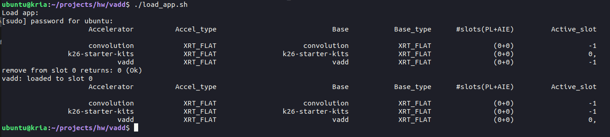
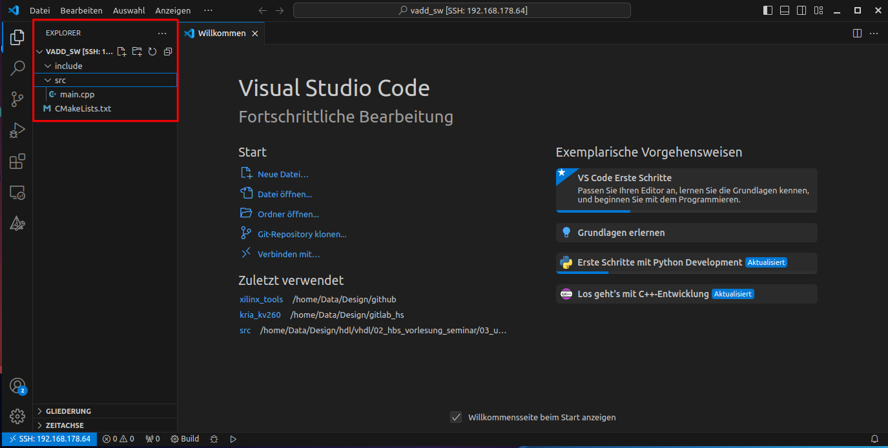
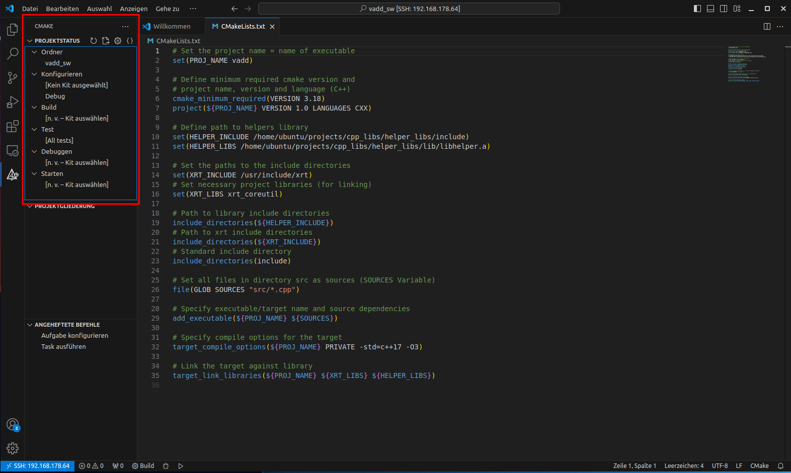
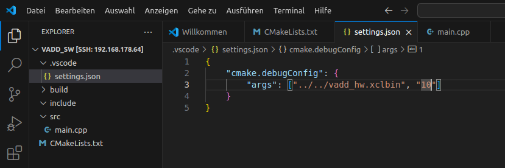

# Vitis Kernel Based Design Tutorial

## Overview
* In this tutorial the kernel based design using an extensible platform is described. We will use a pre-built extensible platform which you can find [here](../resources/extensible_platform/). 
* It is assumed that you have a _Kria KV260 Starter Kit_ board with Ubuntu Linux (Version 22.04) and the _Pynq_ framework for running Jupyter notebooks on the Kria target. Further information can be found here: 
  * [Ubuntu Linux for the Kria KV260](https://xilinx-wiki.atlassian.net/wiki/spaces/A/pages/2363129857/Getting+Started+with+Certified+Ubuntu+22.04+LTS+for+Xilinx+Devices)
  * [Pynq](http://www.pynq.io/)
* We also further assume that you have installed Vitis Version 24.1 on a Linux computer running Ubuntu 22.04.
* The tutorial will go through the following steps:
  * Develop the IP kernel with Vitis HLS.
  * Build the FPGA hardware, i.e. the bitfile for the programmable logic, with Vitis v++ compiler (using a bash script).
  * Transfer the hardware bitfile to the Kria target for SW development with Pynq or C/C++ development. 
  * Import the hardware bitfile in Pynq as overlay and write Python SW with Jupyter Notebook running on the Kria board.
  * Develop a C/C++ software application. 
* The necessary source codes for this tutorial can be found [here](../kernel_based_design/reference_files/). Just copy the complete folder and keep the directory structure for this tutorial. You can either download this whole Github repository or only the folder `reference_files` using a browser extension like [GitZip](https://gitzip.org). Rename the folder to `vadd`. The sub-folders contain the following:
  * `dtbo`: Folder for generation of device tree data.
  * `hls`: Folder for IP core generation with Vitis HLS.
  * `kria/bash_scripts`: Here you can find some bash scripts for project setup on the Kria target.
  * `kria/cpp_libs`: Library for the C++ project.
  * `kria/pynq`: Here you can find the Jupyter notebook code which must be transferred to the Kria target.
  * `kria/vadd_sw`: Here you can find a C++ SW project using CMake as build system. The SW will be compiled on the Kria target directly.
  * `system`: This folder will be used for building the PL binary.
* The IP kernel development is done with Vitis HLS. You should have some knowledge on Vitis HLS and we recommend to do the [Vitis HLS tutorials](../../vitis_hls/hls_overview.md) beforehand. You will get all source codes and scripts necessary for HLS in the folder `reference_files/hls`. Project setup will be done based on a shell script as described in the HLS tutorials. We will not cover the details of project setup and the work with the Vitis GUI for a HLS project here. Please refer to the HLS tutorials for details.
* The tutorial has been tested with Vivado/Vitis Version 2024.1. Depending on your installation you may have to adapt paths (e.g. paths to the Xilinx installation on your computer) in the scripts etc.

---
## IP development in Vitis HLS
* In this step the IP core is developed with Vitis HLS. The complete source code for the HLS project can be found in the folder `reference_files/hls/src`. 
* There is a bash script `run_hls.sh` in the folder `reference_files/hls/project` which does the HLS project setup and runs synthesis. Open the file `run_hls.sh` and check that the path `/opt/xilinx/Vitis/2024.1/settings64.sh` matches your installation of Vitis. Execute this script on the command line of a terminal program on your Linux computer. 
  * The HLS project setup is defined in the file `project.cfg`. You must not change anything here.
  * The address width of the IP core is be set to 32 Bit in order to be usable with the Pynq Jupyter notebooks. This is set in the config file with: `syn.interface.m_axi_addr64=0`
  * _Note_: When you want to start a shell script in a directory on the command line of a terminal program you must precede the script name with `./`, so in the case of the HLS script you must start it with `./run_hls.sh`. This will hold also for the following steps and also on the Kria target.
* Start Vitis and open the directory `vadd/hls` as a workspace. You will  find now the completed synthesis and you can study the results. You may also run `C Simulation` and `C/RTL Cosimulation`, although the code has already been verified. 
* Then run the `Package` step in the flow. The IP Core is exported as _.xo-file_ for the kernel based flow.
  * Note the location of the _.xo-file_ for subsequent steps. It should be in the directory `hls/project/project_work` and is named `krnl_vadd.xo`. 

---
## Generate the Programmable Logic Binary
* In this step the programmable logic part of the project will be generated by using an _extensible platform_ and the IP core generated above. We will do this with a bash script `link_vadd.sh` which you can find in the directory `system`. In the script the _v++ compiler_ is used to link the HLS generated kernel with the extensible platform and generate the PL binary. 
* As already mentioned you can find an extensible platform for all projects [here](../resources/extensible_platform/). Unpack the file and store the platform directory on your computer. In the bash script `link_vadd.sh` you may have to adapt the path to the platform file where the extensible platform is stored on your computer. If you store it in the same folder as the Kria projects then the path should fit. 
* Start the bash script `link_vadd.sh` in a terminal. This may take a while (depending on the performance of your computer), since a complete Vivado implementation run is performed. When the script has finished you should find two files in the `system` directory:
  * `vadd_hw.xclbin`: This is the PL binary and must be transferred to the Kria target.
  * `vadd_hw.xsa`: This file is needed for the next step.
* The file `vadd_hw.xclbin.info` can be opened with a text editor and gives you some information on the generated hardware, e.g. base addresses and register offsets. You can also open Vitis for an analysis of the results with `vitis --analyze vadd_hw.xclbin.link_summary`.


---
## Generate a device tree overlay file 
* Besides the hardware binary a so-called `device tree overlay` (`.dtbo`) file is needed in order to properly load the hardware under Ubuntu Linux on the Kria target. 
* In the sub-folder `dtbo` you will find a bash-script `create_dtbo.sh` with which you can generate a dtbo-file. Open the script and adjust the path to your Vitis installation. The script calls a second tcl-script `dts.tcl`. In this second script there is a relative path to the _xsa-file_ generated in the step above. Check that this path points to the _xsa-file_. Execute the shell script `create_dtbo.sh`. When the script has finished you should have a device tree overlay file `pl.dtbo` in the sub-folder `dtbo`.
  * _Note_: Warning messages issued by the shell script regarding unconnected or missing components or signals may safely be ignored.

---
## File transfer and directories on the target
* In order to use the FPGA hardware on the Kria target the FPGA binary must be transferred to the correct places in the Ubuntu file system on the target. Since we want to use the hardware with Pynq and also with application SW written in C++ we have to transfer them to three different places:
  * A directory for installation of the FPGA binary ("firmware"). This MUST be a directory in `/lib/firmware/xilinx/` such that the `xmutil` tool can load the binary. Since these directories are owned by `root` you have to use `sudo` for the commands. The directory should be named like the name of the project `/lib/firmware/xilinx/<name>` and has the following content:
    * `pl.dtbo`: Device tree overlay
    * `binary_container_1.bin`: FPGA binary
    * `shell.json`: File provided in folder `kria/bash_scripts`.
  * A project directory for C++ development should be under `/home/ubuntu` for example `/home/ubuntu/projects/<name>` where `<name>` is the name of the project (here `vadd`). 
  * A project directory for Pynq development MUST be under `/home/root/jupyter_notebooks/` for example `/home/root/jupyter_notebooks/projects/<name>`, where `<name>` is the name of the project. Here again `root` is the owner, so you must use `sudo`.
  * We provide for most of the transfer tasks some bash shell scripts as described below.
* The file transfer from your development computer to the Kria target must be done with _SFTP_. For the execution of the bash scripts you must use an _SSH_ connection in a terminal. 
  * First you need to find out the IP address of the Kria board in your network. 
  * On the Kria board there is the user `ubuntu` (password should be `ubuntu`, if not set otherwise) with the home directory `/home/ubuntu`.
  * Open a terminal program and connect to the Kria target via SSH, for example with `ssh ubuntu@192.168.178.64` (assuming an IP address `192.168.178.64`, which may be different in your local network). If you do not want to type always the password for login to the target, you can install the `sshpass` utility on your computer. Then the command is: `sshpass -p <password> ssh ubuntu@192.168.178.64`, where `password` is the password of the user `ubuntu`. 
  * For _SFTP_ file transfer you can normally use the file manager of your Ubuntu distro and enter the network connection, for example `sftp://ubuntu@192.168.178.64/home/ubuntu`. You can also install an app like _FileZilla_ on your computer and use it for the file transfer.
* In the SSH terminal first make a project folder on the Kria target: 
  * In the `/home/ubuntu` home directory make a folder `projects` with `mkdir projects`.
  * In the `projects` folder make a folder for the `vadd` project with `mkdir vadd`.
  * For additional projects you can make a new project folder.
* Transfer the bash scripts in the folder `reference_files/kria/bash_scripts` and the file `shell.json` to the new project folder. The scripts are commented and you may have to change the project name in the scripts (should be `vadd`). You may also have to make them executable by `chmod a+x *.sh`.
  * _Note_: You should be able to open the remote file in a text editor on your computer from the file manager. 
* Transfer the FPGA binary `system/vadd_hw.xclbin` and the device tree file `dtbo/pl.dtbo` to the project folder.
* Initialize the folders/directories by executing the script `initialize_directories.sh`. This will generate the necessary folders for the firmware and the Pynq development.
* Copy the FPGA binary to the firmware directory by executing the script `copy_xclbin.sh`.
* Now we have everything in place to start SW development on the Kria target.

---
## SW development in Python with Jupyter notebooks and Pynq
* In the next step of this tutorial we will test the IP core with a SW application written in Python and executed by a Jupyter notebook application running on the Kria target. The Jupyter notebook code can be found in the folder `reference_files/kria/pynq/vadd_extensible.ipynb`.
* Copy the Jupyter notebook code `vadd_extensible.ipynb` (via _SFTP_) first to the home directory on the Kria board (`/home/ubuntu`). Then open a _SSH_ connection on the Kria board and move the notebook into the path `/home/root/jupyter_notebooks/projects/vadd/` on the Kria board with:
  * `sudo cp vadd_extensible.ipynb /home/root/jupyter_notebooks/projects/vadd/`. 
* The notebook uses Python scripts as modules. Copy the directory `utils` (also in the folder `reference_files/kria/pynq/`) to the directory `/home/root/jupyter_notebooks/projects/` on the Kria target with:
  *  `sudo cp -r utils/ /home/root/jupyter_notebooks/projects/`. 
* The Jupyter notebook application is already running on the Kria board after booting the board and can be accessed via a web browser (`<ip_address>:9090/lab`, Password `xilinx`).
  * _Note_: The Jupyter notebook is running under the user _root_ and therefore we have a different password than the user _ubuntu_.
* Open the web browser with the IP address given above. You should find the Jupyter notebook file in the project directory `projects/vadd`. Open the notebook file and execute it. The notebook code is documented, so we omit any further explanations here. You may have to adapt paths (e.g. the project path).

---
## SW development in C++ on the Kria target
* Besides the Jupyter notebook we can develop the SW also with C/C++. Usually C code is faster in execution than Python code, so for streaming applications it may be better to use a C based application.
* Normally SW is developed in Vitis and cross-compiled for the Kria target. Another possibility is to compile the SW directly on the target. As an advantage you do not need things like a _sysroot_, if you cross-compile for a Linux target and you do have less problems with incompatible libraries. As a disadvantage compilation times are normally longer on the Kria target, compared to a laptop computer. 
* We use _VS Code_ (with _CMake_) on the development computer and do a remote development via _SSH_ on the Kria target. You can find informations on VS Code under https://code.visualstudio.com There is also a download section. The following extensions are needed for VS Code on the development computer:
	* `C/C++`
	* `CMake tools`
	* `Remote SSH`, `Remote Explorer`
	* Some of the extensions will be automatically installed on the target system, when connecting to it.
* We will use _CMake_ for building the C++ SW application. CMake is a build system where you can describe all dependencies of a SW project in a simple text file (always named `CMakeLists.txt`). CMake stands for _cross-platform make_ and is basically a generator which creates platform specific build scripts. When used under Linux it generates scripts for the `make` build system.
* If you are not familiar with CMake you can find a tutorial on VS Code with CMake here (for Linux): https://code.visualstudio.com/docs/cpp/cmake-linux 
* We will develop remote on the Kria host running Ubuntu Linux and therefore the necessary tools like _cmake_, _make_ and the _gcc-toolchain_ should have been installed.
* Each CMake based SW project has the same directory structure as shown below:
  * For all header files there is a folder `include`  and for all .cpp files there is the folder `src`. In the root directory of the project there is the  `CMakeLists.txt` file for CMake. During the CMake processing in VS Code an additional folder `build` will be generated. 
  * Our example project `vadd_sw` has exactly this structure (except that we do not have a `project.h` file).

```
├── CMakeLists.txt
├── include
│   └── project.h
└── src
    └── main.cpp

```
* We will use a small library for the project (which you can use also for other C++ projects), which first needs to be installed:
  * Copy the folder `kria/cpp_libs` to the Kria target folder `/home/ubuntu/projects`.
  * Go to the folder `cpp_libs/helper_libs_src` and execute the script `make_and_install.sh`.  This will compile the sources and install the library in the folder `cpp_libs/helper_libs`. The compilation is also based on _CMake_. 
* In the directory `kria/vadd_sw` you can find the source code and the `CMakeLists.txt` file, which is needed for VS Code. Copy the directory `vadd_sw` to the project folder (`/home/ubuntu/projects/hw/vadd`) on the Kria target.
* Before we can start SW development you have to load the FPGA binary (firmware) with the script `load_app.sh` (should be in your project folder). When you execute the script you should see something similar to the next image (you may not have the _convolution_ accelerator). In the last line you can see that the `vadd` _accelerator_ was loaded in the active _slot_ (marked with 0, all inactive slots are -1).



* In the next step we will start VS Code and connect to the Kria target.
  * Start VS Code on your computer. 
  * Open the command palette (`Ctrl-Shift-P` or `F1`) and type `remote-ssh`. Select the entry `Connect to host ...`. You must enter the same SSH credentials (`<user>@<host-ip>`) as shown above for the SSH connection.
  	* When VS Code connects to the target it will download VS Code plus some extensions on the target, this may take some time.
  	* After the first connection you should find the SSH connection in the `Remote Explorer` for re-connecting. Select the IP address and push the arrow symbol to re-connect. 
* Open the (remote) folder `/home/ubuntu/projects/hw/vadd/vadd_sw/` in VS Code, this is the project workspace. You should see now your project as shown in the image below. In red you can see the _Explorer_, where the source code and the `CMakeLists.txt` file are shown. Open the source file `main.cpp` and study the code. 



* The code has lots of comments which should help you in understanding it. For the handling of the IP kernels we provide a small library in the folder `reference_files/cpp_libs/helper_libs_src/` (which you should have already installed). Besides the code for the timer (`TimeMeasure.h`/`TimeMeasure.cpp`) it consists of the files [xrt_helper.cpp](reference_files/kria/cpp_libs/helper_libs_src/src/xrt_helper.cpp) and [xrt_helper.h](reference_files/kria/cpp_libs/helper_libs_src/include/xrt_helper.h) and defines a class `KernelDevice` and a template class `KernelBuffer`. Both classes wrap the necessary Xilinx XRT API calls for initializing the IP kernel and the definition of the data buffers. We will describe briefly here the two classes:
  * `KernelDevice`: This class serves to initialize the kernel object when its constructor is called. In the source file `main.cpp` it is called with `KernelDevice vaddHW(0, binaryFile, "krnl_vadd");` The first argument is the _device index_ which should always be 0 for this tutorial. The second argument is the path to the FPGA binary file which is loaded by the constructor. The third argument is the name of the HW kernel and must match the name of the toplevel function in Vitis HLS. The member variable `kernel` can then later be used to call the execution of the HW kernel, e.g. in this example it is called with `auto run = vaddHW.kernel(in1.buffer, in2.buffer, out.buffer, data_size);`. The arguments of the kernel call correspond to the arguments of the HLS function but are either XRT buffers (see class `KernelBuffer`) or a scalar variable. In this example the first three arguments are XRT buffers and the last argument is a scalar value (with the same data type as in the HLS code). 
  * `KernelBuffer`: With this template class the data buffers for the IP kernel are implemented. When the arguments of the IP kernel refer to memory located in the main memory and being accessed via AXI master interfaces then the appropriate data buffers have to be implemented in the main memory. The problem here is that the IP kernel accesses physical memory but the C++ software application accesses normally virtual memory. The XRT buffer allocates memory in physical memory and links it to a user pointer in virtual memory. For example the constructor call in `main.cpp` is `KernelBuffer<int> in1(vector_size_bytes, 0, vaddHW);`. The first argument is the size of the buffer in bytes. The second argument is the _Group ID_, which in this case is the index of the argument in the HLS function. The third argument is the _kernel device_ represented by the instance of the class `KernelDevice`. With the user pointer, e.g. `in1.ptr`, we can access the buffer from the software application and write or read to it. After writing to the buffer it must be _synchronized_, which effectively transferes the data to the physical memory. This is done e.g. with `in1.buffer.sync(XCL_BO_SYNC_BO_TO_DEVICE);` In the same sense if we want to read data from a buffer we first have to synchronize it with e.g. `out.buffer.sync(XCL_BO_SYNC_BO_FROM_DEVICE);` and then we can read the data with the user pointer, e.g. with `out.ptr[i]` in the code in `main.cpp`.
  * You can find more information on Xilinx XRT [here](https://xilinx.github.io/XRT/2022.1/html/xrt_native_apis.html).

* Open the `CMakeLists.txt` file: It defines the paths to the libraries, namely the XRT libraries and the helpers library, which you found in the folder `helper_libs_src`. Depending on where you copied and installed this library you may have to change the library path (if you followed the instructions above, it should fit). When you scroll further down the `CMakeLists.txt` file you will see project include and source directory and the specification of the executable and its dependencies. The nice thing here is that you do not have to change anything here as long as you stick to the directory structure described above: All header files in the folder `include` and all .cpp files in the folder `src`. The last two entries in the `CMakeLists.txt` file specify the compiler options and how the executable must be linked to the libraries. For new projects you can just copy the `CMakeLists.txt` file and change the project name in the second line of the file - the rest should work, if you use the same libraries.
* For building the project select the CMake symbol in the side bar of VS Code (last symbol). You should see the CMake view as shown in the image below:



* You first have to configure the tool chain ("kit") to be used: Move the mouse over `Konfigurieren > [Kein Kit ausgewählt]` and select the stylus symbol. Select one of the kits, e.g. `gcc 11.4.0 aarch64-linux-gnu`, which should be shown then instead of `[Kein Kit ausgewählt]`.
* Move the mouse over `Build` and select the build symbol. Your code should be built and you can see the output in the OUTPUT view below the editor. Since you copied an existing project there should be no errors during the build process, provided that the library paths are correct.
* Since the program needs two arguments (path to xclbin file and data size) an entry in a VS Code workspace settings file (located in `vadd_sw/.vscode/settings.json`) is needed to specify the arguments. Open the file in the explorer as shown in the next image. There is already an entry `cmake.debugConfig > args`  and the path to the binary should be correct (if not then change it here). You can change the second argument in order to process more samples. Note that each argument value is a string and needs double quotes.



* You can now run the application if you move the mouse to `Starten` and select the symbol. 
* Above the  `Starten` entry there is also a `Debugggen` entry which can be used to debug the code. Make sure that you have set at least one break point in the source code by clicking left to the line number in the editor. The debugger is based on `gdb` and VS Code will jump to the debugger view with the standard debugging features. 
* You can also run the program in the terminal. For example when you are in the project folder `vadd` the command would be `vadd_sw/build/vadd vadd_hw.xclbin 10`
