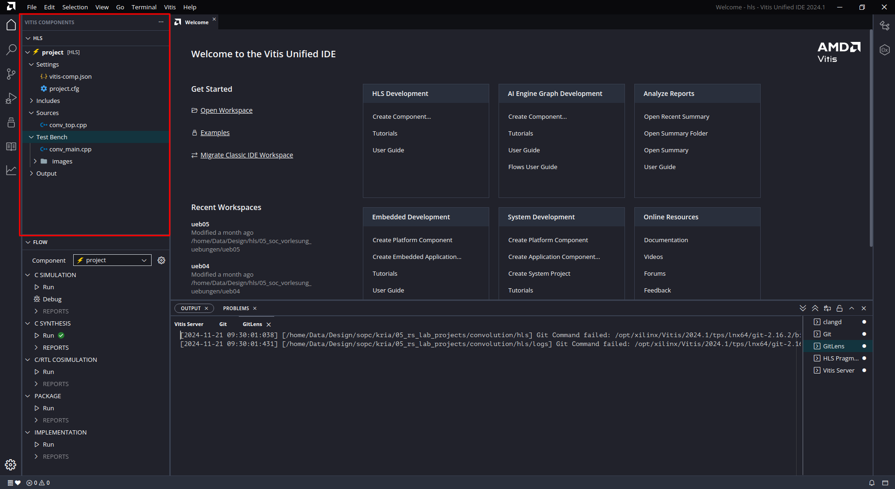

# Vitis OpenCV Design Tutorial

---
## Overview
* This tutorial is intended to show the complete design flow for a kernel based design using the _Xilinx Vision Library_, which basically implements _OpenCV_ kernels in hardware. This tutorial follows the kernel based design flow as described in the tutorial [kernel_based_design](../kernel_based_design/kernel_based_design.md) and thus this tutorial should have been done beforehand. We will reference to this tutorial and describe here only what is necessary and important w.r.t. the _Xilinx Vision Library_ and streaming applications with the generated hardware. 
* The tutorial assumes you have a _Kria KV260 Starter Kit_ board with Ubuntu Linux 22.04 and a host computer running Ubuntu Linux 22.04, with the _Xilinx Vitis Core Development Kit_ (Version 2024.1). The FPGA hardware which we will design here will support also a streaming application using the _Gstreamer_ framework on the Kria target board. 
* The Xilinx OpenCV library is part of the so-called _Vitis Vision Library_ and is contained in the _L1_ (Level 1) directory structure. We will use here only the _L1_ library with the OpenCV kernels. The tutorial uses a 2D filter function (`cv::filter2D	`) which is also known as _convolution_.
* Further information on OpenCV and the Xilinx Vision library can be found here:
  * [OpenCV Website](https://opencv.org ), The convolution function is defined [here](https://docs.opencv.org/4.4.0/d4/d86/group__imgproc__filter.html#ga27c049795ce870216ddfb366086b5a04).
  * [Xilinx Vision Library](https://xilinx.github.io/Vitis_Libraries/vision/2022.1/index.html)
  * The OpenCV kernel APIs are documented in [Vitis Vision Library API Reference](https://xilinx.github.io/Vitis_Libraries/vision/2022.1/api-reference.html). The convolution function is defined [here](https://xilinx.github.io/Vitis_Libraries/vision/2022.1/api-reference.html#custom-convolution).
* Not all OpenCV functions are available in the Xilinx OpenCV library and sometimes there are slight differences between the OpenCV library and the Xilinx implementation of the OpenCV functions, concerning functionality and also the result values (e.g. rounding effects). If you want to implement an OpenCV function in hardware you first have to check if the intended function is available in the Xilinx OpenCV library and if it has potential differences in the functionality. Be prepared that you may see slight differences in the pixel values between the two implementations (which will not be the case for the convolution function used in this tutorial). 
* The design flow is as follows:
  * Design the OpenCV kernel with Vitis HLS and test it with a C++ testbench that reads the input image. The reference data will be generated in the testbench using the OpenCV software function.
    * _Note_:  In the folder `jupyter` you can find a Jupyter notebook with the same OpenCV function, if you want to play around with the OpenCV function and its parameters.  
  * Build the hardware bitfile with Vitis and the extensible platform. Export the hardware to the Kria KV260 board (running Ubuntu 22.04). 
  * Test the OpenCV kernel on the Kria board with a Jupyter notebook and also with a C++ based application.
  * This tutorial, which uses the OpenCV convolution function, should serve as a blueprint for the development of other OpenCV based IP cores. Therefore there are some hints in the document w.r.t. the implementation of other OpenCV functions.
* The necessary source codes for this tutorial can be found in the folder `reference_files`. Copy the complete folder hierarchy to your computer and  keep the hierarchy as is. Rename the folder to `convolution`. Prefereably you copy the folder to the same destination as the folder for the tutorial [kernel_based_design](../kernel_based_design/kernel_based_design.md). We will also need the same extensible platform. 
* The subfolders are:
  * `dtbo`: Here are scripts for the generation of the device tree.
  * `hls`: Script and source files for HLS design of the OpenCV kernel.
  * `images`: Image example files with different sizes.
  * `jupyter`: Jupyter notebook for the laptop/PC.
  * `kria`: Jupyter notebooks, C++ application SW and scripts for the Kria KV260 target.
  * `system`: Workspace for the Vitis project.
* The development described here has been tested with Vivado/Vitis Versions 2024.1. The Kria KV260 board used is running Ubuntu 22.04.

---
## Installation of Libraries
* You need an installation of the OpenCV C++ library on your development computer. If it is not already installed then we provide instructions on how to install the library on a Linux computer [here](../resources/opencv_installation.md). Further information on the installation of OpenCV for the Vitis Vision Library can be found [here](https://github.com/Xilinx/Vitis_Libraries/tree/main/vision).
* If you want to use the Jupyter notebook for testing the OpenCV convolution function you need an installation of Python including the OpenCV library and Jupyter Notebook on your computer. You can find information here:
  * Python: https://www.python.org
  * OpenCV: https://docs.opencv.org/4.x/da/df6/tutorial_py_table_of_contents_setup.html
  * Jupyter Notebooks: https://jupyter.org
  * For the Jupyter notebook you need the additional packages `numpy`, `matplotlib`, `opencv-python` and `jupyter`. They can normally be installed with the Python package installer `pip`. There's also an Ubuntu package `libgl1`, which needs to be installed on your Ubuntu 22.04 host computer.
* For Vitis HLS you need the _Xilinx Vitis Vision Library L1_. You can find a zip-file with the library [here](../resources/vitis_vision_L1/vision_L1.zip). Download the file and unpack it in the folder, where the HLS project `convolution` is located (that means the folder `vision_L1` must be parallel to the project folder `convolution`). There are some file paths in the HLS project setup which must match the location, where you copied the library.

---
## Using the Jupyter Notebook
* As we already mentioned this step is optional. It can serve for getting an impression how the convolution filter works and getting familiar with Jupyter notebooks, since we will use them also on the Kria target for testing the OpenCV hardware kernel. The notebook uses the same images as for the HLS testbench.
* In the folder `jupyter` you can find a Jupyter notebook. Start Jupyter notebook on your computer which should open in your web browser (use `jupyter notebook` in a terminal to start). Navigate to the folder in the project directory, which you copied from the repository. Open the Jupyter notebook `convolve_image.ipynb`. 
* The Jupyter notebook is commented, so we will be brief here. The OpenCV function is a simple 2D filter, a.k.a. convolution. You can change the filter matrix, for example an edge filter or the simple identity. 

---
## IP Kernel Development in Vitis HLS
* In the folder `hls/project` you can find a bash script `run_hls.sh` for HLS which you can use to setup the project and run it completely. The bash script uses the HLS configuration file `project.cfg`. Open this file with a text editor. You should see the specification for the _C flags_  as shown below.
  * The `-I` flag specifies the path to the Vitis Vision L1 library as a relative path. The starting point for this path is the folder `convolution/hls/project` (assuming that your project folder is named _convolution_). This means that the library has been unpacked parallel to the project folder. If you get errors during the execution of the bash script then please check the path to the library.
  * For the `tb.cflags` there is also a second `-I` flag which specifies the path to the OpenCV software library. If you installed the OpenCV library as described [here](../resources/opencv_installation.md), then the library should be found in `/opt/opencv`. 
  * To make it clear: There are **two** OpenCV libraries, the software library installed in `/opt/opencv` and the Vitis L1 library for the OpenCV hardware kernels. The software library is only used in the testbench, it can _not_ be used in the C++ code for synthesis (you will get errors). 
```
syn.cflags=-I../../../vision_L1/include -std=c++14
tb.cflags=-I../../../vision_L1/include -I/opt/opencv/include/opencv4/ -std=c++14
```
* Run the bash script `run_hls.sh`. Check that no errors occurred. If the path to the L1 library is correct you should see no errors. Then open the Vitis GUI and select the folder `convolution/hls` as a workspace. You should see the opened project as shown in the next image. In the area marked in red (_Vitis Components Explorer_, please refer to the [HLS Tutorial](../../vitis_hls/tutorial_01/tutorial_01.md)) you can see the project configuration file and the source codes for the design (`conv_top.cpp`) and the testbench (`conv_main.cpp`).



* Before we run the steps in the _Flow Navigator_ it may be a good idea to study the code, since this tutorial should serve as a blueprint for your own OpenCV projects. We begin with the testbench code, so open the file `conv_main.cpp` in the text editor. 
  * In line 15 you can see the include of the header file `conv_top.h`. You can open it by pushing the left mouse button while you are holding the key `Ctrl` (or `Strg`) pressed on your keyboard. In this file you can see the function header for the toplevel design function `conv_top` and the include of the header file `project.h`. Open this file as well, it defines the necessary symbols which are used in the testbench and in the design. In the upper part you can find some symbols/parameters which you can change (there is no need to change the other parameters):
    * `PARALLEL`: If this is set to 1, then the IP kernel will process 8 pixels in parallel, which also means that a data bus size of 64 bit will be generated for the AXI bus interface. If set to 0, there will be no parallel processing of pixels and therefore you will get a lower performance.
    * `IMG_SEL`: You can select between three test images with different size from 64x64 pixels to 1920x1080. Be aware that the execution time for _C Simulation_ and especially _C/RTL Simulation_ depends on the size of the image, so it is a good idea to start with the smallest image. B.t.w. the images are gray scale images, since the IP kernel can only process 8 bit gray scale image. 
    * `COEFFS`: We have predefined three different convolution filter coefficients. The first one is the identity, so the output image will be the same as the input image. The other two coefficients lead to a output image where you can see the edges of the image. Although it is defined as a vector it will be applied inside the OpenCV function as a 3x3 matrix.
  * Go back to the `main` function in the testbench code in `conv_main.cpp`. In the upper part (lines 19 - 44) the input image is read and the image size is extracted. Then memory is allocated for the reference image `ocv_ref`, the output image of the IP kernel `out_img` and a difference image `diff`.
  * In line 47 the OpenCV software function `cv::filter2D` is called, which calculates the reference image.
  * In line 50 the IP kernel toplevel function `conv_top` is called which executes the IP kernel (DUT: _Device Under Test_) to be tested.
  * The rest of the code (lines 54 - 84) serves for calculating a difference image and writing out the image files. Furthermore some statistics on the difference image are calculated: The number of different pixels `diffpixels`, the relative number of different pixels `err_per` and the minimum and maximum values (`mindiff`, `maxdiff`) for the pixel differences. For the convolution function in this tutorial there should be no differences between the OpenCV software function and the Xilinx OpenCV kernel function. But it may happen for other OpenCV functions that you will get differences between the two implementations, which can be attributed for example to rounding differences. The metrics can help you in determining if the differences are significant.
  * There is one important point for the testbench: The cosimulation will only work if the testbench main function returns 0. So if the `maxdiff` value is greater than the defined symbol `MAXDIFF` (line 78) the cosimulation will fail. You should determine during the C simulation the value for `MAXDIFF` (in the file `project.h`), such that the testbench returns 0. For this tutorial you can leave it as is, since the convolution function should have a perfect match between OpenCV software function and the IP kernel. 
* The IP core (kernel) code is in the file `conv_top.cpp`. Open this file in the text editor.
  * The interface consists of the two pointers for input and output image and the filter data and the width and height of the actual image. The first three interfaces are AXI-Master interfaces, the two image pointers are bundled together and the filter image is bundled seperately. This is necessary since the image data and the filter data are of different size. Width and height are user registers in the IP core. The IP core thus gets two AXI-Master ports and one AXI-Slave port (for control data and master DMA addresses) for connecting to the processor system. As already mentioned the size of the pointer are changed from 8 bit to 64 bit if you use the parallel processing mode of the OpenCV function.
  * There are two functions in the kernel code (`xf::cv::Array2xfMat` and `xf::cv::xfMat2Array`) which copy the interface data to local buffers which are of type `xf::cv::Mat`, this is the standard OpenCV matrix for image data. This is the Xilinx recommended method of converting the interfaces to the arguments of the OpenCV functions. If you want to modify the code for other OpenCV functions you should keep this conversion method as is.
* In the _Flow Navigator_ run _C Simulation_. The simulation should complete without errors. The output images can be found in the _Vitis Components Explorer_ under `Output > csim > build`. You can open the image files in the Vitis GUI with a mouse click.
* Next run _C Synthesis_ (it was already run during project setup with the bash script). Open the reports and study the synthesis results, especially performance and resources and the interfaces (refer to the [HLS tutorials](../../vitis_hls/hls_overview.md) on how to do this). You can compare the estimate for the execution time (latency) later on with measurements on the Kria KV260 target.
* Next run _C/RTL Cosimulation_. If you use the largest image it may take some time until it completes, depending on the compute power of your computer.
* You can repeat the steps with different image sizes and different convolution filter kernels. You can also check how the execution time increases if you switch off parallel execution (set `#define PARALLEL 0` in `project.h`).
* The last step is the export of the IP kernel in the _Flow Navigator_ by clicking `Run` in _Package_. The IP Core is exported as _.xo-file_ for the kernel based flow.
  * Note the location of the _.xo-file_ for subsequent steps. It should be in the directory `hls/project/project_work` and is named `conv_top.xo`. 

---
## Generate the Programmable Logic Binary
* Follow the steps as described in the tutorial [kernel_based_design](../kernel_based_design/kernel_based_design.md#generate-the-programmable-logic-binary). The bash script is again in the folder `system` but is called `link_convolution.sh`. You should have already the extensible platform from the previous tutorial, which will be reused here. Check that the paths in the bash script to the extensible platform and the kernel match your folder structure. 

---
## Generate a Device Tree Overlay File 
* Follow the steps as described in the tutorial [kernel_based_design](../kernel_based_design/kernel_based_design.md#generate-a-device-tree-overlay-file). Again make sure that the paths in the scripts match your folder structure.

---
## File Transfer and Directories on the Target
* You can also follow the steps as described in the tutorial [kernel_based_design](../kernel_based_design/kernel_based_design.md#file-transfer-and-directories-on-the-target):
  * Make a project directory `/home/ubuntu/projects/convolution`
  * From the Github folder `reference_files/kria/bash_scripts` copy the complete content to the Kria project folder `/home/ubuntu/projects/convolution`
  * Execute the bash script `ìnitialize_directories.sh`, it will generate the firmware and jupyter directories and copy the `shell.json` file to the firmware directory.
  * Copy the FPGA binary `conv_hw.xclbin` from the Vitis project directory `system` to the Kria project folder `/home/ubuntu/projects/convolution`.
  * Copy the device tree overlay `pl.dtbo` from the folder `dtbo` to the Kria project folder. 
  * Execute the bash script `copy_xclbin.sh`, this will transfer the FPGA binary and the device tree overlay to the firmware directory.
  * Transfer the Jupyter notebooks in the folder `reference_files/kria/pynq` to the directory `/home/root/jupyter_notebooks/projects/convolution/` by copying them first to the project folder and then to the Jupyter notebook folder (`sudo` needed).
  * Copy the folder `reference_files/kria/cpp_sw` to the Kria project folder.
  * Copy the folder `reference_files/images` to the Kria project folder.

---
## SW Development with Jupyter Notebooks
* You can follow here also the steps described in the tutorial [kernel_based_design](../kernel_based_design/kernel_based_design.md#sw-development-in-python-with-jupyter-notebooks-and-pynq). The Jupyter notebooks should be in the directory `/home/root/jupyter_notebooks/projects/convolution` if you followed the instructions above. Open Jupyter notebook on the Kria target in your browser and go to `projects/convolution`. 
* There is a Jupyter notebook `convolution_test.ipynb` in the folder `jupyter_kria` which you can use to check the functionality of the IP kernel on the Kria board and measure the execution time of the IP core. The necessary image files should be in the project directory on the Kria target. Check that the project path is correct. The notebook measures also the execution time of the OpenCV software function. 
* There is also a second notebook `convolution_hd.ipynb` which reads an image from an attached USB camera and applies the convolution to it.

---
## SW Development with C++
* For SW development with C++ you can also follow the steps as described in the tutorial [kernel_based_design](../kernel_based_design/kernel_based_design.md#sw-development-in-c-on-the-kria-target). If you copied the folder `reference_files/kria/cpp_sw` to your Kria target you should find two C++ based applications `conv_single` and `conv_stream`. The first one is for verification of the OpenCV HW kernel (it does basically the same as the Jupyter notebook) and the second one is dedicated to implement a video streaming application with the OpenCV kernel, based on a Gstreamer backend. Here we will discuss the application `conv_single`. We assume that you have already installed the small software library as mentioned in [kernel_based_design](../kernel_based_design/kernel_based_design.md#sw-development-in-c-on-the-kria-target). 
* Before we can start SW development you have to load the FPGA binary (firmware) with the script `load_app.sh` (should be in your project folder). 
* Start VS Code and open the remote connection to the Kria target. Select the folder `cpp_sw/conv_single` in your convolution project folder (`/home/ubuntu/projects/convolution`) as workspace. The source code again has been commented, so you should be able to understand it.
* When you are asked to select a kit then select `gcc 11.4.0 aarch64-linux-gnu` (refer again to [kernel_based_design](../kernel_based_design/kernel_based_design.md#sw-development-in-c-on-the-kria-target)). 
* You can then build the application by pressing the build symbol in the _CMake_ view.
* Since the application also uses command line arguments, there is also a `settings.json` file in the folder `.vscode` where you can set the path to the FPGA binary and the test image. Run the application by pressing the `Starten` symbol.
 

---
## C++ Video Streaming Application
* In the folder `conv_stream` you can find a C++ based application for video streaming with the convolution kernel. The application uses the _Gstreamer_ framework to stream video frames over the network from the Kria target to your computer. You can find informations and tutorials on Gstreamer [here](https://gstreamer.freedesktop.org/documentation/tutorials/index.html?gi-language=c). The Gstreamer framework is already installed on the Kria target and it should also be installed on your Linux computer. If not then follow the instructions in the tutorial. 
* We provide two bash shell scripts in order to test the connection between the Kria target and your Linux computer (in the folder `reference_files/gstreamer`):
  * `gst_rtp_pc.sh`: Start this script on your Linux computer. Gstreamer will listen on port 50000 for video frames coming in. You can change the width and height of the video frames in the script. This script can also be used later to receive the frames from the C++ application.
  * `gst_rtp_test.sh`: Copy this script to the Kria target. It will send test video frames to an IP address. You must find out the IP address of your Linux computer in the network and change it in the bash script.
* Start VS Code, open the remote connection and open the folder `cpp_sw/conv_stream` as workspace.
* Study the code in the source file `main.cpp`. Again we have commented the code, so that you should be able to understand it. Information on the used OpenCV API can be found [here](https://docs.opencv.org/3.4/index.html). Here are some further hints for understanding the code:
  * You can switch between a software implementation of the OpenCV convolution function or the hardware kernel implementation of the convolution. Switching is done statically with the symbol `#define HW` in the header file `project.h`.
  * There is an endless main loop where images are read from the USB camera attached to the Kria board using standard OpenCV functions (`cv::VideoCapture`). Then the image is processed either by the OpenCV software function or the hardware kernel. The result image is written to the Gstreamer backend with the OpenCV `VideoWriter`. The `VideoWriter` is initialized with a Gstreamer pipeline definition in the `project.h` header file: (`#define GST_PIPELINE "appsrc  ! videoconvert ! rtpvrawpay ! udpsink host=192.168.178.62 port=50000"`) The IP address is the address of your computer which receives the video stream and may have to be adapted to the IP address of your computer. The transfer uses the RTP protocol (Real-Time Transport Protocol).
  * Before entering the main loop the kernel object and the XRT buffers for the input and output image are initialized and the filter buffer is loaded with the filter data. In the main loop the OpenCV image data have to be copied to and from the XRT buffers. This is only necessary if the HW kernel is used. See also the tutorial [kernel_based_design](../kernel_based_design/kernel_based_design.md#sw-development-in-c-on-the-kria-target) for informations on the XRT kernel and buffer classes.  
* Compile the code and run the application as described in the tutorial [kernel_based_design](../kernel_based_design/kernel_based_design.md#sw-development-in-c-on-the-kria-target). On your computer you can use the bash script `gst_rtp_pc.sh` to receive the video stream. If you run the application from VS Code in the _CMake_ tab then there is a file `settings.json` in the folder `.vscode` which defines the path to the FPGA binary as first argument of the application (check if the path fits your project). If you run the application from the command line then you have to specify this path on the command line.
* You can then experiment with different video frame sizes and different convolution filter coefficients. In the file `project.h` you can find some examples, but you could also add other values. Remember that the maximum frame size is 1920x1080. Compare also the software implementation against the hardware kernel by the measured frame rate. 

