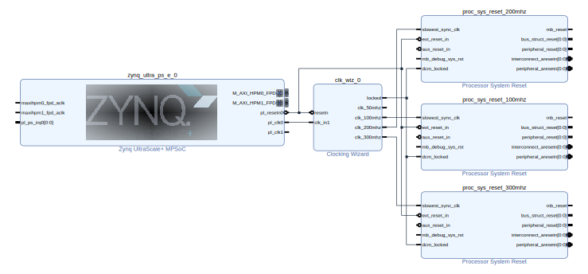
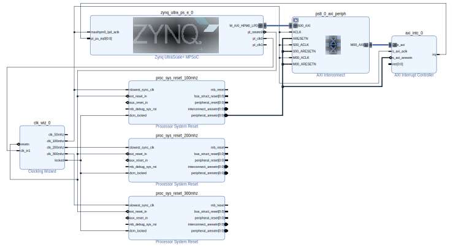
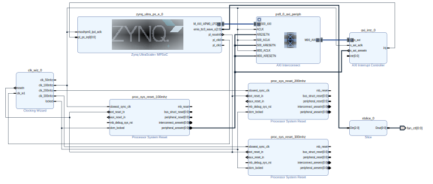
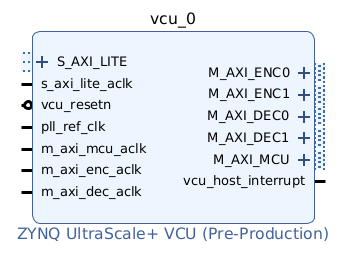
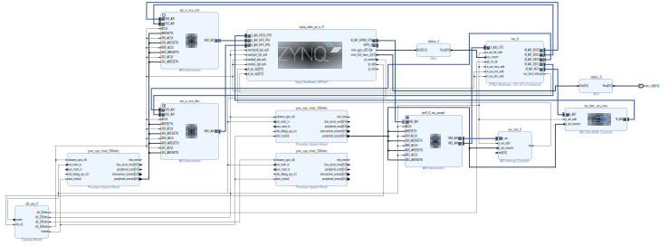

# Design of an Extensible Platform for Streaming Applications on Kria KV260

---
- [Design of an Extensible Platform for Streaming Applications on Kria KV260](#design-of-an-extensible-platform-for-streaming-applications-on-kria-kv260)
  - [Overview](#overview)
  - [Basic hardware infrastructure](#basic-hardware-infrastructure)
  - [Interrupt Controller](#interrupt-controller)
  - [Fan Control](#fan-control)
  - [Video Codec Unit](#video-codec-unit)
  - [Address assignment and platform setup](#address-assignment-and-platform-setup)
  - [Validate and export the design](#validate-and-export-the-design)
  - [Create a Vitis Platform](#create-a-vitis-platform)
  - [Links](#links)

---
## Overview
* This tutorial describes the development of a so-called `Extensible Hardware Platform`. The extensible hardware platform contains the `static and unchanging hardware components` that should always be present in the design as well as the infrastructure for the `v++ linker` to integrate additional hardware kernels later on. These additional HW kernels are developed independently, packaged into PL kernels (`.xo` files) and can automatically be connected with the signals and interfaces provided by the extensible hardware platform in a later development stage using the `Vitis IDE`. This separation allows for more rapid development and testing of different hardware functions by letting one easily exchange and test different PL kernels utilizing the `v++ linker` without having to alter the hardware design manually. 
  
* Vitis extensible HW platform development can be divided into two parts:

  * Platform hardware creation in Vivado. It exports an XSA file with clock, reset, AXI interface and interrupt signals and properties.
  
  * Platform creation in Vitis to combine all hardware and software components and generate a XPFM description, which can be subsequently used in Vitis application projects. The development of a Vitis application project is not described here (see e.g. tutorial `vitis_kernel_based_design.md`).

* In order to support video streaming applications, the extensible hardware platform will contain the following components: 
  * The hardware infrastructure and configuration required for the v++ linker to connect the PL kernels with the platform like platform clocks, `Processor System Reset` IPs required for each clock that should be exported (i.e. made available for kernel linking), `AXI interfaces`, etc. 
  * A `Clocking Wizard` IP block generating four different clock signals with 50 MHz, 100 MHz, 200 MHz and 300 MHz with corresponding `Processor System Reset` IPs. 
  * An `AXI Interrupt Controller` IP block to support more than 16 interrupt signals from PL kernels. 
  * A `VCU (Video Codec Unit)` IP block for enabling hardware accelerated video encoding and decoding using `H.264 compression`. Video compression is neccessary to be able to stream the video data over the network in real time.
  * A connection of the `fan-control pin` with the Zynq's processing unit to allow the operating system to control the fan speed.

* In the following we assume the `Kria KV260 Vision AI starter kit` is used as target system and the Ubuntu 22.04 image is installed on the target. For the installation of the Ubuntu image please refer to the document `ubuntu.md` in the folder `linux`.
* The work described below has to be done very carefully step-by-step. You can always save the design in Vivado and come back later. Check that your platform looks the same as the images shown in the different steps.
* The development described here has been tested with Vivado/Vitis Version 2024.1. Depending on your installation you may have to adapt paths (e.g. paths to the Xilinx installation on your computer) in the scripts etc.

---
## Basic hardware infrastructure
1. Create a workspace and launch Vivado  
2. Create a Vivado project named `kv260_hw_platform`.
   * Select `File>Project>New`, Click `Next`.
   * In Project Name dialog set Project name to `kv260_hw_platform` and keep `Create project subdirectory` checked. Then click `Next`.
   * Under `RTL Project` enable `Project is an extensible Vitis platform` and `Do not specifiy sources at this time`. Click `Next`.
   * Select `Boards` tab
     * Click `Refresh` button to load the latest list of boards.
     * Select `Kria KV260 Vision AI Starter Kit SOM` (or `Kria KV260 Vision AI Starter Kit`).
     * Click `Connections`, click drop-down button and select `Vision AI Starter Kit carrier card`, click `OK`.
     * Click `Next`.
   * Review project summary and click `Finish`
3. Create a block design.
   * In Project Manager, under IP INTEGRATOR, select `Create Block Design`.
   * Change the design name to `system`. Click `OK`.
4. Add MPSoC IP and run block automation to configure it.
   * Right click Diagram view and select `Add IP`.
   * Search for `zynq` and then double-click the `Zynq UltraScale+ MPSoC` from the IP search results.
   * Click the `Run Block Automation` link to apply the board presets. In the Run Block Automation dialog, ensure the following is check marked:
     * `All Automation`
     * `Zynq_ultra_ps_e_0`
     * `Apply Board Presets`
     * Click `OK`.
5. Next we need to generate several clock signals for the different PL components of the design and the kernels that will be linked into the design later on. For this design four different clock signals are needed with frequencies of `50 MHz`, `100 MHz`, `200 MHz`, and `300 MHz` respectively. 
   * Right click Diagram view and select `Add IP`.
   * Search for and add a `Clocking Wizard` from the IP Search dialog.
   * Double-click the `clk_wiz_0` IP block to open the Re-Customize IP dialog box.
   * Click the `Output Clocks` tab.
   * Enable `clk_out1` to `clk_out_4` in the `Output Clock` column and set the requested output frequency to `50 MHz`, `100 MHz`, `200 MHz` and `300 MHz`. 
   * To keep the design clear and readable, give the clocks port names reflecting their frequencies: `clk_50mhz`, `clk_100mhz`, `clk_200mhz`, `clk_300mhz`. 
   * At the bottom of the dialog box set the `Reset Type` to `Active Low`.
   * Click `OK` to close the dialog. 
6. Make the following connections: 
   * Connect the `clk_wiz_0/clk_in1` input with the `zynq_ultra_ps_e_0/pl_clk0` signal of the Zynq IP. 
   * Connect the `clk_wiz_0/resetn` with the `zynq_ultra_ps_e_0/resetn0`. 
   * Note: There are several ways to create signal connections in Vivado. You can `manually` make connections (Pencil icon when hovering over a port of an IP and dragging to a target pin to create the connection), right-click a pin and select `Make Connection` from the context menu to select a target pin or use the `Connection Automation` feature and use the dialog.  
7. For each clock signal that should be exported in the platform, to make it accesible for the kernel linker in later development steps, a reset reset signal must be created via `Processor System Reset` blocks. In this design, we will export the `100 MHz`, `200 MHz` and `300 MHz` clocks later on.
   * Add three `Processor System Reset` IP blocks and rename them according to the corresponding clock signal: `proc_sys_reset_100mhz`, `proc_sys_reset_200mhz`, `proc_sys_reset_300mhz`.
   * For renaming select block and change name in `Block Properties` window (lower left).
   * Connect the `slowest_sync_clk` of each processor system reset with the corresponding clock signal of the clocking wizard: 
     * `proc_sys_reset_100mhz/slowest_sync_clk` with `clk_wiz_0/clk_100mhz`
     * `proc_sys_reset_200mhz/slowest_sync_clk` with `clk_wiz_0/clk_200mhz`
     * `proc_sys_reset_300mhz/slowest_sync_clk` with `clk_wiz_0/clk_300mhz` 
     * You can also use the `Connection Automation` to do this.
   * Connect each `ext_reset_in` pin of the processor system resets with the Zynq's `zynq_ultra_ps_e_0/pl_resetn0` pin. Again this can be done via `Connection Automation`.
   * Connect each `dcm_locked` pin of the processor system resets with the clocking wizards `clk_wiz_0/locked` pin. This has to be done manually.
   *  The following image shows how the system should look like.



8. Enable clocks for the platform
   * Go to `Platform Setup` tab. If it is not opened yet, use menu `Window > Platform Setup` to open it.
   * Click `Clock` tab
   * Enable the following clocks under `clk_wiz_0`: `clk_100mhz`, `clk_200mhz`, `clk_300mhz`
   * Change their `ID` to 0, 1 and 2
   * Set a default clock: click `Is Default` for `clk_200mhz`
   * After everything is setup, it should report `Info: No problem with Clock interface`.
   * Note: There should be only one default clock in the platform. The v++ linker (in an application project in Vitis IDE) will use the default clock to connect the IP blocks if there are no user assignments for link configuration.
  
---
## Interrupt Controller

1. The v++ linker can automatically link the interrupt signals between kernel and platform. The available interrupt signals in the platform are exported by `PFM.IRQ property`.
For simple designs, interrupt signals can be sourced by processor's `pl_ps_irq`. The limitation is that it can only supply maximum 16 interrupt signals. To supply more interrupt signals, we can use an AXI Interrupt Controller. We will enable AXI HPM0 LPD to control the AXI Interrupt Controller, add the AXI Interrupt Controller and enable interrupt signals for PFM.IRQ. Enable AXI HPM0 LPD to control the AXI Interrupt Controller:
   * In the block diagram, double-click the `Zynq UltraScale+ MPSoC` block.
   * Select `PS-PL Configuration > PS-PL interfaces > Master interface`.
   * Enable the `AXI HPM0 LPD` option.
   * Expand the arrow before AXI HPM0 LPD. Check the AXI HPM0 LPD Data width settings and keep it as default 32.
   * Disable `AXI HPM0 FPD` and `AXI HPM1 FPD`. We reserve AXI HPM0 FPD and AXI HPM1 FPD for kernel usage. Disabling them from the block diagram can prevent auto connection to use it by accident. We can export the unused AXI interfaces in Platform Setup, no matter if it is visible in the block diagram or not.
   * Click `OK` to finish the configuration.
2. Add the AXI Interrupt Controller and configure it.
   * Right click Diagram view and select `Add IP`, search and add `AXI Interrupt Controller IP`. It is instantiated as `axi_intc_0`.
   * Double click the `AXI Interrupt Controller` block, change `Interrupt Output Connection` to `Single` so that it can be connected to PS IRQ interface.
   * Click `OK`.
3. Connect AXI Interfaces of axi_intc_0 to AXI HPM0 LPD of PS.
   * Click `Run Connection Automation`
   * Review the settings (`axi_intc_0` is enabled, `s_axi interface` is to be connect to `/zynq_ultra_ps_e_0/M_AXI_HPM0_LPD`)
   * Set `Clock Source` for `Slave Interface` and `Clock Source` for `Master Interface` to `/clk_wiz_0/clk_100mhz` (100 MHz)
   * Click OK
4. Connect irq of the Interrupt Controller
   * Connect `axi_intc_0.irq` to `zynq_ultra_ps_e_0.pl_ps_irq[0:0]` (manually).
   * The block diagram should now look as shown below.



5. Enable interrupt signals for the platform:
   * Go to `Platform Setup` tab
   * Go to `Interrupt` tab
   * Enable `intr` under `axi_intc_0`
6. As mentioned above we will enable also the AXI Master interfaces in the PS:
   * Go to `Platform Setup` tab
   * Go to `AXI Port` tab in Platform Setup
   * Under `zynq_ultra_ps_e_0`, enable `M_AXI_HPM0_FPD` and `M_AXI_HPM1_FPD`. Keep the `Memport` and `sptag` default to `M_AXI_GP` and `empty`.
   * `M_AXI_GP` means general purpose AXI Master interface, `sptag` is only applicable to AXI slave interfaces.
   * The v++ linker will instantiate AXI Interconnect automatically to connect between PS AXI Master interfaces and slave interfaces of acceleration kernels. One AXI Master interface can connect up to 16 kernels.
7. Enable AXI Master interfaces from AXI Interconnect:
   * Under `ps8_0_axi_periph`, click `M02_AXI`, press Shift and click `M08_AXI` to multi-select master interfaces from `M02_AXI` to `M08_AXI`.
   * Right click the selection and click on `Enable`.
   * Keep the `Memport` and `sptag` default to `M_AXI_GP` and `empty`.
8. Enable AXI Slave interfaces from PS to allow kernels access DDR memory:
   * Under `zynq_ultra_ps_e_0`, select the following AXI slave interfaces: `S_AXI_HPC1_FPD`, `S_AXI_HP2_FPD`, `S_AXI_HP3_FPD`. Do not select the other slave interfaces.
   * Right click the selections and select `enable`.
   * Change Memport of `S_AXI_HPC1_FPD` to `S_AXI_HP` because we will not use any coherent features for these interfaces.
   * Type in simple `sptag` names for these interfaces so that they can be selected by v++ configuration during linking phase: `HPC1`, `HP2`, `HP3`.

---
## Fan Control

* To enable Linux to control the fan on the Kria board, an EMIO mapping between the PWM output of the TTC0 subsystem of the Zynq's PS and the physical A12 pin of Zynq that is connected to the fan on the Kria board must be provided.
1. Open the PS configuration dialog by double-clicking `Zynq UltraScale+ MPSoC`.
   * Activate `I/O Configuration > Low Speed > Processing Unit > TTC0 > Waveout`. Select `EMIO` as `I/O`.
   * Close the PS configuration dialog by clicking `OK`.
2. Since only one of TTC0's output signals is needed, we will use a `slice` IP to select one output. Right click Diagram view, select `Add IP`, search and add `Slice`.
   * Double click the `Slice` block, set
     - `Din Width = 3`
     - `Din From = 2`
     - `Din Down To = 2`
     - `Dout Width = 1`
   * Click `OK` to close the `Slice` configuration dialog.
3. Connect PS port `emio_ttc0_wave_o[2:0]` to `Slice` port `Din[2:0]`.
4. Connect `Slice` port `Dout[0:0]` to a new I/O port by right-clicking port `Dout[0:0]` and selecting `Make External`. Rename the new I/O port to `fan_ctl` (Select port and rename in properties window on lower left side).
5. Create a new constraint file by selecting `Project Manager > Add Sources > Add or create constraints`. Click `Create File`, set `fan_ctl.xdc` as file name and click `Finish`.
   * Open the new constraint file by double-clicking `Sources > Constraints > fan_ctl.xdc`. Add constraints as follows:
       ```
       set_property PACKAGE_PIN A12 [get_ports {fan_ctl[0]}]
       set_property IOSTANDARD LVCMOS33 [get_ports {fan_ctl[0]}]
       set_property SLEW SLOW [get_ports {fan_ctl[0]}]
       set_property DRIVE 4 [get_ports {fan_ctl[0]}]
       ```
   * Save and close `fan_ctl.xdc`
6. The block diagram should now look as shown below.
    


---
## Video Codec Unit

* In the following steps we'll be integrating the `VCU (Video Codec Unit)` IP block into the design to enable applications to compress and decompress `H.264/H.265` video streams with `hardware support`. The video codec is implemented as an embedded `hard IP` inside `Zynq UltraScale+ MPSoC` located on the PL side. The VCU block provides the following interface that need to be connected to the design: 



* To connect the AXI master interfaces to the Zynq Processing System we will use the Zynq's `AXI HP0 FPD`, `AXI HP1 FPD` and `AXI HPC0 FPD` slave interfaces. To control the VCU, its AXI slave interface will be connected to the Zynq's `AXI HPM0 LPD` master interface. 

* The VCU has specific requirements concerning its clocking: 
  - Max. frequency of `MCU clock`: 444 MHz
  - Max. frequency of `AXI Master clocks`: 333 MHz
  - Max. frequency of `AXI Slave clock`: 167 MHz
  - Range of the `PLL reference clock`: 27 MHz to 60 MHz

* Additionally the following ratio requirements need to be met: 
  - `s_axi_lite_aclk` ≤ 2 × `m_axi_enc_aclk`
  - `s_axi_lite_aclk` ≤ 2 × `m_axi_dec_aclk`

* To fullfill those requirements, the VCU will be connected with clock signals in the following way: 
  - `vcu0/m_axi_enc_aclk` and `m_axi_dec_aclk` with 300 MHz
  - `vcu0/m_axi_mcu_aclk` and `vcu0/s_axi_lite_aclk` with 100 MHz
  - `vcu0/pll_ref_clk` with 50 MHz  

* There is one interrupt line from the VCU core to the PS (`vcu_host_interrupt`), which has to be connected to either `PL-PS-IRQ0[7:0]` or `PL-PS-IRQ1[7:0]`. We'll be using the Zynq PS `ps_pl_irq1` port for this purpose. The `vcu_resetn` signal of the VCU should be tied to either `AXI GPIO` or `ZynqMP GPIO(EMIO)`.   

* More details on the `VCU` IP and its requirements can be found [here](https://docs.xilinx.com/r/2022.1-English/pg252-vcu/H.264/H.265-Video-Codec-Unit-v1.2).

* With the following steps, we will integrate the VCU in our platform:

1. Zynq PS configuration: 
   * `Double-click` on the `Zynq PS` IP to open the configuration dialog.
   * In the `PS-PL Configuration` options: 
     - Expand `PS-PL Interfaces > Slave Interfaces` and enable: `AXI HP0 FPD`, `AXI HP1 FPD` and `AXI HPC0 FPD`.
     - Expand `General > Interrupts > PL to PS`, enable `IRQ1[0-7]` (select `1` in dropdown list) to expose the `pl_ps_irq1` interrupt port for connection.
   * In the `I/O Configuration` options: 
     - Expand `I/O Configuration > Low Speed > I/O Peripherals > GPIO`, enable `GPIO EMIO` and select `92` in the dropdown list.
   * Click `OK` to apply the changes
2. Add the `Zynq UltraScale+ VCU` IP to the block design
3. Add two `AXI Interconnect` IPs 
   * Rename them to `axi_ic_vcu_enc` and `axi_ic_vcu_dec` respectively
4. Configure (double-click IP) both `AXI Interconnects` with the following parameters: 
   * Tab `Top Level Settings`: 
     - `Number of Slave interfaces`: 2
     - `Number of Master interfaces`: 1
   * Tab `Slave Interfaces`: `Enable Register Slice` = `Outer` for both slave interfaces.  
   * Tab `Master Interfaces`: `Enable Register Slice` = `Outer` for the master interface.
5. Add one `AXI Data Width Converter` IP and rename it to `axi_dwc_vcu_mcu`.
6. Click the `Run Connection Automation` link (the light-green banner at the top of the block diagram view).
   * Enable `S_AXI_HP0_FPD` under `zynq_ultra_ps_e_0`, set the options as follows: 
     - Master Interface: `vcu0/M_AXI_ENC0`
     - Bridge IP: `axi_ic_vcu_enc`
     - Clock source for master and slave interface: `clk_wiz_0/clk_300mhz`
   * Enable `S_AXI_HP1_FPD` under `zynq_ultra_ps_e_0`, set the options as follows: 
     - Master Interface: `vcu0/M_AXI_DEC0`
     - Bridge IP: `axi_ic_vcu_dec`
     - Clock source for master and slave interface: `clk_wiz_0/clk_300mhz`
   * Click `OK` to let the `Designer Assistance` apply the connections.
7. Click the `Run Connection Automation` link again.
   * Under `vcu_0`: 
     - Enable `M_AXI_DEC1` and set the `Slave interface` to `zynq_ps_ultra_e_0/S_AXI_HP1_FPD`.  
     - Enable `M_AXI_ENC1` and set the `Slave interface` to `zynq_ps_ultra_e_0/S_AXI_HP0_FPD`.
      - Enable `pll_ref_clk` and set the `Clock Source` to `clk_wiz_0/clk_50mhz`.
      - Enable `S_AXI_LITE`, leave `Clock source for Slave interface` at `Auto`.
   * Click `OK` to let the `Designer Assistance` apply the connections. 
8. Create the following connections manually: 
   * Zynq PS:  
     - `zynq_ultra_ps_e_0/saxihpc0_fpd_aclk` with `clk_wiz_0/clk_100mhz`
   * VCU: 
     - `vcu_0/vcu_host_interrupt` with `zynq_ultra_ps_e_0/pl_ps_irq1[0:0]` 
     - `vcu_0/m_axi_mcu_aclk` with `clk_wiz_0/clk_100mhz`
   * Add a `Slice` IP to the block design.
     - `Double-click` on it to configure: 
       - Din Width : 92
       - Din From  : 2
       - Down To   : 2
       - Dout Width: 1
     - Connect the Slice `Din` with the Zynq's `emio_gpio_o[91:0]`.
       - Note: If Zynq's `emio_gpio_o[91:0]` is not visible, click on the `+` symbol next to the `GPIO_0` port on the Zynq PS block.
     - Connect the Slice's `Dout[0:0]` to `vcu_0/vcu_resetn`.
   * AXI Data Converter (`axi_dwc_vcu_mcu`): 
     - `axi_dwc_vcu_mcu/s_axi_aclk` with `clk_wiz_0/clk_100mhz`
     - `axi_dwc_vcu_mcu/s_axi_aresetn` with `proc_sys_reset_100mhz/peripheral_aresetn[0:0]`
     - `axi_dwc_vcu_mcu/S_AXI` with `vcu_0/M_AXI_MCU`
     - `axi_dwc_vcu_mcu/M_AXI` with `zynq_ultra_ps_e_0/S_AXI_HPC0_FPD`

9. Configure the VCU (`Double-click` the `VCU` IP): 
   * Open the `Basic Configuration-Tab`: 
     - Encoder Configuration:  
       - Enable Encoder: 🗹
       - Coding Standard = HEVC
       - Coding Type = Intra & Inter Frame
       - Resolution = 3840x2160
       - FPS = 30
       - Color Format = 4:2:0
       - Color Depth = 8bpc
       - Use Encoder Buffer: 🗹
       - Memory Resource Type = URAM ONLY
       - Max Number of Encoder Streams = 1
     - Decoder Configuration: 
       - Enable Decoder: 🗹
       - Coding Standard = HEVC
       - Coding Type = Intra Frame Only 
       - Resolution = 3840x2160
       - FPS = 30
       - Color Format = 4:2:0
       - Color Depth = 8bpc
       - Max Number of Decoder Streams = 1   
 
   * Note: The options set in the VCU configuration dialog are only used to estimate power consumption, bandwith and to calculate the encoder buffer size by Vivado. The actual VCU subsystem configuration is controlled by software at runtime. 
   * At this point, the VCU interface should be fully connected. The resulting block diagram should be similar to the one shown in the image below.



---
## Address assignment and platform setup
1. Switch to the `Address Editor` tab and auto-assign the address segments (`Assign All` button).
2. Switch to the `Platform Setup` tab and check the following settings to the platform (most of them have been applied already during the step `Interrupt Controller`): 
   - `AXI Port`: 
     - Under `zynq_ultra_ps_e_0`, enable the `M_AXI_HPM0_FPD` and `M_AXI_HPM1_FPD AXI` ports. Keep the `Memport` and `sptag` default (`M_AXI_GP` and `empty`).
     - Under `zynq_ultra_ps_e_0`, enable the AXI slave interfaces: `S_AXI_HPC1_FPD`, `S_AXI_HP2_FPD`, `S_AXI_HP3_FPD`.
     - Change the Memport of `S_AXI_HPC1_FPD` to `S_AXI_HP` because we will not use any coherent features for these interfaces.
     - Type in simple `sptag` names for these interfaces so that they can be selected by v++ configuration during linking phase: `HPC1`, `HP2`, `HP3`.      
     - Under `ps8_0_axi_periph`, select and enable interfaces from `M02_AXI` to `M08_AXI`. Keep defaults for `Memory` and `sptag` (`M_AXI_GP` and `empty`).
   - `Clock`: 
     - Enable the clocks: `clk_100mhz`, `clk_200mhz` and `clk_300mhz`, change their ID to  0, 1 and 2 and select the `200 MHz` clock as `default` clock for the v++ linker.
   - `Interrupt`: Enable `intr` under `axi_intc_0`
   - `Platform name`: 
     - Name: `kv260_hw_platform`
     - Board: `kv260`
     - Vendor: `xilinx`
     - Version: `1.0`

---
## Validate and export the design

1. Validate the block design
   * Click the `Validate Design` button in the block design Diagram window.
   * Note: During validation, Vivado reports a critical warning that `/axi_intc_0/intr` is not connected. This warning can be safely ignored because v++ linker will link kernel interrupt signals to this floating intr signal. This message will also show up in the following steps.
2. Create a top module wrapper for the block design
   * In Source tab, right click `system.bd` in `Design Sources` group.
   * Select `Create HDL Wrapper...`
   * Select `Let Vivado manage wrapper and auto-update`.
   * Click `OK` to generate wrapper for block design.
3. Generate the design
   * Select `Generate Block Design` from Flow Navigator
   * Select `Synthesis Options` to `Global`. It will skip IP synthesis during generation.
   * Click `Generate`.
   * Click `Generate Bitstream` in Flow Navigator window (under `PROGRAM AND DEBUG`).
   * Click `Yes`.
4. Export the platform
   * Click menu `File > Export > Export Platform` to launch the Export Hardware Platform wizard. This wizard can also be launched by `Export Platform` button in Flow Navigator or `Platform Setup` window.
   * Click `Next` in the first information page.
   * Select `Platform Type`: `Hardware`, click `Next`. 
   * Select `Platform State`: `Pre-synthesis`, enable `Include Bitstream`, click `Next`
   * Input `Platform Properties` and click `Next`. For example:
     * Name: `kv260_hw_platform`
     * Vendor: `xilinx`
     * Board: `kv260`
     * Version: `1.0`
     * Description: `This platform contains a VCU and provides three clocks with 100MHz, 200MHz and 300MHz.`
    * Fill in XSA file name: `kv260_hw_platform` and keep the export directory as default.
    * Click `Finish`.
    * `kv260_hw_platform.xsa` will be generated. The export path is reported in the Tcl console.

---
## Create a Vitis Platform
* So far we have designed the extensible platform with Vivado and exported it as `.xsa`-file. For application projects in Vitis we need to generate a Vitis platform. This will be done in the following steps with Vitis. The generated platform project can then be referenced in Vitis application projects (see other tutorials). The platform project has to be generated only once and can serve different Vitis application projects. For the following steps and also the Vitis application projects it is assumed that you have a Vitis installation (Version 24.1) under Linux (Ubuntu 22.04).
* Before starting Vitis make a directory which will serve as a Vitis workspace (e.g. _kv260_vitis_platform_). 
* Start Vitis. On the welcome page select `Embedded Development > Create Platform Component`
  * Add the `Component name` (e.g. _kv260_platform_) and `Component location` (the directory you created). Select `Next`.
  * On the next page select `Hardware Design` and select the `kv260_hw_platform.xsa` file, you generated with Vivado in the previous chapter. Select `Next`.
  * On the next page you will have to wait a little until the fields are populated. Change the operating system to `linux` and leave the processor to `psu_cortexa53`. 
  * Uncheck option `Generate boot artifacts` because we have already an up and running Ubuntu Linux on the target. Click `Next` and `Finish`.
* When the generation of the platform project has finished the settings file (`vitis-comp.json`) should be open. Click the `linux psu_cortexa53` entry: The fields marked red are not really needed for our purpose, since we do have a running Ubuntu Linux on the Kria board. Leave the fields empty.
* In the Flow view, click the `Build` button to generate the platform. You will see an error due to the missing entries in the fields mentioned above but the platform is generated anyway.
* The generated platform directory named `kv260_platform` is placed in the `kv260_platform/export` directory in the Vitis workspace. The platform is ready to be used for application development (see the tutorials on application projects). 
   * You just have to keep this exported platform directory and can also copy it to another place. In the application projects you have to reference to this platform directory. 
   * You may want to keep the Vivado project for the platform, in case that you want to make changes to it or in case something is wrong with the platform.


---
## Links

* https://xilinx-wiki.atlassian.net/wiki/spaces/A/pages/1641152513/Kria+K26+SOM
