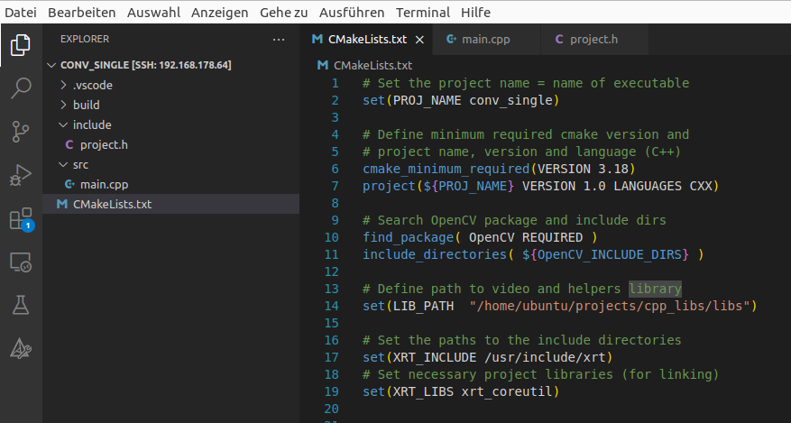
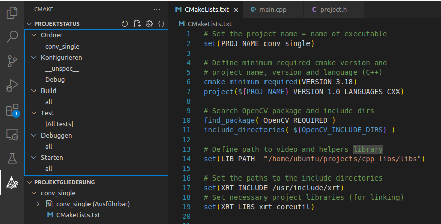

# VS Code C++ Development

Author: F.Kesel, 17.07.24

---
- [VS Code C++ Development](#vs-code-c-development)
	- [Overview](#overview)
	- [Connecting VS Code to the target](#connecting-vs-code-to-the-target)
	- [SW development in C/C++ with VS Code and CMake](#sw-development-in-cc-with-vs-code-and-cmake)
	- [Using the Gstreamer Backend with C/C++](#using-the-gstreamer-backend-with-cc)


---
## Overview

* The following describes how to develop a C++ based SW application on the Kria board which uses HW kernels, the OpenCV library and the Gstreamer framework for video streaming applications.
* We will use VS Code for remote development and connect via SSH to the Kria target. You can find informations on VS Code under https://code.visualstudio.com There is also a download section with downloads for Windows, Linux or MacOS.
* For C++ based SW development we will use CMake in VS Code. Development and compilation of the code will be done remote on the Kria target. The advantage is that all necessary libraries are on the target and no cross-compilation tool chain is needed on the host. As a disadvantage the compilation times on the Kria target may be longer compared to a powerful host computer.
* By using the "Dev Containers" extension we can also connect to a Docker container running on the Kria target. This is optional.
* The following extensions are needed for VS Code on the development computer:
	* `C/C++`
	* `CMake tools`
	* `Dev Containers` (if connection to a Docker container is needed)
	* `Remote SSH`, `Remote Explorer`
	* Some of the extensions will be automatically installed on the target system, when connecting to it.
* In the demo `convolution_opencv` there are two application examples in the folder `cpp_sw` with C++ code and a CMake file. Both examples use a small SW library, which can be found in the sub-folder `helper_libs_src`. The application examples and the library must be transferred to the Kria target. The library must be compiled before being used in the projects. There is a bash shell script `make_and_install.sh` for compiling and installing the library. If you want to change the path where the library is installed just edit the script and change the path in `cmake -DCMAKE_INSTALL_PREFIX=`. Make sure that this path is then adapted in the project `CMakeLists.txt` file.


---
## Connecting VS Code to the target
* Connecting to the target with VS Code via SSH:
	* Open the command palette (`Ctrl-Shift-P` or `F1`) and type `remote-ssh`. Select the entry `Connect to host ...`. You must enter your SSH credentials (`<user>@<host-ip>`).
	* After the first connection you should find the SSH connection in the `Remote Explorer` for re-connecting. Select the IP address and push the arrow symbol to re-connect.
	* If you do not need the Docker container, you can select your project directory and start developing (see [SW development in C/C++ with VS Code and CMake](#sw-development-in-cc-with-vs-code-and-cmake)). 
* Connect to the Docker container on the target (optional):
	* SSH connection needs to be established, see above
	* Start Docker container on Kria target 
	* In VS Code: `Dev Containers: Attach to Running Container` > Select container, a new VS Code window will open up.
	* Select your project directory and start developing.
	* When you are finished close the connection (Bottom left green field).

---
## SW development in C/C++ with VS Code and CMake
* We will use CMake for building the C++ SW application. CMake is a build system where you can describe all dependencies of a SW project in a simple text file (always named `CMakeLists.txt`). CMake stands for cross-platform make and is basically a generator which creates platform specific build scripts. When used under Linux it generates scripts for the `make` build system.
* If you are not familiar with CMake you can find a tutorial on VS Code with CMake here (for Linux): https://code.visualstudio.com/docs/cpp/cmake-linux 
* We will develop remote on the Kria host running Ubuntu Linux, the necessary tools like cmake, make and the gcc-toolchain should be already installed. If not then follow the instructions in the VS Code tutorial in order to install the tools. 
* Each CMake based SW project has the same directory structure as shown below:
  * For all header files there is a folder `include`  and for all .cpp files there is the folder `src`. In the root directory of the project there is the  `CMakeLists.txt` file for CMake. During the CMake processing in VS Code an additional folder `build` will be generated. 
  * Please see for example the project `conv_single` which has exactly this structure.

```
├── CMakeLists.txt
├── include
│   └── project.h
└── src
    └── main.cpp

```
* Open VS Code remote on the Kria target as described in [Connecting VS Code to the target](#connecting-vs-code-to-the-target). Then open the folder `conv_single` on the Kria target in VS Code. You should see the opened project as in the image below (not fully shown in the image, content of CMakeLists.txt may be different in your project):



* The `CMakeLists.txt` file defines the paths to the libraries, namely the OPenCV and XRT libraries and the helpers library, which you found in the folder `helper_libs_src`: Depending on where you copied and installed this library you may have to change the library path. When you scroll further down the `CMakeLists.txt` file you will see project include and source directory and the specification of the executable and its dependencies. The nice thing here is that you do not have to change anything here as long as you stick to the directory structure described above: All header files in the folder `include` and all .cpp files in the folder `src`. The last two entries in the `CMakeLists.txt` file specify the compiler options and how the executable must be linked to the libraries. For new projects you can just copy the `CMakeLists.txt` file and change the project name in the second line of the file - the rest should work, if you use the same libraries.
* For building the project select the CMake symbol in the side bar of VS Code (last symbol). You should see the CMake view as shown in the image below:



* You first have to configure the tool chain ("kit") to be used: Move the mouse over `Konfigurieren > __unspec__` and select the stylus symbol. Select one of the kits, e.g. `gcc 11.4.0 aarch64-linux-gnu`, which should be shown then instead of `__unspec__`.
* Move the mouse over `Build` and select the build symbol. Your code should be built and you can see the output in the OUTPUT view below the editor. Since you copied an existing project there should be no errors during the build process, provided that the library paths are correct.
* You can now run the application if you move the mouse to `Starten` and select the symbol. The application can also be run on the command line in the `build` directory.
* Above the  `Starten` entry there is also a `Debugggen` entry which can be used to debug the code. Make sure that you have set at least one break point in the source code by clicking left to the line number in the editor. The debugger is based on `gdb` and VS Code will jump to the debugger view with the standard debugging features. 

---
## Using the Gstreamer Backend with C/C++
* If you want to build a C++ video streaming application with OpenCV and a OpenCV hardware kernel you can use a Gstreamer pipeline as a backend. Information on Gstreamer can be found in the document [gstreamer.md](gstreamer.md)
* In the software application example `conv_stream` you can find an example on how to feed a Gstreamer pipeline which streams the video frames over RTP to a remote computer.
* In the example the following line of code opens the OpenCV video writer object with a Gstreamer pipeline, `output_pipeline` is a string defining the pipeline. The 3rd argument (`0`) defines the `fourcc` argument which is 0 if Gstreamer is used. The 4th argument specfies the framerate (30 fps), then follows the size of the frames and the last argument specifies that grayscale frames are used.

```
cv::VideoWriter out(output_pipeline, cv::CAP_GSTREAMER, 0, 30.0, cv::Size(width, height), false);
```
* The Gstreamer pipeline is defined as a string in the `project.h` header file. The `videoconvert` stage converts the video frames received from the application source (`appsrc`) such that it can be sent via RTP to the host computer. In this case no video compression is used. There is also a second string defined in the same header file for H264 compression, but in this case special drivers for the H264 kernel are needed for which a Docker container is needed. This will be described in another tutorial.

```
#define GST_PIPELINE  "appsrc  ! videoconvert ! rtpvrawpay ! udpsink host=192.168.178.62 port=50000"
```
* In the main loop (file `main.cpp`) the image frames are written to the pipeline with:
```
out.write(hwOutImgMat);
```
* Note: It is important that the OpenCV library was compiled with support for Gstreamer. In addition to the steps described in [opencv_installation.md](opencv_installation.md) you need to do the following:
  * Before installation of the OpenCV library you need to install the following packages: `sudo apt install libgstreamer1.0-dev libgstreamer-plugins-base1.0-dev`
  * For installation of the OpenCV library you need to add the Gstreamer support with the switch `-D WITH_GSTREAMER=ON ` for cmake.