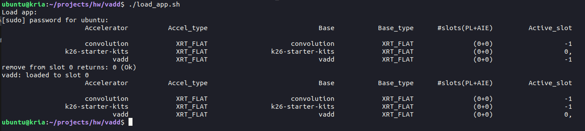

# Vitis Kernel Based Design Tutorial

---
## Overview
* In this tutorial the kernel based design using an extensible platform is described. You can find a pre-built extensible platform [here](../resources/extensible_platform/). Download the zip-file and unpack it on your computer. The location of the platform-directory can be anywhere on your computer. 
* It is assumed that you have a Kria KV260 Starter Kit board with Ubuntu Linux (Version 22.04) and the _Pynq_ framework for running Jupyter notebooks on the Kria target. Further information can be found here: 
  * [Ubuntu Linux for the Kria KV260](https://xilinx-wiki.atlassian.net/wiki/spaces/A/pages/2363129857/Getting+Started+with+Certified+Ubuntu+22.04+LTS+for+Xilinx+Devices)
  * [Pynq](http://www.pynq.io/)

* The tutorial will go through the following steps:
  * Develop the IP kernel with Vitis HLS and export them as .xo-files.
  * Build the FPGA hardware, i.e. the bitfile for the programmable logic, with Vitis v++ compiler (using a bash script).
  * Transfer the hardware bitfile to the Kria target for SW development with Pynq or C/C++ development. 
  * Import the hardware bitfile in Pynq as overlay and write Python SW with Jupyter Notebook running on the Kria board.
  * Develop a C/C++ software application. 
* The necessary source codes for this tutorial can be found [here](../kernel_based_design/reference_files/). Just copy the complete folder and keep the directory structure for this tutorial. You can either download this whole Github repository or only the folder `reference_files` using a browser extension like [GitZip](https://gitzip.org). Rename the folder to `vadd`. The sub-folders contain the following:
  * `dtbo`: Folder for generation of device tree data.
  * `hls`: Folder for IP core generation with Vitis HLS.
  * `kria/bash_scripts`: Here you can find some bash scripts for project setup on the Kria target.
  * `kria/cpp_libs`: Library for the C++ project.
  * `kria/pynq`: Here you can find the Jupyter notebook code which must be transferred to the Kria target.
  * `kria/vadd_sw`: Here you can find a C++ SW project using CMake as build system. The SW will be compiled on the Kria target directly.
  * `system`: This directory will be used for building the PL binary.
* The IP kernel development is done with Vitis HLS. You should have some knowledge on Vitis HLS and we recommend to do the [Vitis HLS tutorials](../../vitis_hls/hls_overview.md) beforehand. You will get all source codes and scripts necessary for HLS in the folder `reference_files/hls`. Project setup will be done based on a shell script as described in the HLS tutorials. We will not cover the details of project setup and the work with the Vitis GUI for a HLS project here. Please refer to the HLS tutorials for details.
* The tutorial has been tested with Vivado/Vitis Version 2024.1. Depending on your installation you may have to adapt paths (e.g. paths to the Xilinx installation on your computer) in the scripts etc.

---
## IP development in Vitis HLS
* In this step the IP core is developed with Vitis HLS. The complete source code for the HLS project can be found in the folder `demos > vadd > hls > src`. 
* There is a bash script `run_hls.sh` in the folder `demos > vadd > hls > project ` which does the HLS project setup and runs synthesis. Open the file `run_hls.sh` and check that the path `/opt/xilinx/Vitis/2024.1/settings64.sh` matches your installation of Vitis. Execute this script on the command line. 
  * The HLS project setup is defined in the file `project.cfg`. You must not change anything here.
  * The address width of the IP core is be set to 32 Bit in order to be usable with the Pynq Jupyter notebooks. This is set in the config file with: `syn.interface.m_axi_addr64=0`
  
* Start Vitis and open the directory `vadd/hls` as a workspace. You will  find now the completed synthesis and you can study the results. You may also run `C Simulation` and `C/RTL Cosimulation`, although the code has already been verified. 
* Then run the `Package` step in the flow. The IP Core is exported as _.xo-file_ for the kernel based flow.
  * Note the location of the _.xo-file_ for subsequent steps. It should be in the directory `hls/project/project_work` and is named `krnl_vadd.xo`. 

---
## Generate the Programmable Logic Binary
* In this step the programmable logic part of the project will be generated by using an _extensible platform_ and the IP core generated above. We will do this with a bash script `link_vadd.sh` which you can find in the directory `system`. In the script the _v++ compiler_ is used to link the HLS generated kernel with the extensible platform and generate the PL binary. 
* As already mentioned you can find an extensible platform for all projects [here](../resources/extensible_platform/). Unpack the file and store the platform directory on your computer. In the bash script `link_vadd.sh` you may have to adapt the path to the platform file where the extensible platform is stored on your computer. If you store it in the same folder as the Kria projects then the path should fit. 
* Start the bash script `link_vadd.sh` in a terminal. This may take a while (depending on the performance of your computer), since a complete Vivado implementation run is performed. When the script has finished you should find two files in the `system` directory:
  * `vadd_hw.xclbin`: This is the PL binary and must be transferred to the Kria target.
  * `vadd_hw.xsa`: This file is needed for the next step.
* The file `vadd_hw.xclbin.info` can be opened with a text editor and gives you some information on the generated hardware, e.g. base addresses and register offsets. You can also open Vitis for an analysis of the results with `vitis --analyze vadd_hw.xclbin.link_summary`.

---
## Generate a device tree overlay file 
* Besides the hardware binary a so-called `device tree overlay` (`.dtbo`) file is needed in order to properly load the hardware under Ubuntu Linux on the Kria target. 
* In the sub-folder `dtbo` you will find a bash-script `create_dtbo.sh` with which you can generate a dtbo-file. Open the script and adjust the path to your Vitis installation. The script calls a second tcl-script `dts.tcl`. In this second script there is a relative path to the _xsa-file_ generated in the step above. Check that this path points to the _xsa-file_. Execute the shell script `create_dtbo.sh`. When the script has finished you should have a device tree overlay file `pl.dtbo` in the sub-folder `dtbo`.
  * Warning messages issued by the shell script regarding unconnected or missing components or signals may safely be ignored.

---
## File transfer and directories on the target
* In order to use the FPGA hardware on the Kria target the FPGA binary must be transferred to the correct places in the Ubuntu file system on the target. Since we want to use the hardware with Pynq and also with application SW written in C++ we have to transfer them to three different places (for which we provide some bash scripts as described below):
  * A directory for installation of the FPGA binary ("firmware"). This MUST be a directory in `/lib/firmware/xilinx/` such that the `xmutil` tool can load the binary. Since these directories are owned by `root` you have to use `sudo` for the commands. The directory should be named like the name of the project `/lib/firmware/xilinx/<name>` and has the following content:
    * `pl.dtbo`: Device tree overlay
    * `binary_container_1.bin`: FPGA binary
    * `shell.json`: File provided in folder `kria/bash_scripts`.
  * A project directory for C++ development should be under `/home/ubuntu` for example `/home/ubuntu/projects/<name>` where `<name>` is the name of the project (here `vadd`). 
  * A project directory for Pynq development MUST be under `/home/root/jupyter_notebooks/` for example `/home/root/jupyter_notebooks/projects/<name>`, where `<name>` is the name of the project. Here again `root` is the owner, so you must use `sudo`.
* The file transfer from your development computer (we assume you have a Linux computer running Ubuntu 22.04 or a derivative) to the Kria target must be done with _SFTP_. For the execution of the bash scripts you must use an _SSH_ connection in a terminal. 
  * First you need to find out the IP address of the Kria board in your network. On the Kria board there is the user `ubuntu` (password should be `ubuntu`, if not set otherwise) with the home directory `/home/ubuntu`.
  * Open a terminal program and connect to the Kria target via SSH, for example with `ssh ubuntu@192.168.178.64` (assuming an IP address `192.168.178.64`). If you do not want to type always the password for login to the target, you can install the `sshpass` utility on your host. Then the command is: `sshpass -p <password> ssh ubuntu@192.168.178.64`, where `password` is the password of the user `ubuntu`. 
  * For _SFTP_ file transfer you can normally use the file manager of your Ubuntu distro and enter the network connection, for example `sftp://ubuntu@192.168.178.64/home/ubuntu`. You can also install an app like _FileZilla_ on your computer and use it for the file transfer.
* In the SSH terminal first make a project folder: 
  * In the `/home/ubuntu` home directory make a folder `projects` with `mkdir projects`.
  * In the `projects` folder make a folder for the `vadd` project with `mkdir vadd`.
* Transfer the bash scripts in the folder `kria/bash_scripts` and the file `shell.json` to the new project folder. The scripts are commented and you may have to change the project name in the scripts (should be `vadd`). You may also have to make them executable by `chmod a+x *.sh`.
  * _Note_: You should be able to open the remote file in a text editor on your computer from the file manager. 
* Transfer the FPGA binary `system/vadd_hw.xclbin` and the device tree file `dtbo/pl.dtbo` to the project folder.
* Initialize the folders/directories by executing the script `initialize_directories.sh`.
* Copy the FPGA binary to the firmware directory by executing the script `copy_xclbin.sh`
* Now we have everything in place to start SW development on the Kria target.

---
## SW development in Python with Jupyter notebooks and Pynq
* In the next step of this tutorial we will test the IP core with a SW application written in Python and executed by a Jupyter notebook application running on the Kria target. The Jupyter notebook code can be found in the folder `reference_files/kria/pynq/vadd_extensible.ipynb`.
* Copy the Jupyter notebook code `vadd_extensible.ipynb` (e.g. via sftp) first to the home directory on the Kria board (`/home/ubuntu`). Then open a ssh-shell on the Kria board and move the notebook into the path `/home/root/jupyter_notebooks/projects/vadd/` on the Kria board with:
  * `sudo cp vadd_extensible.ipynb /home/root/jupyter_notebooks/projects/vadd/`. 
* The notebook uses Python scripts as modules. Copy the directory `utils` (also in the folder `reference_files/kria/pynq/`) to the directory `/home/root/jupyter_notebooks/projects/` on the Kria target with:
  *  `sudo cp -r utils/ /home/root/jupyter_notebooks/projects/`. 
* The Jupyter notebook application is already running on the Kria board after booting the board and can be accessed via a web browser (`<ip_address>:9090/lab`, Password `xilinx`).
  * _Note_: The Jupyter notebook is running under the user _root_ and therefore we have a different password.
* Open the web browser with the IP address given above. You should find the Jupyter notebook file in the project directory `projects/vadd`. Open the notebook file and execute it. The notebook code is documented, so we omit any further explanations here. You may have to adapt paths (e.g. the project path).

---
## SW development in C++ on the Kria target
* In this step the application SW which is needed in order to test the IP core will be developed in C++. Normally SW is developed in Vitis and cross-compiled for the Kria target. Another possibility is to compile the SW directly on the target. As an advantage you do not need things like a _sysroot_, if you cross-compile for a Linux target and you do have less problems with incompatible libraries. As a disadvantage compilation times are normally longer on the Kria target, compared to a laptop computer. We use _VS Code_ (with _CMake_) on your laptop computer and do a remote development via _SSH_ on the Kria target. 
* We will use a small library for the project (which you can use also for other C++ projects), which first needs to be installed:
  * Copy the folder `kria/cpp_libs` to the Kria target in the folder `/home/ubuntu/projects`.
  * Go to the folder `cpp_libs/helper_libs_src` and execute the script `make_and_install.sh`.  This will compile the sources and install the library in the folder `cpp_libs/helper_libs`. The compilation is also based on _CMake_, which we will explain in more detail below. 
* In the directory `kria/vadd_sw` you can find the source code and the `CMakeLists.txt` file, which is needed for VS Code. Copy the directory `vadd_sw` to the project folder () on the Kria target.
* Before we can start SW development you have to load the FPGA binary (firmware) with the script `load_app.sh` (in your project folder). When you execute the script you should see something similar to the next image (you may not have the _convolution_ accelerator). In the last line you can see that the `vadd` _accelerator_ was loaded in the active _slot_ (marked with 0, all inactive slots are -1).

---
## References
* [Vitis Unified Software Platform Documentation: Application Acceleration Development (UG1393)](https://docs.xilinx.com/r/en-US/ug1393-vitis-application-acceleration)
