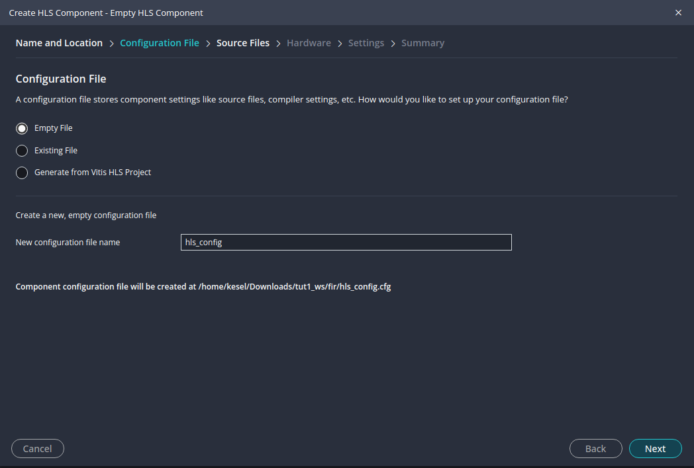

# HLS Tutorial 1: Project Setup and Basic Steps


---
## Overview
* In this tutorial the setup of a Vitis HLS component project is described. Furthermore the basic steps _C Simulation_, _C Synthesis_ and _C/RTL Cosimulation_ are described. As an example we take a simple FIR filter, the source code for the component and the testbench can be found in the folder `reference_files/src`.
* The project setup will be done in the Vitis GUI, this is described in [Creating a HLS component](#creating-a-hls-component). 
* You can setup a project also on the command line, this is described in [Creating components from the command line](#creating-components-from-the-command-line). You can then open the Vitis GUI and open the project workspace and continue working with the project. 
* It is essential that you understand the concept of workspaces and components before you start with a component project. This is described in [Workspaces and components](#workspaces-and-components).
* All setup data of a component is stored in a configuration file. If you setup a component project on the command line you need such a configuration file. You can find the content of a sample file in [Creating components from the command line](#creating-components-from-the-command-line) and in the folder `reference_files`. If you make changes later on in the Vitis GUI all changes will be stored in the same configuration file which you used for setting up the project.

---
## Workspaces and components
* A workspace can contain more than one component. If you want to generate several variants of an IP core, in order to compare them, you must generate for each variant a component (this was called _solutions_ in the old Vitis version).
* In each component folder there must be a configuration file which contains commands and directives for HLS and a work directory, which holds the various outputs of HLS.
* All components can refer to the same source files (in a folder `src`), so a directory structure for a workspace holding several variants of the same IP core should look like the following:
```
workspace_dir
			|-src
			|-component1
				|-component1_work
				component1_config.cfg
			|-component2
				|-component2_work
				component2_config.cfg
			|-...
```
* The directory structure for this tutorial follows this structure: In the folder `reference_files` you can find two solutions/components for the same source code. We will use them in the section [Creating components from the command line](#creating-components-from-the-command-line).

---
## Starting Vitis
* You can launch Vitis in a terminal on the command line by using the following command (replace `<Vitis_Installation_Directory>/` with the path to your Vitis installation which should normally be `/opt/xilinx/Vitis/2024.1/`), where `<workspace>` indicates the workspace mentioned in [Workspaces and components](#workspaces-and-components):

```
source <Vitis_Installation_Directory>/settings64.sh
vitis  -w <workspace> 
```

* Or you can start the Vitis GUI without a workspace with the command `vitis` on the command line and select an existing workspace in the Vitis GUI.
* For the tutorial make a folder with the file manager (for example in your home directory) to be used as a workspace and start the Vitis GUI as described above. You should see the Vitis GUI as shown in the following image (There are already some recent workspaces in the image which you will not see when you open your Vitis IDE).


---
## Creating a HLS component

* With the Vitis IDE opened, from the main menu select `File > New Component > HLS` 
	* You can also select `Create HLS Component` on the navigation pane on the left side or on the Welcome page in the _HLS Development_ section.
* This opens the _Choose Name and Location_ page of the _Create HLS Component_ wizard, as shown in the image below. Enter the component name (`fir`) and location (i.e. the workspace folder) and then push `Next`. The workspace should be the folder which you created as workspace.


* This opens the _Configuration File_ page of the wizard as shown below. The HLS component configuration file contains commands and directives used for the synthesis, simulation, and export of the component and is _the_ most important file (beside the source code files).




* The _Configuration File_ page of the _Create HLS Component_ wizard provides three ways to add a configuration file to your component:
	* `Empty File`: Specifies the creation of a new empty configuration file to be populated after component creation . Selecting this option lets you specify a name in the `New configuration file name` field.
	* `Existing File`: Specifies the use of an existing configuration file. Selecting this option lets you enter the path and name in the File field, or select _Browse_ to locate the file.
	* `Generate from Vitis HLS Project`: This option generates a new config file from an existing Vitis HLS project _hls.app_ file. 
	* Choose `Empty File` as the method of adding the config file to your HLS component, you can keep the name `hls_config` as file name. Select `Next` to proceed to the Source Files.
* The _Source Files_ page of the wizard opens:
	* Under _Design Files_ you can select the `Add files` symbol (marked in red in the image below) to select the primary source file for the design, or add multiple files as needed (not for this tutorial). Copy the `src` folder from the folder `reference_files` to your workspace (with the Linux file manager) and then select the source file `fir.c` with the  `Add files` symbol. There is no need to include the header file `fir.h`, Vitis will find it itself.
	* After adding the source file, you must identify the _Top Function_ which is the function to be synthesized as the top-level function for the HLS component. Push `Browse` and select the function `fir`.
	* Under _Test Bench Files_ you can select with `Add files` (marked in red) the testbench source code `fir_test.c` and a data file `out.gold.dat` which is needed by the testbench.
 	* For both design files and test bench files you can add CFLAGS and CSIMFLAGS to specify directives to be used during compilation and simulation. You can specify directives to be applied to all files or to specific files from each category. Adding these flags can also be done later on, for this tutorial leave the fields empty. After adding files and folders and directives, select `Next` to proceed.


* The _Select Part_ page of the wizard is opened. It is mandatory to select the correct FPGA part for which the component should be used later on. For this tutorial we use the Artix-7 part as shown in the next image. Proceed with `Next`. 


* You will now see the _Settings_ page of the wizard. 
	* The _Settings_ page lets you specify a clock period or frequency for the design, and a clock uncertainty. The default clock for the tool is a clock period of 10 ns (or 100 MHz), and a clock uncertainty of 27%. In this case enter the default clock frequency of 10 ns but change the uncertainty to 2 ns as shown in the image below.
	* The _Settings_ page also lets you specify the _flow_target_ for the HLS component build process as being either to generate a Vivado IP or a Vitis kernel as described in [Target Flow Overview](https://docs.amd.com/r/4lwvWeCi9jb~DWzdfWuVQQ/P4DbGaxyPEWYEJfsO7o1Dw) in the Xilinx User Guide. The interface requirements of the Vivado IP or a Vitis kernel are different as explained in [Interfaces of the HLS Design](https://docs.amd.com/r/4lwvWeCi9jb~DWzdfWuVQQ/wEdlxulOAT50bjDEn06U5Q). The default _flow_target_ is the Vivado IP flow. Keep these default settings for this tutorial.
	* Below the _flow_target_ you can also specify the _package.output.format_ for the tool to generate when packaging the design. The default output format is the Vivado IP, which generates a zip-file to be added to your IP catalog, letting you use the HLS generated RTL design in other designs.
	* The data you entered here and above are all stored in the configuration file.
	* Select `Next` to proceed to the Summary page.


* The _Summary_ page reflects the choices you have made on the prior pages. Review the summary and select `Finish` to create the HLS component, or select Back to return to earlier pages and change your selections.
* When the HLS component is created you will get back to the Vitis IDE with the opened component workspace. Now it is time to explain the Vitis IDE in more detail. In the image below you can see five areas or panes in the IDE, if you are familiar with Visual Studio Code you may notice some similarities. The pane numbered with 1 is the _tool bar_ which allows you to switch between major features of the tool: the _Vitis Component Explorer_ (this is where you are at the moment), the _Search_ function, _Source Control_, the _Debug_ view, _Examples_, and the _Analysis_ view. Pane 2 is the _Vitis Component Explorer_ which can be used to view a virtual hierarchy of the workspace. The view displays the different elements of the component or project, such a sources and outputs folder. It does not show the real folder structure on the file system. In the _Flow Navigator_ in pane 3  you can select the actual component and the tools you can apply to it (C Simulation, C Synthesis C/RTL Cosimulation,  Package and Implementation). Pane 4 is the central editor window where you can edit the sources and view reports etc. Pane 5 is the console and terminal area, which may not be opened if you have not started a tool yet.  


* Please review now also the folder structure in your workspace (with the Linux file manager). You have one component named `fir`, which uses the source codes in the `src` folder. In the component folder you can see the configuration file `hls_config.cfg` and the JSON file `vitis-comp.json`, plus another JSON file. You can see the sources and settings files also in the upper left pane (which is called the _Vitis Component Explorer_) in the Vitis GUI as shown in the image below.

```
workspace_dir
			|-src
				fir.c
				fir.h
				fir_test.c
				out.gold.dat
			|-fir
				compile_commands.json
				hls_config.cfg
				vitis-comp.json
```


* In the next sections we will run C simulation, C synthesis and C/RTL cosimulation. When you close the Vitis GUI and open it again you will see your existing workspaces on the _Welcome_ page. Select the workspace name with the mouse and it will open up again. It may be a good idea to save the complete workspace folder (e.g. by zipping the folder) in case you destroy anything. The most important files are the source files in the folder `src` and the configuration file (`hls_config.cfg`).

---
## C Simulation
* The first step in a HLS project is to verify the correct function of the C code of the component. In order to test the component a _test bench_ is needed, which generates input data for the component and compares the output data with reference data. This is the same approach as in VHDL/Verilog design, the difference is that everything is coded in C/C++. So what we basically do here is to compile the code for the testbench and component and run the compiled code as application. 
* First open the C sources in Vitis with the _Component Explorer_ and study the code for the component (`fir.c`) and the testbench (`fir_test.c`). In the component code you can see a loop _Shift_Accum_Loop_ which codes the functionality of an FIR filter with a shift register `shift_reg[N]` where the coefficients (argument `c[N]`) are multiplied with the shifted data and accumulated in the variable `acc` and returned via the pointer `y`. It is good practice to give loops a label in order to be able to identify them during analysis of the HLS synthesis results.  
* The testbench (`fir_test.c`) defines the coefficients for the FIR filter in the variable `taps[N]`. In line 18 the file `out.gold.dat` is opened which contains the input data and the expected output data for comparison. In the loop the input and reference data is read and the component top level function is called in line 26. Finally the output data generated by the component is compared and an error flag is set, if there are discrepancies. An HLS testbench, i.e. the main function, needs to return a value, which is 0 in case of success and 1 if the output data of the component is not correct. This is important because the C/RTL Co-Simulation uses the same testbench and also checks the output of the generated VHDL or Verilog code against the reference data. This means that an HLS testbench always must be written in such a way that it is self-checking and generates a final pass (0) or fail (1) value as return value.
* Run the C Simulation by pushing the `Run` button in the _Flow Navigator_ under `C Simulation`. A window will pop up and ask you if you want to enable the _Code Analyzer_, you can disable this feature for this tutorial. After simulation is completed you will see the output of the simulation below the editor window in the console area.  
* If you write yourself code you may want to use a debugger by pushing the `Debug` button instead of `Run`. Vitis now starts the debugger as shown in the image below. Here you have the standard debugger functions like _Continue_, _Step Over_, _Step Into_ etc. (marked in red). You can also watch the variables (marked in red) or set break points in the source code editor. It is very similar in functionality to the debugger in Visual Studio Code. 
* If you want to stop the debugger then push the red square button (`Stop`). In order to come back to the normal Vitis view, which you had before you started debugging, you have to push in the tool bar (most left pane) the _Vitis Components_ symbol (marked in green).


---
## C Synthesis
* The most important step is the _C Synthesis_ which is in fact the High Level Synthesis (HLS) of the component coded in C/C++. To start the HLS go to the _Flow Navigator_ and push the `Run` button under `C Synthesis`. It will take some seconds depending on the compute power of your machine, when it is finished you will see _Synthesis finished successfully_ in the output console.
* 


---
## Creating components from the command line
* If you want to generate components from the command line, e.g. for comparing variants you can run Vitis HLS from the command line. Switch to the component folder (directory structure as described above) and execute the following commands. This will setup a component project and start a HLS synthesis run, according to the settings given in the configuration file  `component1_config.cfg`. All output data will be stored in the work directory `component_work`.
  
```
source <vitis installation path>/Vitis/<Version>/settings64.sh
v++ -c --mode hls --config ./component1_config.cfg --work_dir component_work
```

* _Tip_: Put the commands in a bash shell script and execute the script.
* The command or script should be executed in the component subdirectory of a workspace, see [Workspaces and components](#workspaces-and-components).
* Below you can see the content of a sample configuration file. Refer to the [Vitis HLS documentation](https://docs.amd.com/r/en-US/ug1399-vitis-hls/HLS-Config-File-Commands) for the meaning of the entries in the file.
```
part=xc7a35tcpg236-1

[hls]
flow_target=vivado
package.output.format=ip_catalog
package.output.syn=false
syn.top=fir
syn.file=../src/fir.c
tb.file=../src/fir_test.c
tb.file=../src/out.gold.dat
clock=10ns
clock_uncertainty=10%
csim.code_analyzer=1
```
