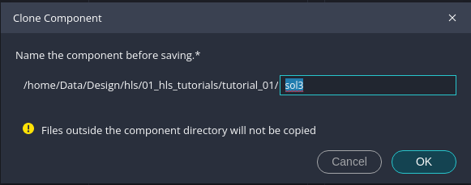

# HLS Tutorial 1b: Creating components from the command line

---
## Overview
* In [tutorial 1](tutorial_01.md) you have set up a project with the Vitis GUI. Since this is quite time consuming it is often better to setup and run projects from the command line (in a Linux terminal). This is especially true if you want to examine several variants of a component. Examining variants of a component means that you want to apply for example different optimization settings and compare them with respect to performance and resource usage. In the older Vitis HLS tool versions the variants have been called _solutions_. We will stick to this term in the tutorials. In the new Vitis HLS, which we use here, solutions must be created by generating different components in the same workspace. The important thing we suggest here is that all solutions/components use the same source code files (which is not mandatory from a Vitis tool point of view) and the difference between the solutions is defined in the different configuration files for the solutions. This leads to a dedicated setup of the folder structure of the workspace for such a project, which we will discuss below.
* In this tutorial we will setup basically the same component as in [tutorial 1](tutorial_01.md), but generate three different solutions and compare them. Fortunately all settings for a component or solution are stored in _one_ configuration file, so the only thing you need is the configurations files for the solutions and some Linux bash shell scripts. Additional solutions can also easily be generated by _cloning_ them in the Vitis GUI. We will first setup two solutions with the bash scripts and then generate a third one inside the Vitis GUI by cloning one existing solution.
* For this tutorial you should have completed the [tutorial 1](tutorial_01.md) since we will not explain the details of the tool steps (simulation, synthesis, co-simulation etc.) here again.

---
## Running the bash scripts
* First download the complete folder `tutorial_01/reference_files` to your computer and rename the folder `reference_files` to `tutorial_01`. This folder will later on be your workspace which you will open in the Vitis GUI.
  * You can either download this whole Github repository or only the folder `reference_files` using a browser extension like [GitZip](https://gitzip.org).
* We will first explain the folder structure of the workspace folder `tutorial_01`. In the workspace folder you find a bash script `run_demo.sh` which basically starts the two bash scripts `sol1.sh` and `sol2.sh` in the sub-folders `sol1` and `sol2`. These sub-folders hold the two variants or solutions (which are in the Vitis terminology two _components_ as explained above). What is also very important is the fact that all solutions use the same source code files in the folder `src`. This folder therefore must not be stored in a component folder but on the workspace level as shown below.

```
tutorial_01
    run_demo.sh
	|-src
        ... (sources)
	|-sol1
		|-sol1_work
		sol1_config.cfg
        sol1.sh
	|-sol2
		|-sol2_work
		sol2_config.cfg
        sol2.sh
```
* If you look into the bash script `sol1.sh` (`sol2.sh` is basically the same for `sol2`) you will find the following code. The first line says that this is a script to be executed as bash shell script. The second line sources the necessary settings from the Vitis installation. In the third line Vitis HLS is executed in script mode and with the `--config` switch we tell Vitis to use the configuration file, which can be found in the same folder. The last switch `--work_dir` specifies that this directory should be used for all output of Vitis. Do not confuse this directory with the Vitis workspace directory (which is in fact a bit confusing) which is the root directory `tutorial_01` in which we have the two components. 
 
```
#!/bin/bash
source /opt/xilinx/Vitis/2024.1/settings64.sh
v++ -c --mode hls --config ./sol1_config.cfg --work_dir sol1_work
```

* Before you can run the shell scripts you have to make them executable with `sudo chmod a+x run_demo.sh` (in a Linux terminal) and the same also for the two sub-scripts `sol1.sh` and `sol2.sh`.
* Then go back to the workspace directory `tutorial_01` and execute the top-level script with `./run_demo.sh` (in a Linux terminal). You should now see the output of Vitis while it is executed. Basically the HLS step is executed for both variants.
* When Vitis is finished open the Vitis GUI. On the Welcome page under _Get Started_ push the `Open Workspace` button. Navigate to the workspace folder `tutorial_01` and select it. Now you should see the opened workspace as in the following image. In the _Vitis Components Explorer_ you can see two components `sol1` and `sol2`, `sol1` is selected in the _Flow Navigator_. For both components `C SYNTHESIS` has already been executed. 


 
---
## Comparing both solutions
* When you executed the bash scripts two components have been created from the same source code, which we will call "solutions". The difference between the two solutions is defined in the configurations files. 
* Now open the synthesis report of solution `sol1` in the _Flow Navigator_ under _C SYNTHESIS_ as shown in the next image. 


* If you compare the results with the synthesis results of [tutorial 1](tutorial_01.md#c-synthesis) you may notice that we now have a much longer latency and interval. This is a result of a different setting in the configuration file. 
* Open the configuration file of `sol1` by double clicking on the file name in the _Vitis Components Explorer_ as shown in the next image. 


* When you scroll down on the left side to the the entry _Compile_ you can see compilation options. Scroll down on the right side until you see the entry `compile.pipeline_loops`. This is set to `0` which means that the loop will not be pipelined. Normally loops are automatically pipelined, which has led to the optimized results in [tutorial 1](tutorial_01.md#c-synthesis). Although it absolutely makes sense to pipeline loops, by switching off this setting you can study what would be the result if loops are not pipelined and what you can gain when you pipeline the loops by setting this to `1` (which means that loops with a tripcount of more than 1 will be pipelined).
* With the symbol marked in red in the next image you can switch between the _Source Editor_ view of the configuration file and the rendered graphical version (called _Settings Form_) from the previous image. You can see that the compile option discussed previously is stored as `syn.compile.pipeline_loops=0`. Every change you make in the _Settings Form_ view will be immediately stored in the configuration file `sol1_config.cfg`, which means that you can enter the options also in the source editor directly. The configuration file contains every option you entered and therefore is one of the most important file besides the C code files.  


* Now open the component `sol2` in the _Flow Navigator_. When you open the synthesis report and compare this solution to `sol1` and to the variant in [tutorial 1](tutorial_01.md#c-synthesis) you may notice that the loop is now pipelined, which leads to a considerable improvement in latency and interval but in [tutorial 1](tutorial_01.md#c-synthesis) we still have a better interval.  


* The difference to [tutorial 1](tutorial_01.md#c-synthesis) can be explained if you look into the configuration file as shown in the next image (shown in text mode). There is an option `syn.compile.enable_auto_rewind=0` which disables the so-called _rewind_ option for pipelined loops (see https://docs.amd.com/r/en-US/ug1399-vitis-hls/Rewinding-Pipelined-Loops-for-Performance). This was enabled by default in [tutorial 1](tutorial_01.md#c-synthesis) and enables overlapping of successive calls to the function or component, which means that new input values could be applied earlier to the component. But, as we discussed in [tutorial 1](tutorial_01.md#crtl-cosimulation), there may be problems in the interfacing leading in sub-optimal operation of the component and thus the _auto rewind_ option may be useless. If you switch this option off, then you might save some hardware resources.


* In both solutions (i.e. _components_) you can execute also the other steps in the _Flow Navigator_ (C Simulation, C/RTL Cosimulation etc.), as we have shown in [tutorial 1](tutorial_01.md). Whenever you change options or settings it will be stored in the configuration file. For the following tutorials we will always provide the folder structure, source files and scripts to setup the project on the command line and then work subsequently in the Vitis GUI.

* When you are done with the solutions you can compare them side by side in a report. Open `View > HLS Compare Reports` as shown in the next image and select both solutions/components. A compare report will open up where you can see the results of synthesis, cosimulation and implementation (if you have executed this step) for the selected components.


---
## Adding solutions to an existing workspace in the Vitis GUI
* If you have setup a project/workspace with scripts, as described above, you can add additional solutions also from the Vitis GUI. This can be done by either setting up a new component as described in [tutorial 1](tutorial_01.md#creating-a-hls-component) where the component location is the workspace which has been setup with the scripts and the component uses the same source code files as the other components in the workspace. A much faster way is by _cloning_ a component. In the following we will add an additional solution `sol3` to our workspace `tutorial_01` by cloning `sol2`.
* Select component `sol2` in the _Vitis Components Explorer_ and push the right mouse button, there should be an entry `Clone Component`. When you push this entry you should see a dialog as shown in the next image. Enter the name `sol3`. This will create the component in the sub-folder `sol3` and copies basically the configuration file from `sol2`, which then has the same name. It will refer to the same source code files as `sol2`. 



* Edit the configuration file of `sol3` (in _Source Editor_ view) and delete the entry `syn.compile.enable_auto_rewind=0`. Then run _C Synthesis__ in the _Flow Navigator_ and finally compare all 3 solutions, as shown in the next image. Solution `sol3` uses the default optimizations _loop pipelining_ and _auto rewind_ as discussed above. When you compare `sol2` and `sol3` you can see that `sol3` needs considerably more flipflops and LUTs for the _auto rewind_ optimization, as we have already mentioned above. 


* When you are done with a solution/component and do not want to keep it any more you can delete the component by selecting the component in the _Vitis Components Explorer_, pushing the right mouse button and select `Delete`. This will delete the complete component sub-folder, including the configuration file. It will not delete the source code files (provided you follow our approach with storing the source code files in the `src` folder on the workspace level).
