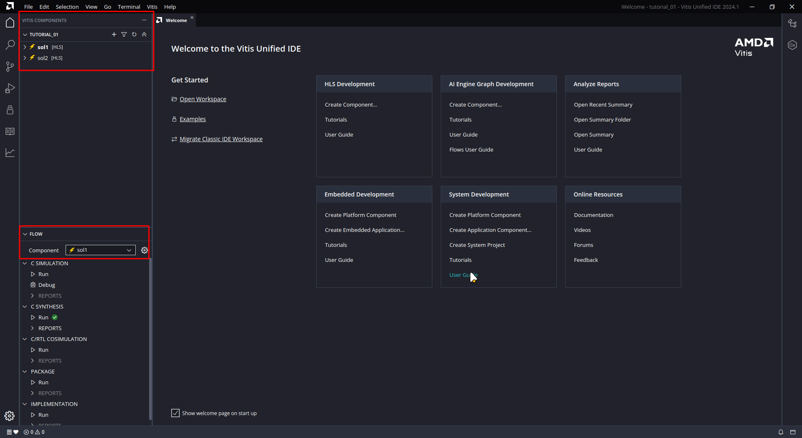
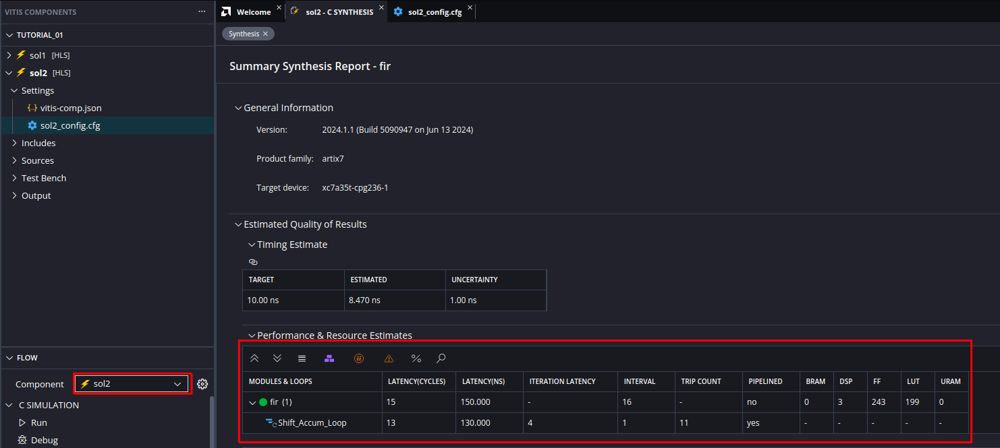

# HLS Tutorial 1b: Creating components from the command line

---
## Overview
* In tutorial 1 you have set up a project with the Vitis GUI. Since this is quite time consuming it is often better to setup and run projects from the command line (in a Linux terminal). This is especially true if you want to examine several variants of a component. 
* In this tutorial we will setup basically the same component as in [tutorial 1](tutorial_01.md), but generate two different variants. Fortunately all settings for a component or variant are stored in _one_ configuration file, so the only thing you need is the configurations files for the variants and some Linux bash shell scripts.
* For this tutorial you should have completed the [tutorial 1](tutorial_01.md) since we will not explain the details of the tool steps (simulation, synthesis, co-simulation etc.) here again.

---
## Running the bash scripts
* First download the complete folder `reference_files` to your computer and rename the folder to `tutorial_01`. This folder will later on be your workspace which you will open in the Vitis GUI.
* We will first explain the folder structure of the workspace folder `tutorial_01`. In the workspace folder you find a bash script `run_demo.sh` which basically starts the two bash scripts `sol1.sh` and `sol2.sh` in the sub-folders `sol1` and `sol2`. These sub-folders hold the two variants or solutions (which are in the Vitis terminology two _components_).

```
tutorial_01
    run_demo.sh
	|-src
        ... (sources)
	|-sol1
		|-sol1_work
		sol1_config.cfg
        sol1.sh
	|-sol2
		|-sol2_work
		sol2_config.cfg
        sol2.sh
```
* If you look into the bash script `sol1.sh` (`sol2.sh` is basically the same for `sol2`) you will find the following code. The first line says that this is a script to be executed as bash shell script. The second line sources the necessary settings from the Vitis installation. In the third line Vitis HLS is executed in script mode and with the `--config` switch we tell Vitis to use the configuration file, which can be found in the same folder. The last switch `--work_dir` specifies that this directory should be used for all output of Vitis. Do not confuse this directory with the Vitis workspace directory (which is in fact a bit confusing) which is the root directory `tutorial_01` in which we have the two components. 
 
```
#!/bin/bash
source /opt/xilinx/Vitis/2024.1/settings64.sh
v++ -c --mode hls --config ./sol1_config.cfg --work_dir sol1_work
```

* Before you can run the shell scripts you have to make them executable with `sudo chmod a+x run_demo.sh` (in a Linux terminal) and the same also for the two sub-scripts `sol1.sh` and `sol2.sh`.
* Then go back to the workspace directory `tutorial_01` and execute the top-level script with `./run_demo.sh` (in a Linux terminal). You should now see the ouput of Vitis running. Basically the HLS step is executed for both variants.
* If Vitis is finished open the Vitis GUI. On the Welcome page under _Get Started_ push the `Open Workspace` button. Navigate to the workspace folder `tutorial_01` and select it. Now you should see the opened workspace as in the following image. In the _Vitis Components Explorer_ you can see now two components `sol1` and `sol2`, `sol1` is selected in the _Flow Navigator_. For both components `C SYNTHESIS` has already been executed. 


 
---
## Comparing both solutions
* When you executed the bash scripts two components have been created from the same source code, which we will call "solutions". The difference between the two solutions is defined in the configurations files. 
* Now open the synthesis report of solution `sol1` in the _Flow Navigator_ under _C SYNTHESIS_ as shown in the next image. 


* If you compare the results with the synthesis results of [tutorial 1](tutorial_01.md#c-synthesis) you may notice that we now have a much longer latency and interval. This is a result of a different setting in the configuration file. 
* Open the configuration file of `sol1` by double clicking on the file name in the _Vitis Components Explorer_ as shown in the next image. 


* When you scroll down on the left side to the the entry compile you can see compilation options. Scroll down on the right side until you see the entry `compile.pipeline_loops`. This is set to `0` which means that the loop will not be pipelined. Normally loops are automatically pipelined, which has led to the optimized results in [tutorial 1](tutorial_01.md#c-synthesis). Although it absolutely makes sense to pipeline loops, by switching off this setting you can study what would be the result if loops are not pipelined and what you can gain when you pipeline the loops by setting this to `1`, which is the default.
* With the symbol marked in red in the next image you can switch between the text version of the configuration file and the rendered graphical version from the previous image. You can see that the compile option discussed previously is stored as `syn.compile.pipeline_loops=0`. Every change you make in the rendered version will be immediately stored in the configuration file `sol1_config.cfg`, which means that you can enter the options in the file editor directly. The configuration file contains every option you entered and therefore is one of the most important file besides the C code files.  


* Now open the component `sol2` in the _Flow Navigator_. When you compare this solution to `sol1` and to the variant in [tutorial 1](tutorial_01.md#c-synthesis) you may notice that the loop is now pipelined, which leads to a considerable improvement in latency and interval but in [tutorial 1](tutorial_01.md#c-synthesis) we still have a better interval.  



* The difference to [tutorial 1](tutorial_01.md#c-synthesis) can be explained if you look into the configuration file as shown in the next image (shown in text mode). There is an option `syn.compile.enable_auto_rewind=0` which disables the so-called _rewind_ option for pipelined loops (see https://docs.amd.com/r/en-US/ug1399-vitis-hls/Rewinding-Pipelined-Loops-for-Performance). This was enabled by default in [tutorial 1](tutorial_01.md#c-synthesis) and enables a better interval, which means that new input values can be applied earlier to the component. But, as we discussed in [tutorial 1](tutorial_01.md#crtl-cosimulation) there may be problems in the interfacing leading in sub-optimal operation of the component. 


