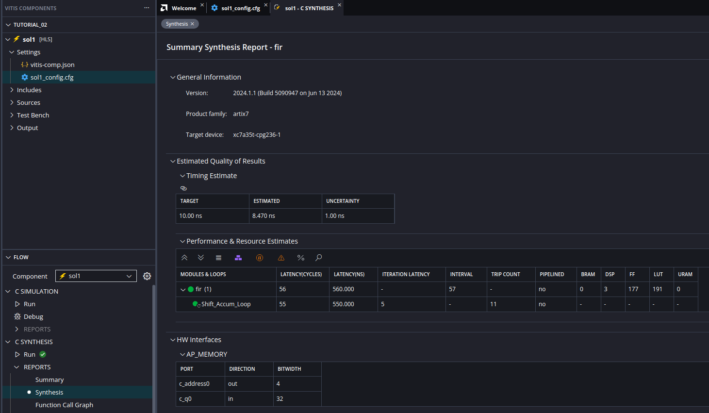
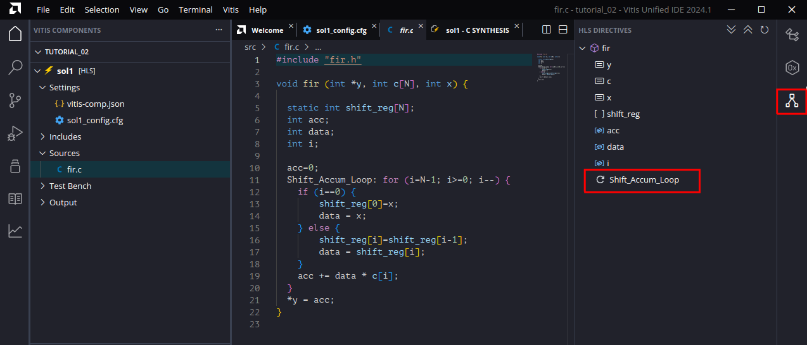
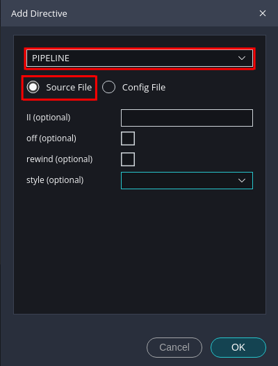
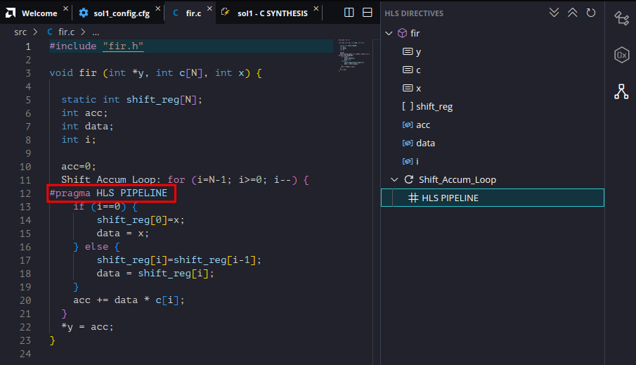
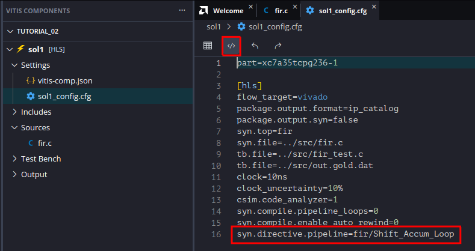

# HLS Tutorial 2: Using Directives and Pragmas

In [tutorial 1](../tutorial_01/tutorial_01.md) and [tutorial 1b](../tutorial_01/tutorial_01_b.md) you have learned how to setup a Vitis HLS project. In this tutorial we will show how you can use directives to modify the component and therefore the resulting hardware. The directives can be stored either in the configuration file (we have done this already in [tutorial 1](../tutorial_01/tutorial_01.md)) or in the source code. In the latter case the directives are called _pragmas_.

For the sake of simplicity we will use the same source code as in [tutorial 1](../tutorial_01/tutorial_01.md). In the configuration file [sol1_config.cfg](../tutorial_02/reference_files/sol1/sol1_config.cfg) you will find the directive `syn.compile.pipeline_loops=0` which prevents the component from being automatically loop pipelined and the directive `syn.compile.enable_auto_rewind=0` which prevents auto rewind of the loop (see the discussion in [tutorial 1b](../tutorial_01/tutorial_01_b.md)). Although you would normally accept an automatic loop pipelining we will first generate an unpipelined and therefore non-optimized component (sometimes called a _baseline implementation_) and then apply a pragma in the source code for loop pipelining in order to show how pragmas can be applied to the code. 

After that we will show how you can apply directives in order to modify the interfaces of the component. These interface directives can be also either stored in the source code as pragmas or in the configuration file.

## Setting up the component and applying loop pipelining
* Download the folder `tutorial_02/reference_files` and rename this folder to `tutorial_02`. You will now have a similar folder structure as in [tutorial 1b](../tutorial_01/tutorial_01_b.md) but now we have only one solution or component which we will modify in the Vitis GUI. 
* Open a Linux terminal, go to the folder `tutorial_02` and execute the bash script `run_demo.sh`. Then start the Vitis GUI and open the workspace `tutorial_02`. Since synthesis has already been run you can open the synthesis report as it is shown in the following image.

* As you can see in the synthesis report the loop is not pipelined, this is due to the fact that we have applied the directive `syn.compile.pipeline_loops=0` in the configuration file `sol1_config.cfg` (Which you can verify by opening the configuration file).
* Now open the source file `fir.c` in the editor window by clicking on the file name in the _Vitis Components Explorer_. On the right side of the Vitis GUI you can see the symbol for the _HLS Directives_ (marked in red in the next image). When you click on this symbol you should see the pane for the _HLS directives_ as shown in the next image. You can see here the objects from the source code for which you can apply directives. 

* When you hover the mouse over the loop _Shift_Accum_Loop_ (this is the reason why you should name the loops in the code) in the _HLS Directives_ pane you can see a `+` sign. Click on the `+` sign and you should see a dialog for entering the directive as shown in the next image. In the upper field select `PIPELINE`. You can choose to either store the directive in the source code as _pragma_ or in the configuration file. Keep it in the source file for the moment. The rest of the fields can be left blank. Press the `OK` button to close the dialog.

* When you close the dialog you should see the directive embedded as pragma in the code as can be seen in the next image.

* Start a new _C Synthesis_ run and open the synthesis report. You should see that the loop has been pipelined leading to an improvement of the latency and interval.

* When you hover again over the `# HLS PIPELINE` directive in the _HLS Directives_ pane you can see now a pencil symbol which allows you to edit the directive. Edit the directive and choose now `Config File` instead of `Source File`, press `OK`. Open the configuration file `sol1_config.cfg` and select the source editor view. You should see now the directive `syn.directive.pipeline=fir/Shift_Accum_Loop` stored in this file as shown in the next image. In the rendered view _Settings Form_ of the configuration file you can find the directive in the section `Design Directives > Pipeline`

* When you run synthesis you will see that you get the same result as in the case when you stored the directive as pragma in the source code. So what is better, storing the directives in the source code or in the configuration file? From our experience directives which will not change, if you want to generate several variants, should be stored as pragmas in the source code, for example interface directives (see next section). Directives which may change from variant to variant, like optimization directives as loop pipelining, are better stored in the configuration file, since you will have for each variant a separate component with a configuration file. The advantage of storing the directives as pragma in the source code is that you have everything in one place, on the other hand the source code may be cleaner if you store the directives in the configuration file. So, it depends and you have to choose which is best for you and your project.

## Applying interface directives
