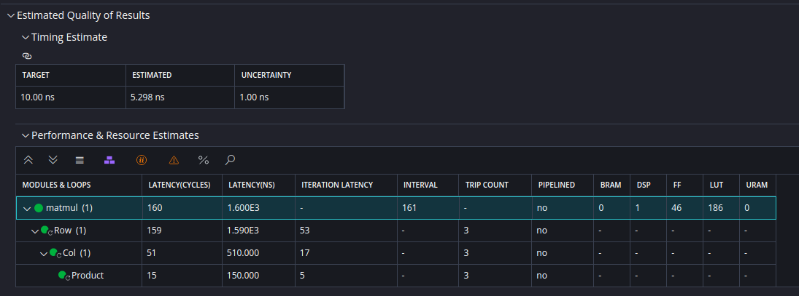
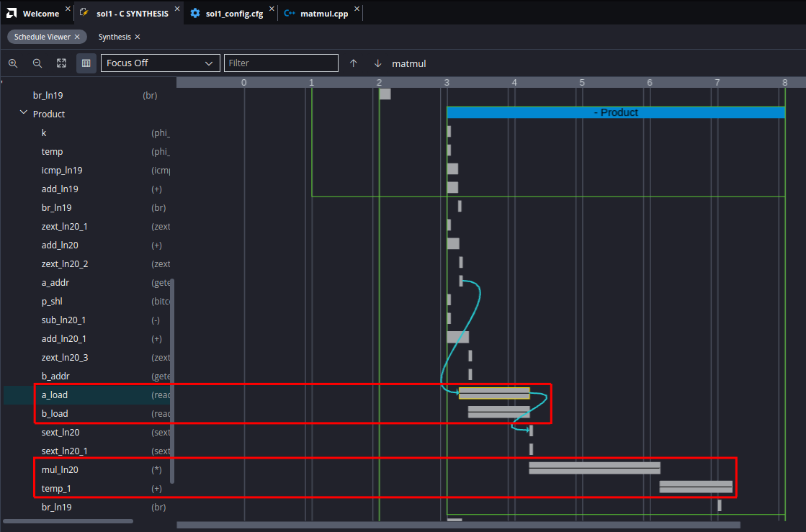
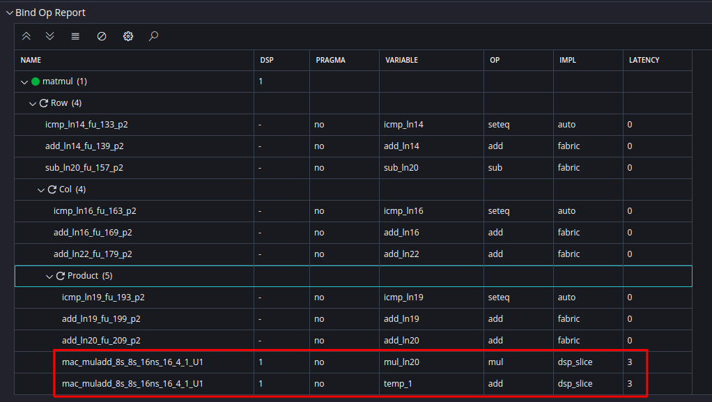
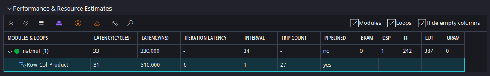
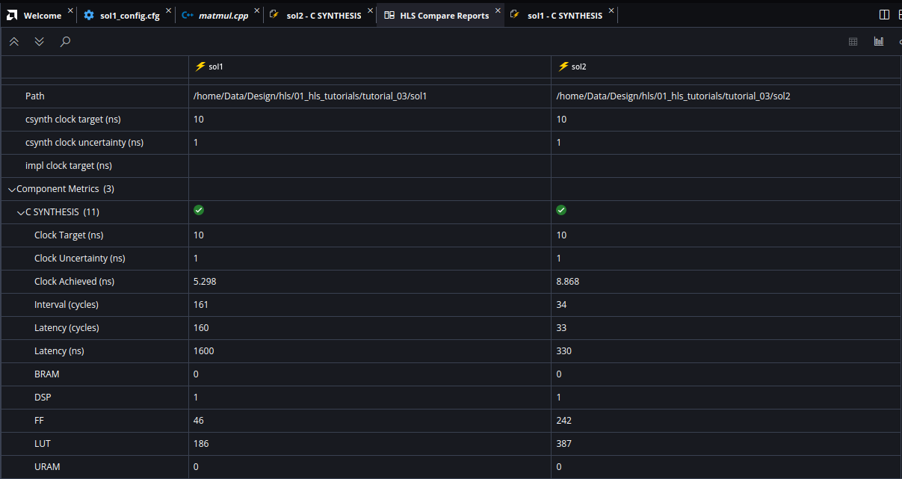

## HLS Tutorial 3: Design Optimization

---
## Overview
* In [tutorial 2](../tutorial_02/tutorial_02.md) you have learned how to apply directives and we already discussed about design optimization with respect to loop pipelining. In this tutorial we want to dive a bit deeper into design optimization. For this tutorial we use a new example with nested loops in order to show how you can optimize nested loops. 
* We will start again with an unoptimized solution and then apply the optimizations step-by-step in order to show the tradeoff between performance gains and resource usage when using optimizations. Therefore we will generate several solutions by cloning the first solution. 

---
## Setting up the component and baseline synthesis
* Like in [tutorial 2](../tutorial_02/tutorial_02.md) download the folder `tutorial_03/reference_files` and rename this folder to `tutorial_03`. 
* Open a Linux terminal, go to the folder `tutorial_03` and execute the bash script `run_demo.sh`. Then start the Vitis GUI and open the workspace `tutorial_03`. Since synthesis has already been run you can open the synthesis report as it is shown in the following image. When you open the configuration file you can see that we have again disabled the default optimizations by setting the following directives (refer to [tutorial 2](../tutorial_02/tutorial_02.md) ) in order to get a baseline implementation and to be able to apply optimization directives step-by-step afterwards:

```
syn.compile.pipeline_loops=0
syn.compile.enable_auto_rewind=0
```



* Open the source code file `matmul.cpp` and study the code: The function `matmul` calculates the inner product of two matrices `a` and `b` and returns the result in matrix `res`. Since we have disabled the default loop optimizations you can see three nested loops in the synthesis result which corresponds directly to the source code. 
* The inner loop `Product` is iterated 3 times ( see _TRIP COUNT_ in the synthesis report) and has an iteration latency of 5 clocks. You can also open the _Schedule Viewer_ (_Flow Navigator_ : `C SYNTHESIS > REPORTS > Schedule Viewer`) in order to study the details of the loop implementation, as shown in the next image. Here you can see that both arguments `a[i][k]` and `b[k][j]` are read (`a_load` and `b_load` in the schedule viewer) in the same clock cycle, then both are multiplied and then added to the local variable `temp` (`temp_1` in the schedule viewer). When you look into the synthesis report under _HW Interfaces_ you can see that all matrix arguments are implemented with interface type _AP_MEMORY_, that means a RAM interface. 



* The multiplication and addition `temp += a[i][k] * b[k][j];` (also called _Multiply-Accumulate_) from the source code is implemented with a DSP48 block in the generated hardware. You can verify this when you scroll down the synthesis report in the section _Bind Op Report_ as shown in the next image (the DSP48 block is called _dsp_slice_ in the report). It takes basically 3 clocks for the _Multiply-Accumulate_ and so this explains why in total 5 clocks are needed for one iteration of the inner loop.



* The loop `Col` needs two additional clocks besides the 15 clocks from the inner loop `Product` which gives in total 17 clocks, as can be seen in the synthesis report. The two additional clocks are needed for entering and leaving the inner loop. Since loop `Col` also has a trip count of 3 it needs 51 clocks for one iteration. Finally the outer loop `Row` needs also two additional clocks which results in 53 clocks for one iteration and in total 159 clocks for all 3 iterations. The latency of the whole operation of the component is then 160 clocks and the interval is 161 clocks.    
* Now that we have understood how the source code is implemented in the component in hardware when can begin to optimize the implementation.

---
## Pipelining the inner loop
* When you are trying to optimize nested loops it is a good idea to begin with the inner loop and study the results. In order to be able to compare the results to our baseline implementation we will generate a second solution by cloning the first solution. In the _Vitis Components Explorer_ hover the mouse over the component `sol1` and push `Clone Component`. Name the new component `sol2`.
* Open the source code file `matmul.cpp`. On the right side of the Vitis GUI select the `HLS Directives` pane (refer to [tutorial 2](../tutorial_02/tutorial_02.md#setting-up-the-component-and-applying-loop-pipelining)). Select the inner loop `Product` and apply the `PIPELINE` directive as shown in the next image. The directive should be stored in the configuration file, since we want to generate different solutions with different optimizations.


* Before you start a synthesis run, check the configuration file (in the _Source Editor_). You should have an entry `syn.directive.pipeline=matmul/Product` which tells you that the loop `Product` will be pipelined. After the synthesis has been run open the synthesis report. You should see the result similar to the following image.



* Surprisingly there is only one loop in this implementation! Basically two optimizations where applied here. You specified that the inner loop should be pipelined. When nested loops are pipelined then Vitis HLS performs an additional optimization which is called _loop flattening_. This merges the inner loops into the outer loops, which leads in our case to one loop left. When you compare the number of iterations you can see that we still have 27 loop iterations, which is the same as in the original design (3 x 3 x 3 = 27). You should not confuse this with _loop unrolling_ which reduces the total number of loop iterations.
* Loop flattening needs so-called _perfect nested loops_. In a perfect nested loop, the loop bounds are constant and only the innermost loop contains any functionality. Please refer to the [Xilinx documentation]( https://docs.amd.com/r/en-US/ug1399-vitis-hls/Working-with-Nested-Loops). Vitis HLS automatically flattens loops when they are pipelined, if possible.
*  Compare the reports for both solutions (`View > HLS Compare Reports`) as shown in the image below. You can see that we reduced the interval from 161 clock cycles to 34 clock cycles, which is a factor of 4.7! When you compare the resources you can see that the number of DSPs is still the same, but we need more flipflops and LUTs. But this was a very effective optimization since we could reduce the latency and interval considerably. What is important is the fact that the number of DSPs, which is a precious resource, did not increase, which follows from the fact that the loops were not unrolled. 



## Pipelining the next loop level
* 