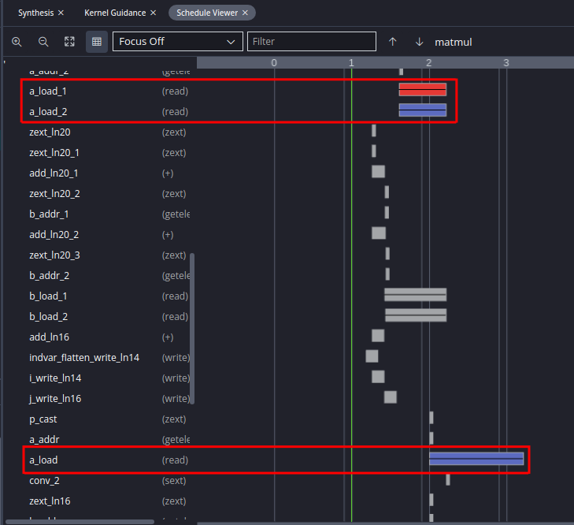
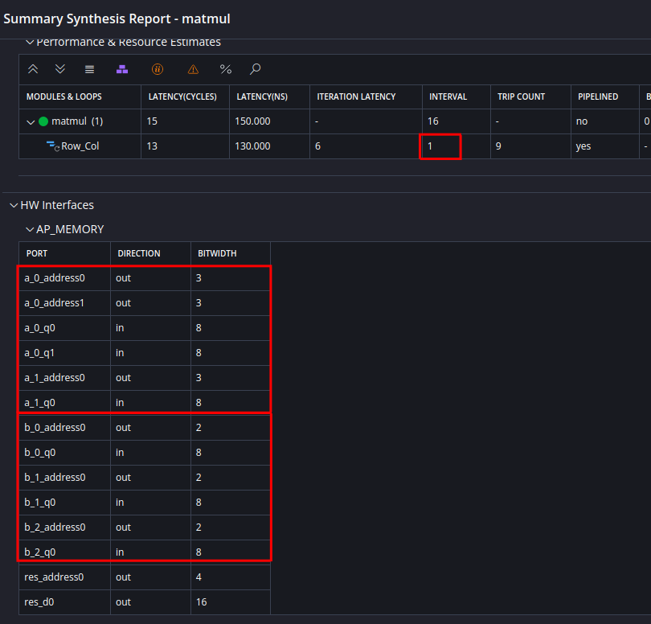

## HLS Tutorial 3: Design Optimization

---
## Overview
* In [tutorial 2](../tutorial_02/tutorial_02.md) you have learned how to apply directives and we already discussed about design optimization with respect to loop pipelining. In this tutorial we want to dive a bit deeper into design optimization. For this tutorial we use a new example with nested loops in order to show how you can optimize nested loops. 
* We will start again with an unoptimized solution and then apply the optimizations step-by-step in order to show the tradeoff between performance gains and resource usage when using optimizations. Therefore we will generate several solutions by cloning the first solution. 

---
## Setting up the component and baseline synthesis
* Like in [tutorial 2](../tutorial_02/tutorial_02.md) download the folder `tutorial_03/reference_files` and rename this folder to `tutorial_03`. 
* Open a Linux terminal, go to the folder `tutorial_03` and execute the bash script `run_demo.sh`. Then start the Vitis GUI and open the workspace `tutorial_03`. Since synthesis has already been run you can open the synthesis report as it is shown in the following image. 


* When you open the configuration file `sol1_config.cfg` you can see that we have again disabled the default optimizations by setting the following directives (refer to [tutorial 2](../tutorial_02/tutorial_02.md) ) in order to get a baseline implementation and to be able to apply optimization directives step-by-step afterwards:

```
syn.compile.pipeline_loops=0
syn.compile.enable_auto_rewind=0
```

* Open the source code file `matmul.cpp` and study the code: The function `matmul` calculates the inner product of two matrices `a` and `b` and returns the result in matrix `res`. Since we have disabled the default loop optimizations you can see three nested loops in the synthesis result which corresponds directly to the source code. 
* The inner loop `Product` is iterated 3 times ( see _TRIP COUNT_ in the synthesis report) and has an iteration latency of 5 clocks. You can also open the _Schedule Viewer_ (_Flow Navigator_ : `C SYNTHESIS > REPORTS > Schedule Viewer`) in order to study the details of the loop implementation, as shown in the next image. Here you can see that both arguments `a[i][k]` and `b[k][j]` are read (`a_load` and `b_load` in the schedule viewer) in the same clock cycle, then both are multiplied and then added to the local variable `temp` (`temp_1` in the schedule viewer). When you look into the synthesis report under _HW Interfaces_ you can see that all matrix arguments are implemented with interface type _AP_MEMORY_, that means a RAM interface. 


* The multiplication and addition `temp += a[i][k] * b[k][j];` (also called _Multiply-Accumulate_) from the source code is implemented with a DSP48 block in the generated hardware. You can verify this when you scroll down the synthesis report in the section _Bind Op Report_ as shown in the next image (the DSP48 block is called _dsp_slice_ in the report). It takes basically 3 clocks for the _Multiply-Accumulate_ and so this explains why in total 5 clocks are needed for one iteration of the inner loop.


* The loop `Col` needs two additional clocks besides the 15 clocks from the inner loop `Product` which gives in total 17 clocks, as can be seen in the synthesis report. The two additional clocks are needed for entering and leaving the inner loop. Since loop `Col` also has a trip count of 3 it needs 51 clocks for one iteration. Finally the outer loop `Row` needs also two additional clocks which results in 53 clocks for one iteration and in total 159 clocks for all 3 iterations. The latency of the whole operation of the component is then 160 clocks and the interval is 161 clocks.    
* Now that we have understood how the source code is implemented in the component in hardware when can begin to optimize the implementation.

---
## Pipelining the inner loop
* When you are trying to optimize nested loops it is a good idea to begin with the inner loop and study the results. One of the most effectice optimization for loops is pipelining, so we will pipeling the inner loop `Product`.
* In order to be able to compare the results to our baseline implementation we will generate a second solution by cloning the first solution. In the _Vitis Components Explorer_ hover the mouse over the component `sol1` and push `Clone Component`. Name the new component `sol2`.
* Open the source code file `matmul.cpp`. On the right side of the Vitis GUI select the _HLS Directives_ pane (refer to [tutorial 2](../tutorial_02/tutorial_02.md#setting-up-the-component-and-applying-loop-pipelining)). Select the inner loop `Product` and apply the `PIPELINE` directive as shown in the next image. The directive should be stored in the configuration file, since we want to generate different solutions with different optimizations. The rest of the entries can be left blank. You can get more details on the options of loop pipelining in the [Vitis HLS User Guide](https://docs.amd.com/r/en-US/ug1399-vitis-hls/Pipelining-Loops)


* Before you start a synthesis run, check the configuration file (in the _Source Editor_). You should have an entry `syn.directive.pipeline=matmul/Product` which tells you that the loop `Product` will be pipelined. After the synthesis has been run open the synthesis report. You should see the result similar to the following image.


* Surprisingly there is only one loop in this implementation! Basically two optimizations where applied here. You specified that the inner loop should be pipelined. When nested loops are pipelined then Vitis HLS performs an additional optimization which is called _loop flattening_. This merges the inner loops into the outer loops, which leads in our case to one remaining loop. When you compare the number of iterations you can see that we still have 27 loop iterations, which is the same as in the original design (3 x 3 x 3 = 27). You should not confuse this with _loop unrolling_ which reduces the total number of loop iterations.
* Loop flattening needs so-called _perfect nested loops_. In a perfect nested loop, the loop bounds are constant and only the innermost loop contains any functionality. Vitis HLS automatically flattens loops when they are pipelined, if possible. Please refer to the [Vitis HLS User Guide]( https://docs.amd.com/r/en-US/ug1399-vitis-hls/Working-with-Nested-Loops) for detailed information on this topic.
*  Compare the reports for both solutions (`View > HLS Compare Reports`) as shown in the image below. You can see that we reduced the interval from 161 clock cycles to 34 clock cycles, which is a factor of 4.7! When you compare the resources you can see that the number of DSPs is still the same, but we need more flipflops and LUTs. But this was a very effective optimization since we could reduce the latency and interval considerably. What is important is the fact that the number of DSPs, which is a precious resource, did not increase, which follows from the fact that the loops were not unrolled. 


## Pipelining the next loop level
* In this section we want to study what happens when we set the pipeline directive to the next level in the nested loop which is the loop `Col`. Generate a new solution `sol3` by cloning again solution `sol1`.
* Open the source code `matmul.cpp` and open the _HLS Directives_ viewer. If you still see the pipeline directive from solution `sol2` then you should refresh the viewer (top right symbol in the viewer marked in red in the next image) or look into the configuration if the pipeline directive is there (e.g. when you cloned accidentally `sol2`). Select the loop `Col` and apply again the `PIPELINE` directive to the loop (store it in the config file) as shown in the next image. In the configuration file you should now have the directive `syn.directive.pipeline=matmul/Col`.


* Run the synthesis and open the synthesis report as shown in the following image. You can see that the trip count was reduced from 27 iterations to 9 iterations (marked in red in the next image). Since we applied the pipeline directive to the middle loop level, the inner loop was unrolled and and the loops `Row` and `Col` have been flattened. This leads to a further improvement of latency and interval compared to solution `sol2`.


* In the synthesis report you can see a so-called _II Violation_ (marked in red) and that the _INTERVAL_ of the loop is 2 (not 1 as in the previous solution). This means that pipelining could not achieve the optimal II (_Initiation Interval_) value of 1. For a further analysis of the problem you can open the _Kernel Guidance_ under `C Synthesis > REPORTS > Kernel Guidance` as shown in the next image.


* The problem results from the fact that the inner loop was unrolled. Therefore in each iteration of the flattened loop 3 elements of matrix `a[][]` (and `b[][]`) have to be read, which is not possible with a Block RAM interface, which can deliver at maximum 2 elements (since it is a dual-port RAM). The result is that the next loop iteration can start only after 2 clocks and therefore results in II=2. You can see this also in the schedule viewer as shown in the next image. There are 3 memory accesses for `a[][]`  (and `b[][]`), where 2 are in the same clock cycle and the third one is one clock later. Although the problem is reported only for array `a` there is the same problem also for array `b`.  



* When you look into the _HW INTERFACES_ section in the synthesis report you can see that Vitis HLS generated a dual port memory interface for both arrays `a` and `b` such that _one_ Block RAM can be attached to, since Block RAMs are dual-ported. If there would be only one port per memory the II value would be 3 instead of 2, because then only one array element could be accessed per clock cycle. Generating a dual port interface is automatically done by Vitis HLS, if needed. But still the memory access is a bottleneck in this solution and we will see in the next section how we can improve this.


* When you delete all directives in the configuration file (also the directives `pipeline_loops=0` and `enable_auto_rewind=0`) then Vitis HLS will basically do the same with the nested loop: The middle and outer loop will be flattened and pipelined and the inner loop will be unrolled. You can verify this by cloning solution `sol1` and removing the mentioned directives. You will also see that there is the same _II violation_.  


---
## Optimizing the array interface for higher memory bandwidth
* In this last section we want to show how you can optimize the array interfaces in order to get a higher memory bandwidth and therefore a better II value for the loop. Clone solution `sol3` and name it `sol4`. First do a synthesis run and verify that you get the same results as in solution `sol3` with the same _II Violation_.
*  Open the source code and the _HLS Directives_ view as shown in the next image. Select the argument `a` and add a directive with the `+`sign.


* Add the directive `ARRAY_PARTITION` to the config file as shown in the next image. The `dim` value must be set to 2. This will partition the array along dimension 2 by a factor of 2. 


*  When you run synthesis you should still see an II violation, but when you look in the _Kernel Guidance_ you can see that now array `b` is the problem. In the synthesis report you can see that we have now 3 ports for array `a` but only 2 ports for array `b`, so array `b` is still a bottleneck.


* We have to apply the same directive for array `b` as shown in the next image. Note that in this case we set `dim` to 1. 


* After running synthesis again you should see the result as in the next image. The Interval II has improved to 1 and the total latency and interval of the component has also improved compared to the previous solution. The drawback is that we have more memory interfaces and have to attach _two_ Block RAMs for each array.



*  You may wonder what the meaning of the `dim` value is and why it was set to 2 for array `a` and 1 for array `b`? For this example it is important that you partition the array along the right dimension. Look into the code: The inner loop `Product` iterates over loop variable `k` and since this loop is unrolled we have to parallelize the array accesses for variable `k`. In the code you see that `temp += a[i][k] * b[k][j];`, where `a` has variable `k` in the second dimension and `b` has `k` in the first dimension. 
*  You can verify that the dimension is important by changing for example the directive for `b` from 1 to 2 and running synthesis: You get a similar result as without partitioning the array as shown in the next image. What is even worse is the fact that now two dual port interface for `b` have been generated but we have no benefit in terms of performance.   
  


* Finally also the `type` can be important, where we have chosen `cyclic`. This means that the array elements are assigned in a cyclic manner to the two Block RAMs. For this example you can also choose `block` but in certain cases the type can also make a difference. You can find more information in the [Vitis HLS User Guide](https://docs.amd.com/r/en-US/ug1399-vitis-hls/Array-Partitioning) on this topic.
* Finally we can compare all four solutions as shown in the next image. It is obvious that `sol4` is the best solution in terms of performance but comes with the price of an additional RAM interface and the need to partition the external memory. The second best solution is `sol3` and this would have been also the solution Vitis HLS would have generated without any directives. You will see the II violation in this case, but this is acceptable for the sake of not having to partition the external memory. When you compare solutions `sol2` and `sol3` you can see that although you have less usage of flipflops and LUTs for `sol3`, `sol3` needs 2 DSPs instead of 1, which is a result of unrolling the inner loop. Keep in mind that we only have 3 iterations in the inner loop: With more iterations in the inner loop you will also need more DSPs if it is unrolled. So in some cases it can make sense to not unroll the inner loop and only pipeline the inner loop, which does not need additional DSPs. Therefore it could be sensible to switch off the automatic optimization which Vitis HLS does by default and carefully add directives and study what the implications are in terms of performance and resource usage.

