# HLS Tutorial 4: Interface Synthesis

---
## Overview
* In this tutorial we would elaborate a bit more on the topic of _Interface Synthesis_. In the previous tutorials we have already covered some interface types like for example _AP_MEMORY_, which generates the ports for Block RAMs in the component. First we have to distinguish between the interface of the C/C++ software function, which are the arguments of the function, and the interface of the generated hardware component, which are basically the ports of the component. In the case of the hardware component we can also talk of an interface, for example when we have a set of ports for attaching a Block RAM memory or a set of ports for a _bus interface_.
* Depending on the type of SW argument there is a default implementation of the HW interface (i.e. the ports) in Vitis HLS. This whole topic is called _Interface Synthesis_ and you can find more information in the [Vitis HLS User Guide](https://docs.amd.com/r/en-US/ug1399-vitis-hls/Introduction-to-Interface-Synthesis). By using directives you can change the default implementation of the interfaces and we will concentrate on this topic in this tutorial.
* We assume that you have completed the previous tutorials and are familiar with Vitis HLS and the GUI concepts and the loop optimization from [tutorial 3](../tutorial_03/tutorial_03.md). 

---
## Setting up the component and baseline synthesis
* Like in the previous tutorials download the folder `tutorial_04/reference_files` and rename this folder to `tutorial_04`. 
* Open a Linux terminal, go to the folder `tutorial_04` and execute the bash script `run_demo.sh`. Then start the Vitis GUI and open the workspace `tutorial_04`. You should see the component `sol1` (what we called a _solution_ in the previous tutorials) in the _Vitis Components Explorer_.
* First open the component source code `accumulator.c` and study the code.  There is a nested loop which iterates over the number of `CHANNELS` and the number of `SAMPLES` (per channel). For each channel we accumulate the data from the samples with `accu += d_i[j*CHANNELS + i];`. What is important for the following discussion is the fact that we access the data in array `d_i[]` not sequentially but with a constant distance given by `CHANNELS`. 
* Open the testbench code `accumulator_test.c` and study the code. First the input array `d_i[]` is filled with test data, which is simply the value of the loop counter. Then the reference data is generated by a copy of the code in the component. In line 30 the component function is called and finally the output data of the component is compared with the reference data and a final output message is generated. 
* Open the configuration file `sol1_config.cfg` and select the _Source Editor_ view. You can see that we applied already the following directives as explained in [tutorial 3](../tutorial_03/tutorial_03.md) and pipelined the inner loop L1. 

```
syn.compile.enable_auto_rewind=0
syn.compile.pipeline_loops=0
syn.directive.pipeline=accumulator/L1
```

* Next run through the steps in the flow navigator: _C SIMULATION_, _C SYNTHESIS_ and _C/RTL COSIMULATION_. If you want to get more insight how the component function `accumulator` works you can use the debugger in _C SIMULATION_ by pushing the _Debug_ button instead of _Run_.  
* Open the synthesis report and study the results for the performance and resources and the _HW Interfaces_ as shown in the next image. You can see that the loops `L0` and `L1` have been flattened and pipelined (refer to [tutorial 3](../tutorial_03/tutorial_03.md) for more details on loop pipelining). Under the section _HW Interfaces_ you can see that the arrays `d_i[]` and `d_o[]` have been implemented as memory interfaces with the protocol _AP_MEMORY_. 

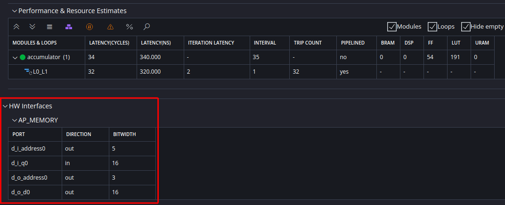

* In order to get more insight into the memory interfaces you can open the generated VHDL code in the _Vitis Components Explorer_ under `Output > syn > vhdl` as shown in the next image. Here you can see the ports for the memory interfaces. For the array `d_o` these are the address port `d_o_address0` (3 bit since we have 8 elements in the array), the control ports `d_o_ce0` (clock enable) and `d_o_we0` (write enable) and the data port `d_o_d0` (16 bit since the data type for the arrays is `int16_t`). For the array `d_i` we get a similar interface, but without the control port for write enable (since the array is only read) and the data port `d_i_q0` is an input port instead of an output port.

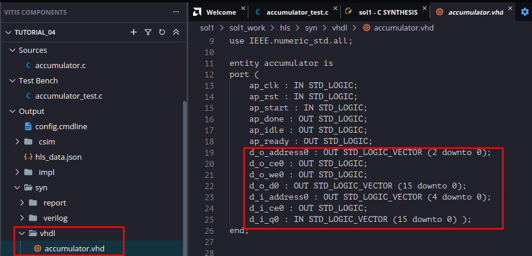

* In the next image the integration of the IP core in Vivado is shown (refer to [tutorial 1](../tutorial_01/tutorial_01.md) on how to do this). You can see that Block RAMs have been attached to the IP core, where the upper one is attached to the ports for array `d_i[]` and the lower one is attached to the ports for array `d_o[]`. The upper BRAM is configured as ROM, which can be filled with data. The lower one is configured as RAM, where the output port `douta[15:0]` is left open, since we only write to the RAM. Normally this RAM should be configured as _Dual Port RAM_ and the RAM should be read by another component in a system. 

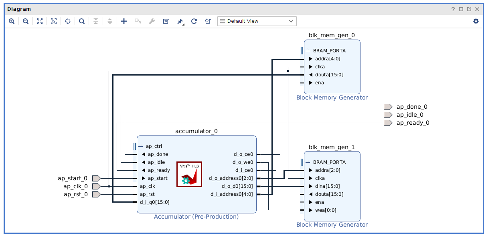

## Modifying the port protocol for the arguments
* So far we have used the default protocol for the array arguments which is __AP_MEMORY_. In this section we will modify the implementation of the hardware interface by using directives.
* First clone the solution `sol1` and name it `sol2` (see previous tutorials on how to do this).
* Open the source code `accumulator.c` and select the _HLS directives_ pane. Select the argument `d_o` and add a directive. As shown in the next image select the _INTERFACE_ directive and select _ap_fifo_ in the field _mode_. The directive should be stored in the _Config File_. 

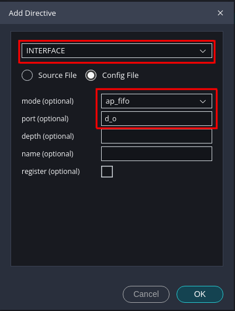

* Now open the config file in _Source Editor_ view. You should now have a directive `syn.directive.interface=accumulator d_o mode=ap_fifo`. Run _C SYNTHESIS_ and open the synthesis report. As shown in the next image the performance is the same as in solution `sol1`. Looking at the section _HW Interfaces_ we can see that the interface for the output `d_o` is implemented as _AP_FIFO_, which means that we can attach a FIFO.  

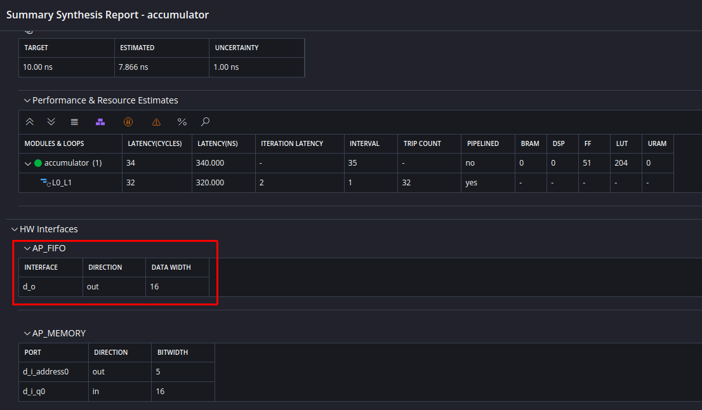

* When you open the generated VHDL code, as shown in the next image, you can see the ports related to the FIFO interface. Since a FIFO will be attached there are no addresses, but only the data port `d_o_din` and a write enable port `d_o_write`. The port `d_o_full_n` is an input port and will be connected to the _FULL_ signal of a FIFO block, such that the component will not write data when the FIFO is full.

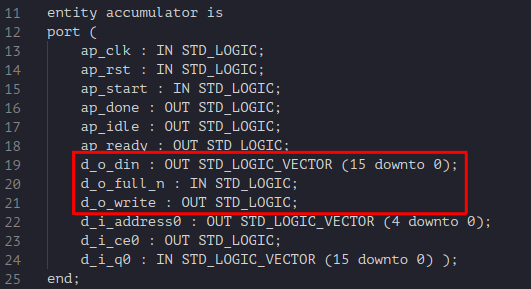

* Finally run the _C/RTL COSIMULATION_ in order to verify the VHDL code.
* In the next step apply the same interface directive to the input port `d_i` as shown in the next image. In the config file you should see the directive `syn.directive.interface=accumulator d_i mode=ap_fifo`. 

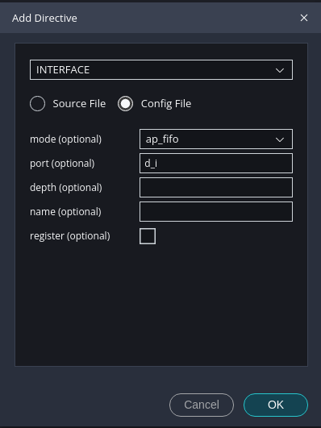

* When you look in the synthesis report you will see that you have an _AP_FIFO_ interface also for argument `d_o`. In the VHDL code there are the ports for this interface, consisting of input data, read enable and a FIFO empty port (i.e. the component will not read from the FIFO when it is empty).
* Run again _C/RTL COSIMULATION_ in order to verify the VHDL code. In the console output you will notice a cosimulation error as shown in the next image. This error means that the simulation of the VHDL code does not produce the same results as the simulation of the C code. 

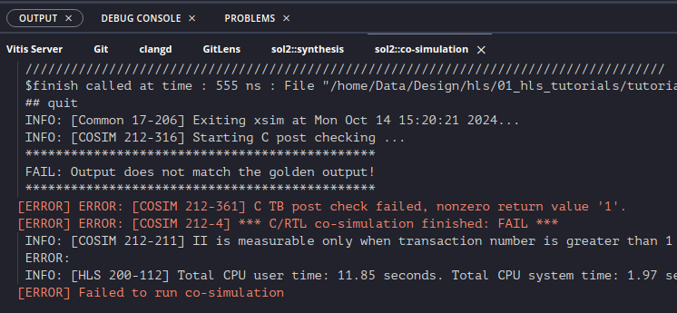

* In order to analyze the problem you can open the _Kernel Guidance_ report under `C SYNTHESIS > REPORTS` as shown in the next image. There are two warnings for the ports `d_i` and `d_o`. In the case of the input port `d_i` it in fact leads to the above mentioned cosimulation problem: The array `d_i` is accessed non-sequentially as we have already mentioned when we discussed the functionality of the C code in the beginning of this tutorial. This means it is not possible to attach a FIFO to the input port `d_i` but a RAM is needed. 

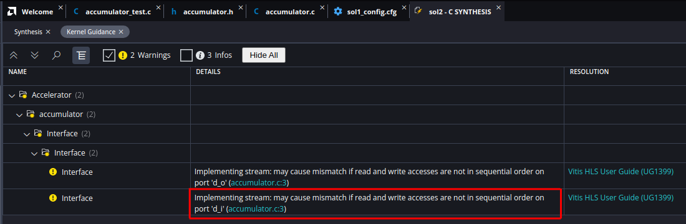

## AXI bus interfaces
* In this section we would like to demonstrate how to integrate the component as an IP core in a processor based system, for example in a [Zynq SoC](https://www.amd.com/en/products/adaptive-socs-and-fpgas/soc/zynq-7000.html). The integration is done via [AXI bus interfaces](https://docs.amd.com/r/en-US/ug1399-vitis-hls/AXI-Adapter-Interface-Protocols). There are basically two so-called _Flows_ for HLS: [Vivado IP Flow](https://docs.amd.com/r/en-US/ug1399-vitis-hls/Interfaces-for-Vivado-IP-Flow) and [Vitis Kernel Flow](https://docs.amd.com/r/en-US/ug1399-vitis-hls/Interfaces-for-Vitis-Kernel-Flow). In this and the previous tutorials we use the _Vivado IP Flow_. The _Vitis Kernel Flow_ is meant for components which should be integrated in processor based SOCs. For both flows there are default implementations for the function arguments, in the case of the _Vitis Kernel Flow_ this is the AXI bus system. But also for the _Vivado IP Flow_ you can specifiy AXI bus interfaces, that is what we will do here. By the way, the flow is also specified in the config file in the _flow target_ which is set here to `flow_target=vivado`. 
* For the component in this tutorial we will specify an AXI slave interface for the output port `d_o` and the block-level control signals. For the port `d_i` we will specify an AXI master interface. We will not discuss here the AXI protocol itself, if you need information on the AXI protocol you can find it [here](https://developer.arm.com/documentation/102202/0300/AXI-protocol-overview).
* Clone a new solution `sol3` from solution `sol1`. Open the C source code `accumulator.c` and the _HLS directives_ pane. Select the function `accumulator` in the HLS directives pane. Add a directive with the `+` sign. Select _INTERFACE_ and in the _mode_ field select _s_axilite_ as shown in the next image. The port should be set to _return_. This adds an AXI Lite slave interface to the component, where the port _return_ and the ports for the block-level control protocol will be implemented as user registers of the slave interface. Make sure that the directive will be added to the config file.

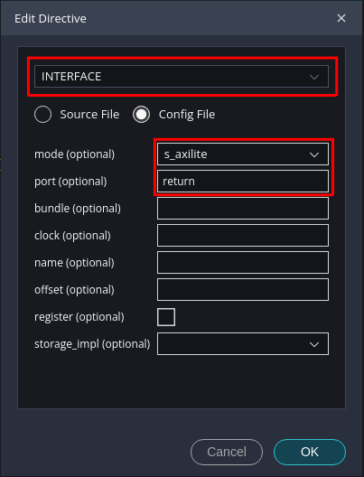

* Next select the port `d_o` in the HLS directives pane. Again add an interface directive and select also _s_axilite_ for this port as shown in the next image. 

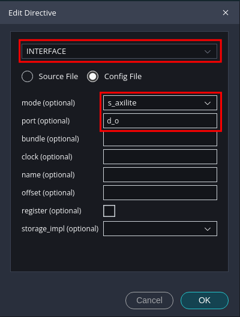

* Finally select the port `d_i` and add an interface directive. In this case select in the _mode_ field _m_axi_. This will add an AXI master interface for the port. This means that the component will act as an AXI master and can access for example the main memory of the processor sytem via DMA. In order to accomplish this the AXI master needs to be programmed with the start address for a DMA transfer. This will be done by a slave register in the AXI slave interface of this component. Therefore add the entry _slave_ in the field _offset_.

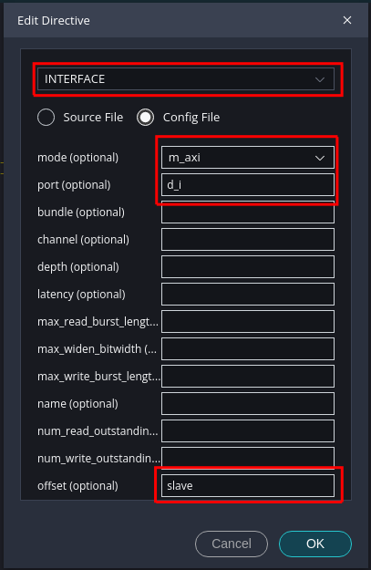

* Next run the _C SYNTHESIS_ and verify the component by running _C/RTL COSIMULATION_. Open the synthesis report. When you scroll down the synthesis report to the section _HW INTERFACES_ you can see the interfaces as shwown in the next image. There is the AXI master interface _m_axi_gmem_ which is used for the input `d_i`. Next there is the AXI slave interface _s_axi_control_ which is used for the block-level control, the output `d_o` and the DMA address for the AXI master. You can also see the registers of the slave interface in the section _S_AXILITE Registers_: The _CTRL_ register contains the block-level control signals (_AP_START_, _AP_DONE_, _AP_IDLE_, _AP_READY_) as bits 0-3. The component is able to generate interrupts, therefore there are some registers related to the interrupt functionality (for further information please consult the [Xilinx User Guide](https://docs.amd.com/r/en-US/ug1399-vitis-hls/AXI4-Lite-Interface)). Finally there is the register _d_i_ which needs to be programmed with the start address for AXI master DMA transfer. The output `d_o` is implemented as memory in the AXI slave interface, which is not shown in this overview.

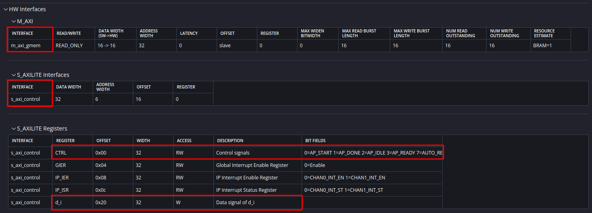

* When you scroll further down in the synthesis report you can see the section _SW I/O Information_ as shown in the next image. Here you can see for example that the output `d_o` is implemented as memory in the slave interface. In the section _M_AXI Burst Information_ it is visible that there seems to be a problem with the burst transfers on the AXI master interface. When you click in the field _RESOLUTION_ on the number a web page will open with further information on this problem: Burst transfers are only possible if the memory accesses are sequential. As we already have seen the function `accumulate` does not access the input data `d_i` in a sequential manner and therefore burst transfers are not possible. This not a functional problem, as the cosimulation runs without error, but a performance issue.

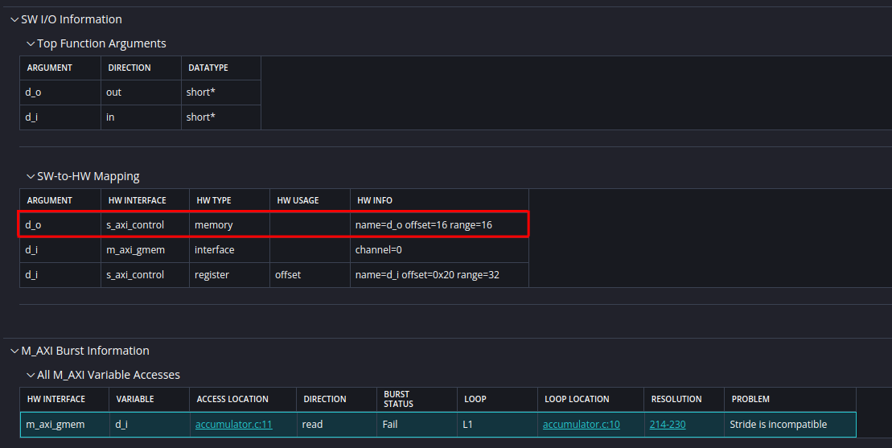

