# Vivado Tutorial

---
## Overview

* This tutorial is a self-study course to introduce the Xilinx Vivado development environment. Using a simple VHDL example, the tutorial describes the necessary steps in Vivado to go from entering the VHDL source code to generating a bit file for programming an FPGA. The tutorial refers to _Vivado_ version 2024.1, with which the individual steps were tested. When you have installed the _Xilinx Vitis Core Development Kit_ then Vivado is included. You can also install Vivado as a standalone tool from the [Xilinx homepage](http://www.xilinx.com/support/download.html). Select `Vivado` and `2024.1` and then `Xilinx Unified Installer 2024.1: Windows Self Extracting Web Installer` (or the Linux Web Installer if necessary). You must request a license at the end of the installation. To do this, you must register with Xilinx.
* If you would like to test the resulting design on FPGA hardware, then the [Basys 3 FPGA board](https://digilent.com/reference/programmable-logic/basys-3/start) from Digilent would be recommended. The pin assginment in this tutorial is dedicated to this board. But you do not necessarily need the board to work through this tutorial using the Vivado software. 
* For further and more in-depth informations on the Xilinx Vivado design flow, the Xilinx documentation is recommended for example the [UltraFast Design Methodology Guide for FPGAs and SoCs ](https://docs.amd.com/r/en-US/ug949-vivado-design-methodology).
* The source files for this tutorial can be found in the folder `reference_files`. Download the complete folder `vivado_intro/reference_files` to your computer. 
  * You can either download this whole Github repository or only the folder `reference_files` using a browser extension like [GitZip](https://gitzip.org).

---
## Creating a project

* In this section, we will create a Vivado project for the corresponding target FPGA device.

* Create a work directory for the Vivado projects on your development computer, e.g. in your user directory or somewhere else where you as a user have write and read permissions.

* Start Vivado 2024.1 from the Windows (or Linux) Start menu (usually found under _Xilinx Design Tools_).

* Under `Quick Start` create a new project by pushing `Create Project`. A _Wizard_ opens as shown in the next image. Enter the relevant entries in the dialogs as described below and go to the next dialog by clicking `Next`.

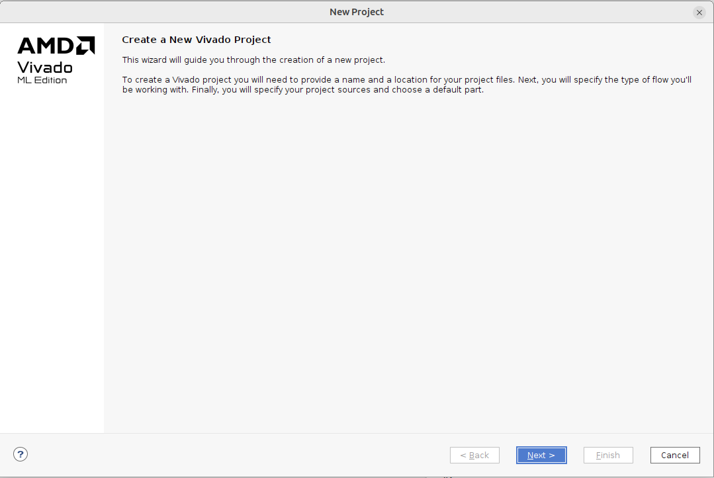

* Give your project a name (e.g. _intro1_). Select the previously created work directory for the Vivado project files as the `Project location` and activate the `Create project subdirectory` option. Important: Do not use spaces, special characters or umlauts in path or file names! The subdirectory will be named with the project name. Push `Next`.
* Select `RTL Project` as the project type and select `Do not specify sources at this time`. We will add the VHDL sources later. Push `Next`.
* In the next dialog the FPGA target component must be specified. The quickest way to select the FPGA component that is installed on the BASYS3 board is to use the following settings: `Family: Artix-7`, `Package: cpg236`, `Speed: -1`. Select the component `xc7a35tcpg236-1` from the list and complete the project creation by clicking `Next` and then `Finish` in the following dialog. You will be returned to the Vivado GUI as shown in the following image.

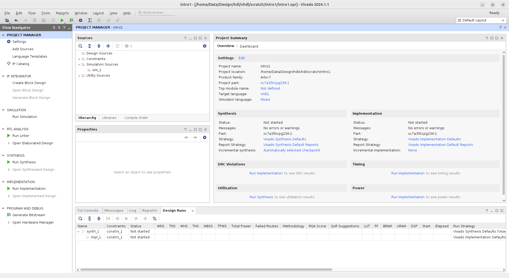

* The Vivado GUI has four areas (marked in red):
  * 1: Menu and tool bar
  * 2: Flow Navigator
  * 3: Tool window
  * 4: Console, messages, reports etc. (named tab area in the following)
* The correct specification of the FPGA component is particularly important for the implementation and the correct assignment of the pins. If the wrong component is selected, the FPGA will not be able to be configured correctly later. The creation of the Vivado project is now complete.
  * _Note_: The exact specification of the FPGA part is only necessary if you plan to download the bitfile at the end of this tutorial to the _Basys 3_ board. If you do not have the board, you can select any other part from the _Artix-7_ family. 

---
## Adding the VHDL source files

* In this section we will add the VHDL source file for our design and a corresponding VHDL testbench for the simulation. The design will be a 4-bit counter that increments with each rising edge at the input port. This input can be connected to a button on the _Basys 3_ board. The four counter outputs can be connected to the board's LEDs. The connections to the board pins will be specified later in this tutorial. The source code for the counter and the testbench can be found in the folder `reference_files`.
* In the _Flow Navigator_ (left column in the Vivado window), under _Project Manager_, click `Add Sources`.
* In the _Wizard_ that opens, select `Add or Create Design Sources`. Click `Next` to go to the next dialog and select `Add Files`. Navigate to the place where you stored the folder `reference_files` and add the file `counter.vhd`. Select `Copy sources into project` as shown in the next image. This will copy the file into the Vivado project. Click `Finish`.

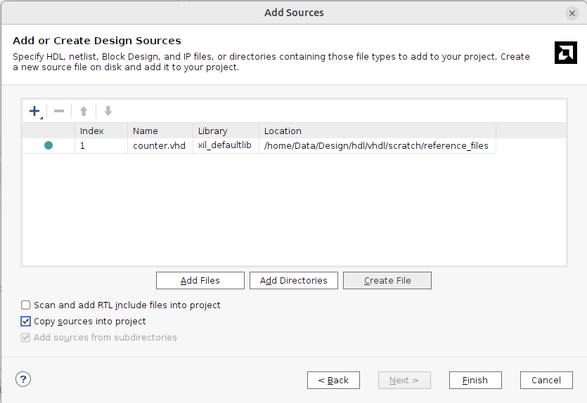

* Repeat this for the testbench file: Click `Add Sources` again, but select now `Add or Create Simulation Sources`. This is important so that Vivado knows that the testbench is only there for simulation and should not be implemented in hardware. Add the testbench file `counter_tb.vhd` as shown in the next image and click `Finish`.

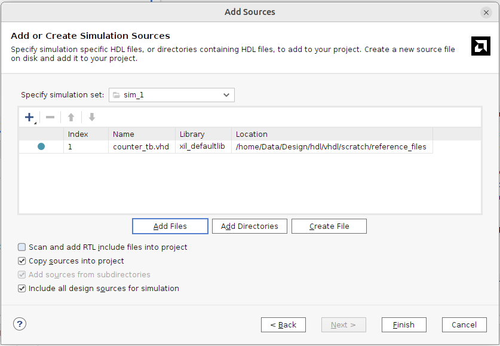

* Now check that you have all neccessary sources in the _Sources_ pane, which is in the _Project Manager_ window in the top left corner as shown in the next image. You can see two entries: _Design Sources_ and _Simulation Sources_ (push the arrow symbol to extend). The `counter.vhd` source file is listed under both entries, but the `counter_tb.vhd` source is listed only under _Simulation Sources_ since it is only needed for simulation. When you later on setup up a new project you should always check that you have all necessary source files and that the testbench is only visible under _Simulation Sources_. The sources belonging to the design itself should appear under _Design Sources_ **and** _Simulation Sources_ .

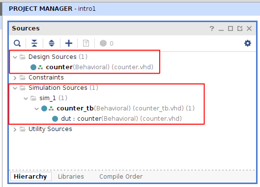

---
## Simulation

* In this section we will simulate the design using the testbench.
* To start the simulator, click on `Run Simulation > Run Behavioral Simulation` in the _Flow Navigator_ under _Simulation_. The simulator window should open up as shown in the next image.
  * _Note_: Vivado is an integrated development environment that starts various tools such as project management, simulator, synthesis or implementation via the _Flow Navigator_ and displays them in an integrated window. Whenever you start a tool a new window will open up in the central tool window of Vivado and gets stacked on top of the previous tool window. You can close a tool by pushing the symbol `X` in the blue title area of the tool (last symbol to the right) and you will be back to the previous tool window. On the bottom of this window stack you should always have the _Project Manager_ window, which you should not close because that would close the complete project.

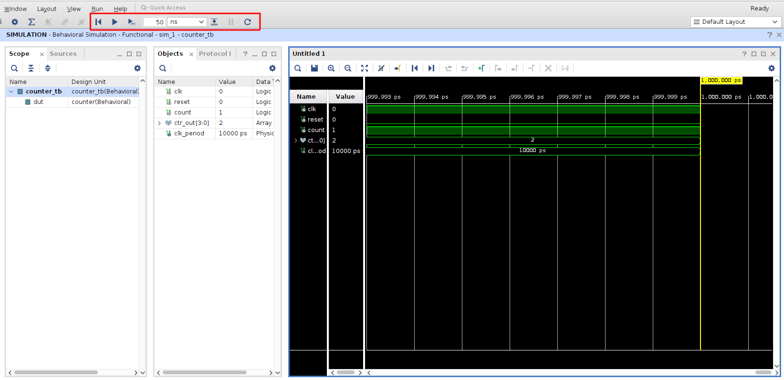

* Under the _Scope_ tab (on the left side of the simulator window) you can see the hierarchical structure of your design. The test bench _counter_tb_ is at the top level, and below that is the counter _counter_ (instance name _dut_, see testbench). The ports, signals and constants defined for the module currently selected under _Scope_ are listed in the _Objects_ window; these can in turn be transferred to the _Waveform Window_ on the right side using _drag & drop_. By default, the signal curves (a.k.a. _waveforms_) of all objects at the top hierarchy level are displayed, in this case the test bench.
* By default, 1000 ns are simulated, but this default setting can be changed in the _Flow Navigator_ under `Settings > Simulation` before the next start of the simulator. In the _Waveform Window_ you will find a bar at the top with buttons for zooming and other functions. To see the complete signal curve, for example, use the `Zoom Fit` button.
  * _Note_: Hover with the mouse over the symbols in the _Waveform Window_ and you will see the function of the symbols. 
* If you want to see internal signals from the _counter_, then select the instance name _dut_ under _Scope_ and then you can select the corresponding signals under _Objects_ using the right mouse button: In the context menu that appears, you can then add the signal using `Add To Wave Window`. 
* However, you will not yet see any signal curves for the new signals. To see them, you must restart the simulator: The Vivado toolbar was expanded above the simulator window when the simulator was started (marked in red in the previous image). There you will find several blue buttons; if you hover the mouse over them, the function is shown. You can use the `Restart` button to reset the simulator to time 0. You can now enter a new simulation time in the toolbar field (e.g. 100 ns) and simulate the corresponding time using the `Run for ...` button (showing the time you entered in the field). 
  * _Note_: Do not use the `Run All` button, because then simulation will run without stopping and you must stop it manually with the `Break` button.
* You can also enter these commands directly in the _Tcl Console_ which you can find in the lower tab area of the Vivado GUI as shown in the next image (the commands you have entered so far are also displayed there), this can be more practical. The commands are for example: _restart_ and _run 100 ns_. If you enter _run \<time\>_ several times, the simulation will continue accordingly with the time you entered. Only a _restart_ will reset the simulation.

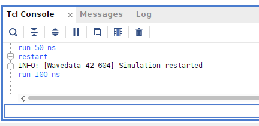

* If you select a signal in the _Wave Window_ with the right mouse button, you can change the value representation under `Default Radix` in the context menu. For example, `unsigned decimal` might be useful for a counter.
* You can save the changes and settings in the _Wave Window_ using the disk symbol: `Save Wavedialog Configuration`. This file will then be added to your project if desired (as prompted in the dialog), and when you start the simulator again, the added signals and all settings will be there.
* If you need to change a VHDL file, you do not need to close the simulator window. Select the source code file in the _Sources_ tab in the simulator window (next to the _Scope_ tab), open it and make the changes. Don't forget to save the file afterwards. The `Relaunch` button (in the Vivado toolbar) re-compiles the code and restarts the simulation. Important: If you change the VHDL code and only do a `Restart`, the old code will be simulated! Therefore, a _Relaunch_ must be done after every code change.
* When you are finished and want to close the simulation, click on the `X` on the right in the blue title bar of the simulator window.  

---
## RTL analysis

* With the help of the so-called _RTL Analysis_, you can get an impression of the implementation of the VHDL code in hardware. This is not yet the actual logic synthesis step, i.e. there is no mapping to the target technology. The representation here is done using macroblocks. However, this representation is much clearer than the actual logic synthesis, so that it allows a quick assessment of the VHDL code.
* In the _Flow Navigator_ under _RTL Analysis_ click on `Open Elaborated Design` and confirm the message with `OK`. Vivado now starts the _Elaborated Design_ window and a schematic drawing of the elaborated code should now be visible in the _Schematic_ tab as shown in the next image.
* What Vivado is doing here is basically a semantic analysis of your VHDL code and shows you how the code is implemented in hardware by Vivado. In the following image you can see the counter register `counter_reg[3:0]` and the incrementer. You can also see the two flip-flops `detect_reg[1:0]` and the _AND_ gate for edge detection. This allows you to check whether your code is implemented in hardware by Vivado as you imagined. Close the _Elaborated Design_ window by clicking on the `X` in the blue title bar.

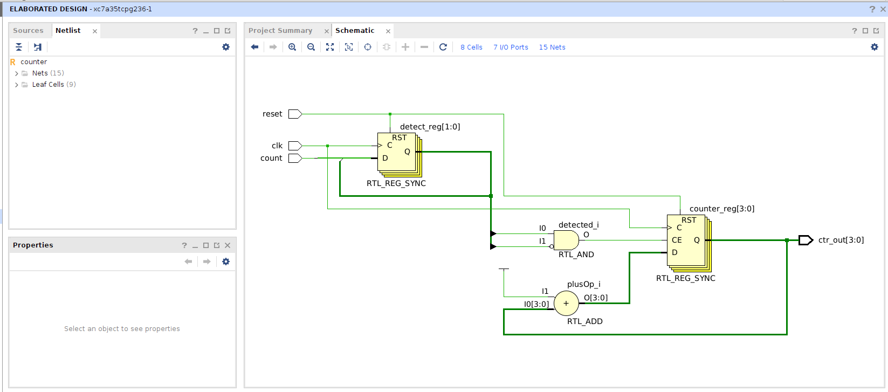

---
## Synthesis
* The next step is _Synthesis_: It maps the VHDL design onto the components available in the FPGA (flip-flops, look-up tables, multiplexers, RAM). The synthesis can also reveal design errors that may not be visible in the simulation (e.g. incomplete sensitivity lists or incompletely coded IF conditions). It is therefore highly recommended to examine the messages (warnings) of the synthesis in depth.
* In the _Flow Navigator_ under _Synthesis_ click on `Run Synthesis`. Do not change anything in the dialog window and confirm with `OK`. The synthesis run will take some time (around 30 secs depending on the compute power of your computer); you can see how far the synthesis has progressed in the Vivado window at the bottom in the tab `Design Runs`.
* When the synthesis run is finished, a window opens. Select `View Reports`. The `Reports` tab is now highlighted at the bottom tab area. Double-clicking on the reports opens them in an editor window. The next image shows an excerpt from the _Utilization Report_, in which you can see that 4 slice LUTs and 6 flip-flops are required to implement the design.

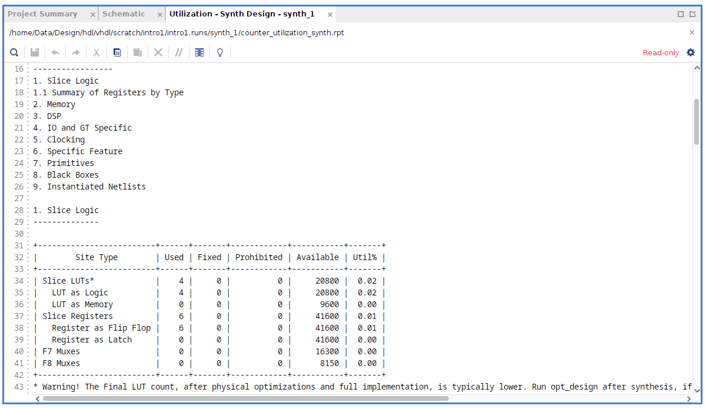

* Any warnings or errors will be displayed in the `Messages` tab (bottom tab area). When you switch off the `Info` you will get a better overview over the warnings. There are warnings for every tool and when you select `Synthesis` you should see only one warning `[Synth 8-7080] Parallel synthesis criteria is not met
`, which means that the design is to small for a parallel synthesis. 
* When you later on write your own code then please check in the `Messages` tab that there are no incomplete sensitivity lists or latches caused by incomplete signal assignments. These are not errors, just warnings, i.e. your code will be implemented in hardware, but you may end up with hardware that does not work correctly.
* In the _Flow Navigator_ under _Synthesis_ click on `Open Synthesized Design`. If you now click on `Schematic` in the _Flow Navigator_ under _Synthesis_, a window will appear with a schematic drawing of the implementation of your code in the target technology, as shown in the next image.

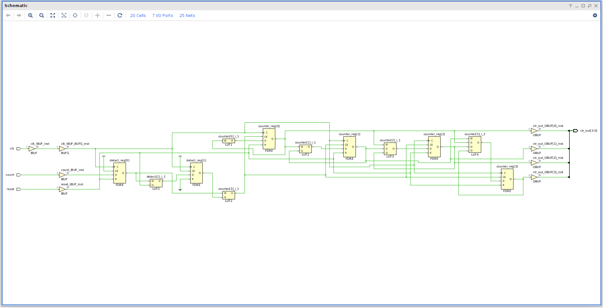
    
---
## Definition of constraints

* In this section, the _constraints_ for the design are to be defined. The constraints are necessary for the implementation. What is definitely needed is the assignment of the ports of the VHDL code to the pins of the FPGA. Furthermore, you can (and should) also specify timing constraints. In the simplest case, this is the specification of the maximum clock frequency that the design should be able to achieve.
* If the synthesized design is not open, click `Open Synthesized Design` under _Synthesis_ in the _Flow Navigator_.
* In the Vivado toolbar, click `Layout` and select the `I/O Planning` layout for Vivado instead of the _Default Layout_. You should then get a view like the following image. The properties of the I/O ports can be defined under the _I/O Ports_ tab at the bottom. This is where the ports are assigned to the FPGA pins, the I/O standards are set, and other features such as driver strength or the _Slew Rate_ are defined. 

 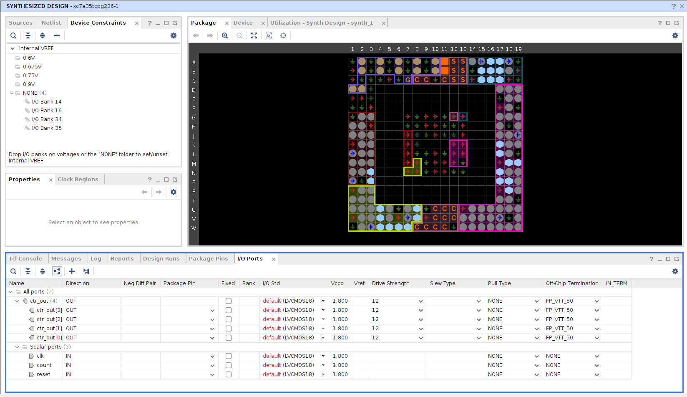

* Expand the `ctr_out` and `Scalar ports` entries by clicking on the arrow symbol. In the column `Package Pin` the ports of the VHDL code can be assigned to the package pins. Enter the informations as shown in the next image. This corresponds to an assignment for the Basys3 board, so that the counter output is on the first four LEDs, two of the buttons are used, and the clock oscillator is connected. It is also important to set the _LVCMOS33_ standard under _I/O Std_, as LEDs, buttons and the clock oscillator on the board work with 3.3 V. You can leave the remaining settings at their default values.

 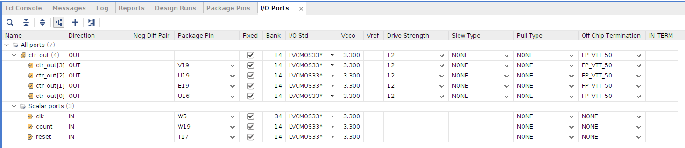

* Save the constraints by selecting `File > Constraints > Save` in the Vivado menu bar. Confirm the message that the synthesis results may subsequently be out of date with OK. In the following dialog, give the file the name `constr.xdc`.
* To define the constraints for the system clock, click on `Constraints Wizard` under _Synthesis_ in the _Flow Navigator_. In the start window of the _Timing Constraints Wizard_ click once on `Next`. In the following dialog you can enter the frequency of the clock signal _clk_ as shown in the next image. Under _Recommended Constraints_ enter the value `100` in _Frequency (MHz)_ (the frequency of the clock oscillator on the BASYS3 board is 100 MHz). Below you can see how this will be entered in the constraint file.

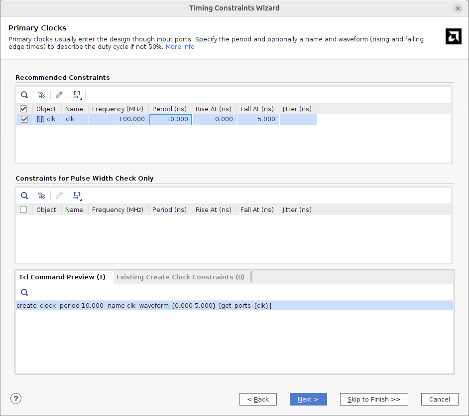

* Skip all other dialog windows with `Skip to Finish` and close the last dialog with `Finish`. In the _Sources_ tab open the constraint file `constr.xdc`. You should see here the same constraints as shown in the next image (the order may be different). Check all lines and if there are differences to the image below, then you can correct this in this file. This constraints file is the basis for the following implementation.

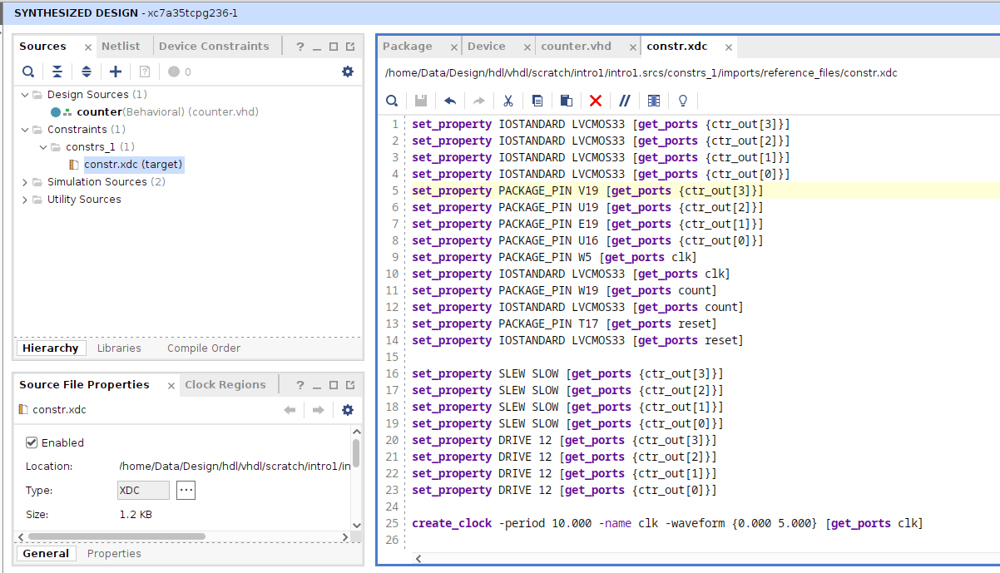

* Finish defining constraints by clicking on the cross in the top right corner of the blue title bar of _Synthesized Design_.
  * Note: Following this procedure, a synthesis run is first carried out without timing constraints. Global optimization goals are then specified during the synthesis (see synthesis settings). If a timing analysis is carried out after the synthesis (analogous to the procedure after implementation described below), it is reported that no constraints are present (entry _Check Timing_). However, after entering the timing constraints, a synthesis run can then be carried out again, in which case the timing constraints are then taken into account (and in all further synthesis runs). But since a timing analysis after synthesis is rather inaccurate it is better to move to the _implementation_.

---
## Implementation

* In this section, the _implementation_ is run in order to place the components on the FPGA and then do the routing. This process is also called _Place & Route_.
* In the _Flow Navigator_ under _Implementation_ click on `Run Implementation`. If you get a message saying that the synthesis is _out of date_, click on `Yes`. This will run the synthesis again. Basically, Vivado checks the time stamps of the source files (VHDL codes, constraints, etc.) and restarts the relevant tools that are affected and also runs all the previous steps again. That means if you have changed sources later, it is sufficient to simply click on the last step `Generate Bitstream` again, so that all the necessary previous steps, such as synthesis and implementation, are then run again.
  * _Note_: When you start the implementation you will be asked for setting _Options_ for the synthesis run. The default is to launch runs on local host (your computer). You can set the number of jobs, which means that the synthesis run (and also the implementation run) will be tried to parallelize in order to use the multi-core architecture of your computer. 
* After completing the implementation, click on `View Reports` and check the messages in the _Messages_ tab. To check whether the _timing constraints_ you specified were met, you can search for _Route Design_ in the _Reports_ tab and open the _Timing Summary Report_ there. 
* Now open the implemented design by clicking on `Open Implemented Design`. A further tab _Timing_ opens in the tab area at the bottom, in which you can find details about the timing . If you select `Intra Clock Paths` in the navigation window on the left , you can see the _Intra Clock Paths_ tab as shown in the next image. Select `clk` and you can get more detailed information about the critical paths. 

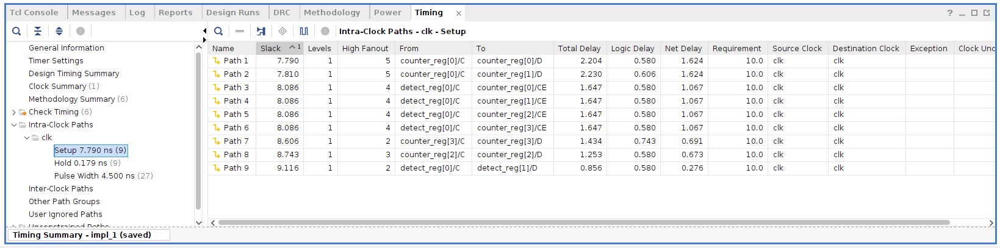
  
* Under _Setup_ you will find information about the paths that go from register to register. A positive _slack_ means that the constraints were met. Further information can then be found in the respective line: start and end point of the path, total delay and the proportions of the routing and components delays. Under _Requirement_ you should see the constraints you specified. If you select a line with the mouse, you can call up a context menu with the right mouse button: There you can, for example, use _Schematic_ to display the path in the schema editor or use _View Path Report_ to display detailed information about this path.

---
## Creating the bit file and configuring the FPGA

* Before the FPGA can be configured, the results of the implementation run must be converted into a _bitstream_ (a configuration file for the FPGA). The following steps are only necessary if you have an FPGA board available.
* In the _Flow Navigator_ under _Program and Debug_ click on `Generate Bitstream` and wait until the bitstream generation is finished.
* If you have a _Basys 3_ board available, connect it to the development computer with a USB cable and switch the board on.
* When the bitstream generation is finished, you can click `Open Hardware Manager`. In the upper left corner of the _Hardware Manager_ window, click `Open Target > Auto Connect`. Make sure the board is turned on first!
  * _Note_: If you can not connect to the board, check that the cable drivers for the board connections have been installed during installation of Vivado. You can find further information [here](https://docs.amd.com/r/en-US/ug973-vivado-release-notes-install-license/Installing-Cable-Drivers).
* You should now see the view shown in the next image. If you now click on `Program Device` (marked in red), you can download the bitstream by clicking on `Program`. The FPGA will now be programmed. When this process is finished, the _DONE_ LED on the board should light up and your design is  ready for testing on the board!
  * _Note_: If no bit file appears under _Program Device_, it is usually because you may have selected the wrong FPGA type when creating the Vivado project. When the Hardware Manager connects to the FPGA, the type designation is read out (window _Hardware Device Properties_). If this does not match the type designation in the bit file, the bit file is not automatically entered for download. If this has happened, you must go to _Settings_ in the Project Manager and correct the FPGA type (_xc7a35tcpg236-1_) and then go through all the steps again by simply clicking on _Generate Bitstream_.

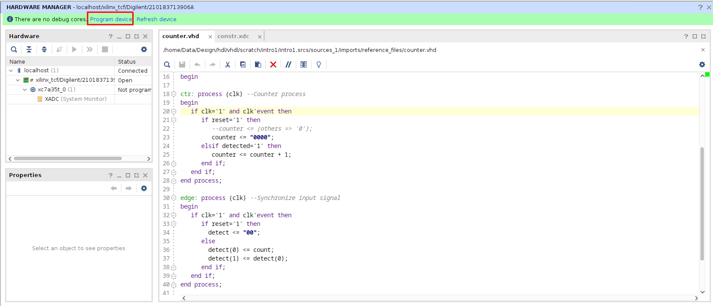

* Please close the _Hardware Manager_ **before** switching off the board. Otherwise Vivado may hang up. 

