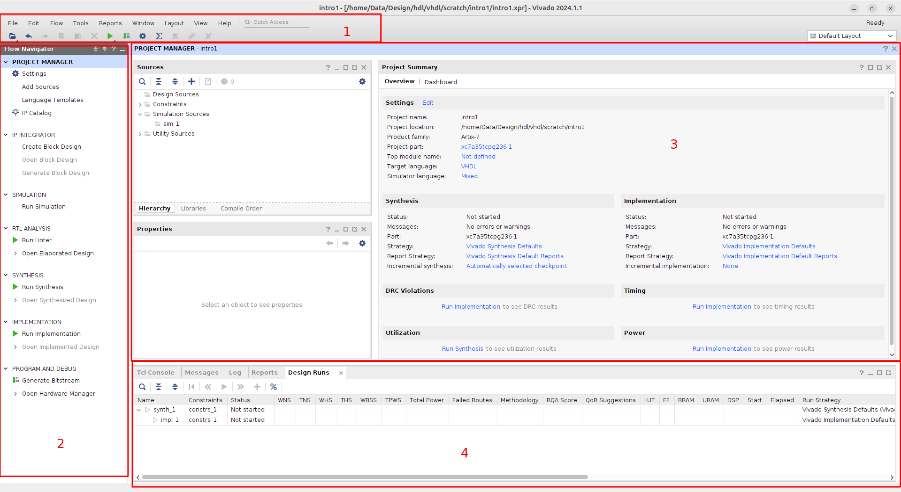

# Vivado Tutorial

---
## Overview

* This tutorial is a self-study course to introduce the Xilinx Vivado development environment. Using a simple VHDL example, the tutorial describes the necessary steps in Vivado to go from entering the VHDL source code to generating a bit file for programming an FPGA. The tutorial refers to Vivado version 2024.1, with which the individual steps were tested. The Vivado software can be downloaded and installed as a free version from the [Xilinx homepage](http://www.xilinx.com/support/download.html). Select "Vivado" and "2024.1" and then " Xilinx Unified Installer 2024.1: Windows Self Extracting Web Installer" (or the Linux Web Installer if necessary). You must request a license at the end of the installation. To do this, you must register with Xilinx.

* If you would like to test the resulting design on FPGA hardware, then the "Basys 3" FPGA board from Digilent would be recommended, which can be obtained in Germany from "trenz-electronic.de". However, this tutorial does not cover the specification of the board and any debugging work that may be necessary. However, we use the corresponding Artix-7 FPGA component for the Vivado project described here as the target hardware. You do not need the board to work through this tutorial using the Vivado software. For further and more in-depth indialogation, the Xilinx documentation is recommended for example the [UltraFast Design Methodology Guide for FPGAs and SoCs ](https://docs.amd.com/r/en-US/ug949-vivado-design-methodology).

---
## Creating a project

* In this section, we will create a Vivado project for the corresponding target FPGA device.

* Create a work directory for the Vivado projects on your development computer, e.g. in your user directory or somewhere else where you as a user have write and read permissions

* Start Vivado 2024.1 from the Windows (or Linux) Start menu (usually found under _Xilinx Design Tools_).

* Under `Quick Start` create a new project by pushing `Create Project`. A _Wizard_ opens as shown in the next image. Enter the relevant entries in the dialogs as described below and go to the next dialog by clicking `Next`.

* Give your project a name (e.g. _intro1_). Select the previously created work directory for the Vivado project files as the `Project location` and activate the `Create project subdirectory` option. Important: Do not use spaces, special characters or umlauts in path or file names! The subdirectory will be named with the project name. Push `Next`.
* Select `RTL Project` as the project type and select `Do not specify sources at this time`. We will create the VHDL sources later. Push `Next`.
* In the next dialog the FPGA target component must be specified. The quickest way to select the FPGA component that is installed on the BASYS3 board is to use the following settings: `Family: Artix-7`, `Package: cpg236`, `Speed: -1`. Select the component `xc7a35tcpg236-1` from the list and complete the project creation by clicking `Next` and then `Finish` in the following dialog. You will be returned to the Vivado GUI as shown in the following image.

* The correct specification of the FPGA component is particularly important for the implementation and the correct assignment of the pins. If the wrong component is selected, the FPGA will not be able to be configured correctly later. The creation of the Vivado project is now complete.

---
## Adding the VHDL source files

* In this section we will create the VHDL source file for our design and a corresponding VHDL testbench for the simulation. The design will be a 4-bit counter that increments with each rising edge of an input. This input can be connected to a button on the Basys board. The four counter outputs can be connected to the board's LEDs. The source code for the counter can be found in the folder `reference_files`.

    In the "Flow Navigator" (left column in the Vivado window), under "Project Manager", click "Add Sources".

    In the "Wizard" that opens, select "Add or Create Design Sources". Click "Next" to go to the next screen and select "Create File". Select "VHDL" as the "File type" and enter "counter.vhd" as the name. Press "OK" and then "Finish" to finish.

    In the following mask you can define the ports of your design. Enter the ports as shown in the figure: "count" is the input with the rising edge of which the counter should increment and "ctr_out" is the output of the counter, which is created as a 4-bit bus. After completion, a VHDL code is generated, which should now appear in the "Project Manager" window of Vivado under "Sources"$\rightarrow$"'Design Sources"'. Open the file in the editor by double-clicking. You now have a VHDL "framework" with a finished entity and an architecture. Now add the missing lines with the code from the appendix. When you save the file ("Save file" button at the top of the editor or "Ctrl-S") a rough syntax check is carried out. If there are errors in the code, they are displayed in color in the editor. Correct the errors.

    Now the testbench is missing: Click on "Add Sources" in the "Flow Navigator" again. But now select "Add or Create Simulation Sources". This is important so that Vivado knows that the testbench is only there for simulation and should not be implemented in hardware. As in the previous procedure, enter "VHDL" as the type and the name "counter_tb.vhd". Do not enter any ports in the port mask - it is a testbench after all. Answer the following question when completing the mask with "Yes". If you now open the "Simulation Sources" in the "Project Manager" in Vivado, you will see the design and the testbench listed.

    Now edit the test bench and add the code from the appendix. If you have entered everything correctly, the hierarchy should be displayed as shown in the figure. If this is not the case, then the names of the component declaration and instantiation may not match the entity.

Simulation

In this section we will simulate the created design using the testbench.

    To start the simulator, click on "Run Simulation"$\rightarrow$ "Run Behavioral Simulation" in the "Flow Navigator" under "Simulation". This will perdialog another syntax check of the VHDL code and further checks when the simulator starts. If errors still occur here, you will find indialogation about them in Vivado in the "Tcl Console" or "Messages" windows at the bottom. The simulator's error messages are entered in a log file:intro1\intro1.sim\sim_1\behav\xsim\xvhdl.log

    Open this file with a text editor and try to understand where your error is. Correct the errors in the source code and start the simulator again. If the simulation started correctly, the simulator window should be open in Vivado, as shown in the figure.

    Under "Scope" you can see the hierarchical structure of your design. The test bench "counter_tb" is at the top level, and below that is the counter "counter" (instance name "dut", see Instancing in the Test Bench). The ports, signals and constants defined for the module currently selected under "Scope" are listed in the "Objects" window; these can in turn be transferred to the display of the signal curves on the right edge of the window using "drag & drop". By default, the signal curves of all objects at the top hierarchy level are displayed, in this case the test bench.

    To the right of "Scope" and "Objects", the signal curves of the selected signals are displayed in a "Wave Window". By default, 1000 ns are simulated, but this default setting can be changed in the "Flow Navigator" under "Settings"$\rightarrow$"'Simulation"' before the next start of the simulator. In the "Wavedialog Display" you will find a bar at the top with buttons for zooming and other functions. To see the complete signal curve, for example, use the "Zoom Fit" button.

    If you want to see signals from the "counter", then select the instance name "dut" under "Scope" and then you can select the corresponding signals under "Objects" using the right mouse button: In the context menu that appears, you can then add the signal using "Add To Wave Window", as shown in the figure. However, you will not yet see any signal curves for the new signals. To do this, you must restart the simulator: The Vivado toolbar was expanded above the simulator window when the simulator was started. There you will find several blue buttons; if you move the mouse over them, the function is shown.

    You can use the "Restart" button to reset the simulator to time 0. You can now enter a new simulation time in the toolbar (e.g. 100 ns) and simulate the corresponding time using the "Run for ..." button. You can also enter these commands directly in the Tcl console below (the commands you have entered so far are also displayed there), this is usually more practical. The commands are: "restart" and "run 100 ns". If you enter "run ..." several times, the simulation will continue accordingly; only a "restart" will reset the simulation.

    If you select a signal in the "Wave Window" with the right mouse button, you can change the value representation under "Radix" in the context menu. For example, "unsigned decimal" might be useful for a counter.

    You can save the settings in the "Wave Window" using the disk symbol: "Save Wavedialog Configuration". This file will then be added to your project if desired (as prompted in the dialog), and when you start the simulator again, the added signals and all settings will be there.

    If you need to change a VHDL file, you do not need to close the simulator window. Select the relevant file in the relevant tab in the simulator window and make the changes. Don't forget to save the file afterwards. The "Relaunch" button re-compiles the code and restarts the simulation. Important: If you change the VHDL code and only do a "Restart", the old code will be simulated! Therefore, a "Relaunch" must be perdialoged after every code change.

    When you are finished and want to close the simulation, click on the 'X' on the right in the blue title bar of the simulator window. You can also do this later with the other tools such as synthesis or implementation. Vivado is an integrated development environment that starts various tools such as project management, simulator, synthesis or implementation via the "Flow Navigator" and displays them in an integrated window.

RTL analysis

With the help of the so-called RTL analysis, you can get an impression of the implementation of the VHDL code in hardware. This is not yet the actual logic synthesis step, ie there is no mapping to the target technology. The representation here is done using macroblocks. However, this representation is much clearer than the actual logic synthesis, so that it allows a quick assessment of the VHDL code.

[[F11]]{#F11 label="F11"}Vivado: Elaborated Design{#F11}

In the "Flow Navigator" under "RTL Analysis" click on "Open Elaborated Design" and confirm the message with "OK". Vivado now starts the "Elaborated Design" window and a schematic drawing of the elaborated code should now be visible in the "Schematic" tab. What Vivado is doing here is basically a semantic analysis of your VHDL code and shows you how the code is implemented in hardware by Vivado. In Figure 11 {reference-type="ref" reference="F11"} you can see the counter register "counter_reg[3:0]" and the incrementer. You can also see the two flip-flops "detect_reg[1:0]" and the AND gate for edge detection. This allows you to check whether your code is implemented in hardware by Vivado as you imagined. Close the "Elaborated Design" window by clicking on the 'X' in the blue title bar.
synthesis

In this section, logic synthesis takes place: it maps the VHDL design onto the components available in the FPGA (flip-flops, look-up tables, multiplexers, RAM). The synthesis can also reveal design errors that may not be visible in the simulation (e.g. incomplete sensitivity lists or incompletely coded IF conditions). It is therefore highly recommended to examine the messages (warnings) of the synthesis closely.

    In the "Flow Navigator" under "Synthesis" click on "Run Synthesis". Do not change anything in the dialog window and confirm with "OK". The synthesis run will take some time; you can see how far the synthesis has progressed in the Vivado window at the very bottom under "Design Runs".

    Any warnings or errors will be displayed in the "Messages" tab. Please check that there are no incomplete sensitivity lists or latches caused by incomplete signal assignments. These are not errors, just warnings, ie your code will be implemented in hardware, but you may end up with hardware that does not work correctly.

    If the design still contains errors (e.g. syntax errors), the synthesis is aborted. In this case, correct the error, run a simulation again and then start the synthesis again.

    When the synthesis run is finished, a window opens. Select "View Reports". The "Reports" tab is now highlighted at the bottom of the Vivado window. Double-clicking on the reports opens them in an editor window. Figure 12 {reference-type="ref" reference="F12"} shows an excerpt from the "Utilization Report", in which you can see that 4 slice LUTs and 6 flip-flops are required to implement the design.

    [[F12]]{#F12 label="F12"}Utilization Report {#F12}

    In the "Flow Navigator" under "Synthesis" click on "Open Synthesized Design". If you now click on "Schematic", a window will appear with a schematic drawing of the implementation of your code in the target technology, as shown in Figure 13 {reference-type="ref" reference="F13"}.

    [[F13]]{#F13 label="F13"} Synthesis Schematic {#F13}

    Close the "Synthesized Design" window by clicking on the 'X' in the blue title bar.

definition of the boundary conditions

In this section, the "constraints" for the design are to be defined. The constraints are necessary for the implementation. What is definitely needed is the assignment of the ports of the VHDL code to the pins of the FPGA. Furthermore, you can (and should) also specify temporal constraints. In the simplest case, this is the specification of the maximum clock frequency that the design should be able to achieve.

    If the synthesized design is not open, click "Open Synthesized Design" under "Synthesis" in the "Flow Navigator".

    In the toolbar, select the "I/O Planning" layout for Vivado instead of the "Default Layout". You should then get a view like in Figure 14 {reference-type="ref" reference="F14"}.

    [[F14]]{#F14 label="F14"} Vivado: I/O-Planning View{#F14}

    [[F15]]{#F15 label="F15"} I/O Planning: I/O Ports {#F15}

    The properties of the I/O ports can be defined under the "I/O Ports" tab at the bottom, as shown in Figure 15 {reference-type="ref" reference="F15"}. This is where the ports are assigned to the FPGA pins ("Site"), the I/O standards are set, and other features such as driver strength or the "Slew Rate" are defined. Expand the "ctr_out" and "Scalar ports" entries by clicking on the arrow symbol. Now enter the "Sites" or FPGA pins for the corresponding ports as shown in Figure 15 {reference-type="ref" reference="F15"}. This corresponds to an assignment for the Basys3 board, so that the counter output is on the first four LEDs, two of the buttons are used, and the clock oscillator is connected. You can find more indialogation about this in the "Reference Manual" for the board if you want to use the board. It is also important to set the "LVCMOS33" standard under "I/O Std", as LEDs, buttons and the clock oscillator on the board work with 3.3 V. You can leave the remaining settings at their default values.

    [[F16]]{#F16 label="F16"} Timing Constraints: Clock frequency{#F16}

    Save the boundary conditions with "File" → "Constraints" → "Save". Confirm the message that the synthesis results may subsequently be out of date with OK. In the following dialog, give the file the name "constr.xdc".

    To define the boundary condition for the system clock, click on "Constraints Wizard" under "Synthesis" in the "Flow Navigator". In the start window of the "Timing Constraints Wizard" click once on "Next". In the following dialog you can enter the frequency of the clock signal "clk" (Figure 16 {reference-type="ref" reference="F16"}). Under "Recommended Constraints" enter → Enter the value 100 in "Frequency (MHz)" (the frequency of the clock oscillator on the BASYS3 board is 100 MHz).

    Skip all other dialog windows with "Skip to Finish" and close the last dialog with Finish.

    Finish defining constraints by clicking on the cross in the top right corner of the blue title bar of "Synthesized Design".

    In the "Project Manager" window you will see under "Sources" → "Constraints" the file "constr.xdc". Open the file by double-clicking it. The file contains commands for creating the constraints defined above. Such a file could also be created manually and added to the project using "Add Sources". You can also make changes directly here in the file if, for example, the pin assignment is not correct.

    Note: Following this procedure, a synthesis run is first carried out without timing constraints having been defined beforehand. Global optimization goals are then specified during the synthesis (see synthesis settings). If a timing analysis is carried out after the synthesis (analogous to the procedure after implementation described below), it is reported that no constraints are present (entry "Check Timing"). However, after entering the timing constraints, a synthesis run can then be carried out again, in which case the timing constraints are then taken into account (and in all further synthesis runs). However, it should be noted that the delay times in particular are only estimated by the wiring ("net delay") (see [@Kesel09]).

implementation

In this section, the "implementation" is used to place the components on the FPGA and then wire them up. This process is also called "Place&Route".

    In the "Flow Navigator" under "Implementation" click on "Run Implementation". If you get a message saying that the synthesis is "out of date", click on "Yes". This will run the synthesis again. Basically, Vivado checks the time stamps of the source files (VHDL codes, constraints, etc.) and restarts the relevant tools that are affected and also runs all the previous steps again. Basically, if you have changed sources later, it is sufficient to simply click on the last step "Generate Bitstream" again, so that all the necessary previous steps, such as synthesis and implementation, are then run again.

    After completing the implementation, click on "View Reports" and check the messages in the "Messages" tab. To check whether the "timing constraints" you specified were met, you can search for "Route Design" in the "Reports" tab and open the "Timing Summary Report" there. You can also get a quick overview further up in the "Project Summary" window.

    Now open the implemented design by clicking on "Open Implemented Design". A further tab "Timing" opens below, in which you can find detailed indialogation about the timing (Figure 17 {reference-type="ref" reference="F17"}). If you select "Intra Clock Paths" in the navigation window on the left in Figure 17 {reference-type="ref" reference="F17"}, you can see the "Intra Clock Paths" tab. → clk" you can get more detailed indialogation about the critical paths. Under "Setup" you will find indialogation about the paths that go from register to register (or from input to register if constraints were specified for the inputs). A positive "slack" means that the constraints were met (see also [@Kesel09]). Further indialogation can then be found in the respective line: start and end point of the path, total delay and the proportions of the routing and components. Under "Requirement" you should see the constraints you specified. If you select a line with the mouse, you can call up a context menu with the right mouse button: There you can, for example, use "Schematic" to display the path in the schema editor or use "View Path Report" to display detailed indialogation about this path.

    [[F17]]{#F17 label="F17"} Timing Report {#F17}

Creating the bit file and configuring the FPGA

Before the FPGA can be configured, the results of the implementation run must be converted into a "bitstream" (a configuration file for the FPGA). The following steps only make sense if you have an FPGA board available.

    In the "Flow Navigator" under "Program and Debug" click on "Generate Bitstream" and wait until the bitstream generation is finished.

    If you have a Basys3 board (or another one) available, connect it to the development computer with a USB cable.

    [[F18]]{#F18 label="F18"} Hardware Manager {#F18}

    When the bitstream generation is finished, you can click "Open Hardware Manager". In the upper left corner of the "Hardware Manager" window (see Figure 18 {reference-type="ref" reference="F18"}), click "Open Target" → "Auto Connect". Make sure the board is turned on first!

    You should now see the view shown in Figure 19 {reference-type="ref" reference="F19"}. If you now click on "Program Device", you will be given the FPGA device to select and then the preset selection of the bitstream file. Click on "Program device". The FPGA will now be programmed. When this process is finished, your design should be ready for testing on the board!

    [[F19]]{#F19 label="F19"} Hardware Manager: Programming the target{#F19}

    Note: If no bit file appears under "Program Device", it is usually because you may have selected the wrong FPGA type when creating the Vivado project. When the Hardware Manager connects to the FPGA, the type designation is read out (window "Hardware Device Properties"). If this does not match the type designation in the bit file, the bit file is not automatically entered for download. If this has happened, you must go to "Settings" in the Project Manager and correct the FPGA type ("xc7a35tcpg236-1") and then go through all the steps again by simply clicking on "Generate Bitstream".
